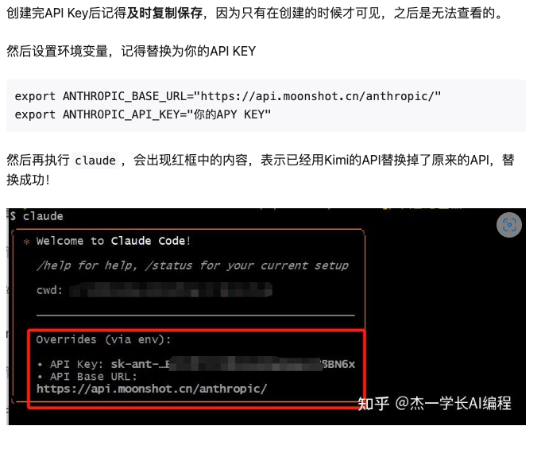

注意 : 不可或缺的一个工具是 cc-switch 可以查看cc-switch教程


## claude code


### 使用教程
```bash
"CLAUDE_CODE_EXPERIMENTAL_AGENT_TEAMS": "1"  # agent teams

# 无需确认
# 如果用户是root
IS_SANDBOX=1 claude --dangerously-skip-permissions 
# 如果用户不是root
claude --dangerously-skip-permissions 


```

- [非常好用，在windows通过wsl使用claude，我就是看的这个](https://itecsonline.com/post/how-to-install-claude-code-on-windows)
- [claude code 官方实战](https://docs.anthropic.com/en/docs/claude-code/overview)
- [claude code 仓库](https://github.com/anthropics/claude-code)
- [Claude Code 實戰教學：三大超好用功能公開！【2025年6月更新】【AI寫程式】](https://vocus.cc/article/6854309dfd89780001335549)
- [Claude Code 最佳实践](https://gaccode.com/document/claude-code-best-practices-zh)
- [让claude更加好用](https://itecsonline.com/post/claude-code-tips-tricks)
- [Claude Code 用法全面拆解！26 项核心功能 + 实战技巧](https://zhuanlan.zhihu.com/p/1928918331810886674)


### 安装


#### mac/linux/wsl


- 安装
```bash
  # 注意，要吧下面的端口设置成你自己的vpn端口，为什么先要设置代理环境变量？ 因为curl默认不会走代理
  export https_proxy=http://127.0.0.1:7897 http_proxy=http://127.0.0.1:7897
  curl -fsSL https://claude.ai/install.sh | bash
```
- 卸载
  ```bash
  rm -f ~/.local/bin/claude
  rm -rf ~/.local/share/claude
  ```


#### windows 

推荐通过wsl安装

[安装参考](https://itecsonline.com/post/how-to-install-claude-code-on-windows)

1. wsl --install  # 如果出现问题就要去 https://blog.csdn.net/no1xium/article/details/131285182
2. wsl --list --online  # 查看有哪些可用的镜像,如果没有Ubuntu-24.04进行第三步
3. wsl --install -d Ubuntu-24.04

进入到wsl里面

sudo apt update
sudo apt full-upgrade -y

目前claude支持原生安装（2026/02） [claude code](https://code.claude.com/docs/en/overview)
```bash
curl -fsSL https://claude.ai/install.sh | bash
```

安装cc-switch， 参考 本网站的 cc-switch 教程 

Install Additional Dependencies

```bash
sudo apt install python3 python3-pip -y #  Install Python (if needed)

sudo apt install git ripgrep -y # Install Git and Ripgrep (Recommended)


mkdir -p ~/.npm-global


```


### 配置其他模型api以使用claude_code

#### 配置kimi-k2-api

https://zhuanlan.zhihu.com/p/1928071611342393465




export ANTHROPIC_AUTH_TOKEN=sk-xxxxxxx..xxxxx
export ANTHROPIC_BASE_URL="https://api.moonshot.cn/anthropic/"

#### 配置GLM4.5
https://zhuanlan.zhihu.com/p/1935092461279117856

#####  ZHIPU-GLM4.5
export ANTHROPIC_AUTH_TOKEN=xxxxxxx..xxxxx
export ANTHROPIC_BASE_URL="https://open.bigmodel.cn/api/anthropic"


### 使用技巧


#### 1. CLAUDE.md 文件管理


---

#### 2. claude code 使用git worktree 开启多线程工作


  - 1. 创建 Git Worktree
  为每个任务创建独立工作目录和分支。例如，开发 `feature-auth` 和 `feature-ui`：

  ```bash
  git worktree add ../my-project-auth -b feature-auth
  git worktree add ../my-project-ui -b feature-ui
  ```

  - 验证：
  ```bash
  git worktree list
  ```

  - 2. 配置环境
  复制配置文件（如 `.env`）并设置不同端口以避免冲突：
  ```bash
  cp .env ../my-project-auth/.env
  cp .env ../my-project-ui/.env
  ```
  - `my-project-auth/.env`：`PORT=3000`
  - `my-project-ui/.env`：`PORT=3001`

  安装依赖：
  ```bash
  cd ../my-project-auth && npm install
  cd ../my-project-ui && npm install
  ```

  - 3. 启动 Claude Code

    在每个 Worktree 中运行 Claude Code：
    - 终端 1：
      ```bash
      cd ../my-project-auth
      claude "Implement JWT-based authentication with refresh tokens"
      ```
    - 终端 2：
      ```bash
      cd ../my-project-ui
      claude "Redesign UI with responsive Tailwind CSS layout"
      ```

  - 4. 提交和合并
  提交代码：
  ```bash
  cd ../my_search-project-auth
  git add .
  git commit -m "Add JWT authentication"
  cd ../my-project-ui
  git add .
  git commit -m "Update UI with Tailwind CSS"
  ```

  合并到主分支：
  ```bash
  cd ../my-project
  git checkout main
  git merge feature-auth
  git merge feature-ui
  ```

  - 5. 清理
  删除 Worktree 和分支：
  ```bash
  git worktree remove ../my-project-auth
  git worktree remove ../my-project-ui
  git branch -d feature-auth
  git branch -d feature-ui
  ```

  - 优化技巧
  - **自动化脚本**：
    ```bash
    function wt() {
      git worktree add ../worktrees/$1 -b $1
      cd ../worktrees/$1
      cp ../my-project/.env .env
      npm install
      claude
    }
    ```
    使用：`wt feature-auth`

  - **任务文件**：在每个 Worktree 创建 `CLAUDE.md` 记录指令，调用 `claude @CLAUDE.md`。
  - **IDE 集成**：使用 VS Code 的 Git Worktrees 扩展切换 Worktree。

  - 注意事项
  - 确保不同 Worktree 使用不同分支。
  - 为数据库任务配置独立实例（如 Docker 容器）。
  - 监控资源使用，避免并行任务过多导致过载。


3.  The Permission System Hack That Changes Everything

 Tips: `--dangerously-skip-permissions`  这个参数只能执行在非root用户下执行，因此如果只有root用户需要创建一个账户

```bash
sudo useradd -m -s /bin/bash username  # 创建新用户

su - username # 切换用户

curl --resolve raw.githubusercontent.com:443:185.199.108.133 -fsSL https://raw.githubusercontent.com/mklement0/n-install/stable/bin/n-install | bash -s 22   # 安装 node 其中--resolve表示自动去找可用的地址， 也可以安装nvm

npm install -g https://gaccode.com/claudecode/install --registry=https://registry.npmmirror.com  # 安装gac站的claude code

claude --dangerously-skip-permissions
```

#### 3. 在容器中开发时--dangerously-skip-permissions指令让它自动执行
```bash 
# 如果用户是root
IS_SANDBOX=1 claude --dangerously-skip-permissions 

# 如果用户不是root
claude --dangerously-skip-permissions 
```

#### 4. VS Code 插件


## codex 

### 安装和配置

#### windows

｀安装｀

安装和claude一样，参考claude的安装方式

--- 

｀配置｀

**设置默认agent full模式**


**设置$env:PYTHONUTF8 = "1"**

不设置的话会出现乱码,因为python代码默认是utf8但是命令行默认是ascii


