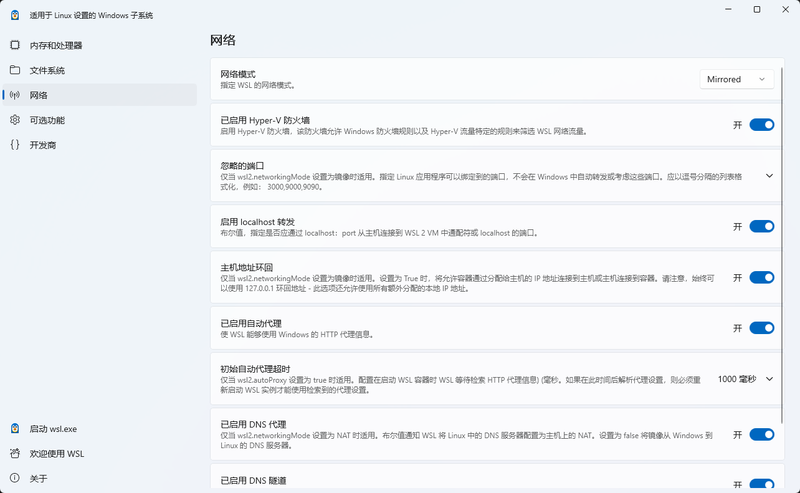
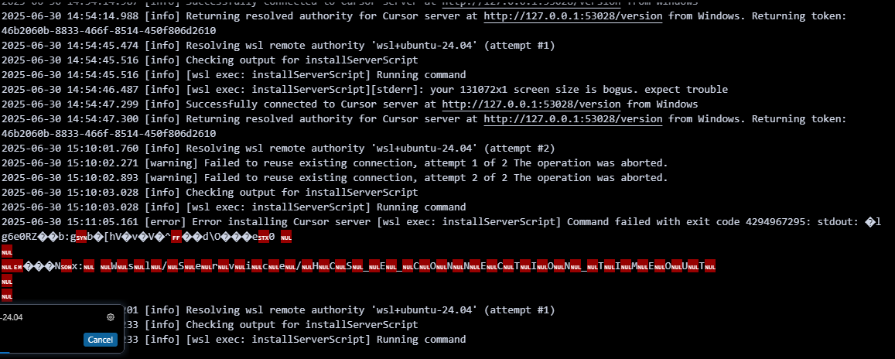
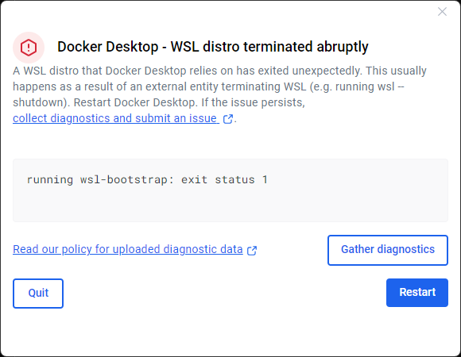

## 基础知识

### 安装

相关教程：

[windows官方](https://learn.microsoft.com/zh-cn/windows/wsl/install)


安装相关软件
```
apt install git
apt install just

# 安装uv
curl -LsSf https://astral.sh/uv/install.sh | sh
```

安装nvm
```bash
curl -o- https://raw.githubusercontent.com/nvm-sh/nvm/v0.40.1/install.sh | bash
```


### 配置




配置中文字体
```bash
sudo apt update
sudo apt install fonts-noto-cjk fonts-wqy-microhei fonts-wqy-zenhei
sudo locale-gen zh_CN.UTF-8
```

如果从windows复制过来的.sh需要修改字符
```bash
sed -i 's/\r$//' ./zata.sh
```


### 问题解决


#### wsl和docker冲突  表现为wsl无法联网  --- 把docker关了，或者使用docker里面的linux容器





<span style="color:red;">下面不要用了，会把网络设置搞乱</span>


~使用下面命令之后重启可以恢复，但是当再次打开docker又会出现问题,主要就是关了docker就行~
```bash
wsl --shutdown
netsh winsock reset
```