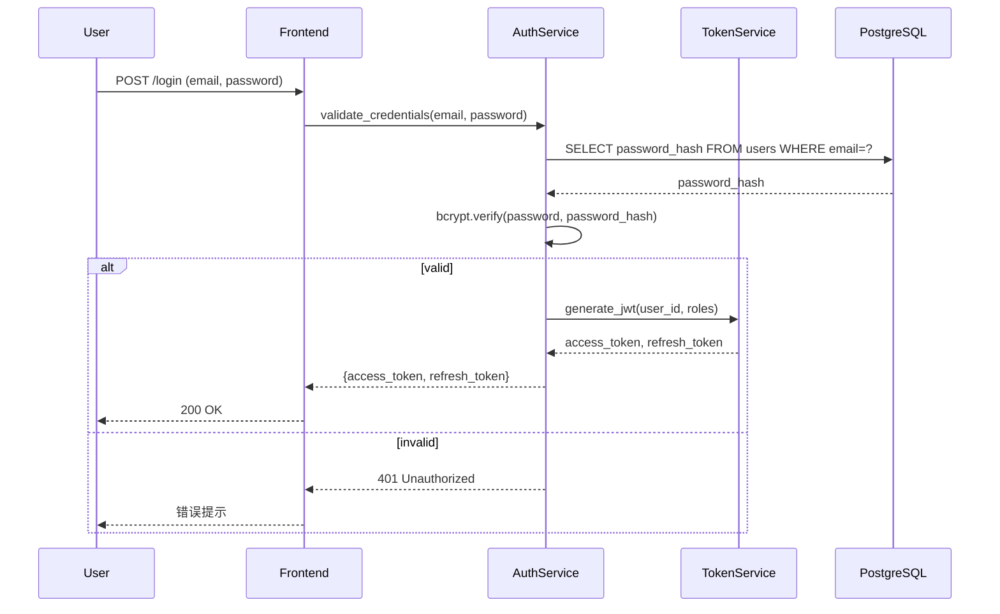

# 软件工程的范式转移：基于 Claude Code 与智能体协作的高效编程实践

在软件开发工具演进的十年周期中，我们正见证一场深刻的范式转移：人工智能的角色从“行内补全助手”跃迁为“具备工具调用能力的协作智能体”。GitHub Copilot 等早期工具聚焦于提升单行代码的编写速度，而 Anthropic 推出的 **Claude Code** 则重新定义了人机协作的边界——它不再局限于预测下一个 token，而是能够理解整个代码库、规划多步任务、并在人类监督下执行具有真实副作用的操作。

本文将基于 Anthropic 官方文档与经验证的工程实践，系统阐述如何构建一套安全、高效、可扩展的智能体协作编程体系，并重点探讨如何将文档维护无缝融入开发工作流。

## 一、Claude Code：终端原生的协作智能体

Claude Code 是 Anthropic 官方推出的命令行工具，其设计哲学根植于 Unix 的“组合性”原则：**每个工具做好一件事，通过管道组合解决复杂问题**。与 IDE 插件不同，Claude Code 以终端为第一交互界面，天然支持文件系统操作、Shell 命令执行与 Git 集成。

### 核心能力矩阵

| 能力维度 | 具体表现 | 安全约束 |
|----------|----------|----------|
| 代码库理解 | 通过 200K+ tokens 上下文窗口分析整个项目结构 | 仅访问用户授权的目录 |
| 工具调用 | 在批准后执行文件编辑、Shell 命令、Git 操作 | **默认需人工批准**，无静默执行 |
| 任务规划 | 将模糊需求拆解为可验证的原子步骤 | 关键节点自动暂停等待审查 |
| 持续对话 | 会话中保持对项目状态的长期记忆 | 企业版支持 Zero-Retention（不保留对话用于训练） |

> 💡 关键认知：Claude Code 是 **human-in-the-loop 的增强型代理**，而非全自动机器人。所有修改操作默认需用户显式批准，这是 Anthropic 安全架构的基石。

### 性能基准：真实世界表现

在 SWE-bench Verified（评估真实 GitHub issue 修复能力的权威基准）中，Claude Sonnet 4.5（2025 年 9 月发布）达到 **77.2%–80.9%** 的解决率，显著超越前代模型。在 OSWorld 基准（评估操作系统级多步任务）中，其得分从 Sonnet 3.5 的 42.2% 提升至 **61.4%**，证明其在复杂工作流中的实用性。

## 二、规则系统：CLAUDE.md 的工程化实践

`CLAUDE.md` 是 Claude Code 的核心配置机制——一个位于项目根目录的 Markdown 文件，会在会话启动时自动加载为系统提示词。它将团队的架构决策、编码规范与工作流知识转化为 AI 可理解的指令。

### 2.1 文件加载逻辑

| 位置 | 行为 | 说明 |
|------|------|------|
| `./CLAUDE.md` | ✅ 官方原生支持，自动加载 | 项目级规范的唯一标准位置 |
| `./subdir/CLAUDE.md` | ✅ 当工作目录进入子目录时自动激活 | 适用于 Monorepo 的模块级规范 |
| `~/.claude/CLAUDE.md` | ⚠️ 非官方标准，需社区工具支持 | 个人全局偏好（如 claude-flow） |

> ⚠️ 重要澄清：**不存在 `.clauderules` 文件格式**。所有规则应通过 `CLAUDE.md` 表达，或通过 Skills 机制封装为可复用工作流。

### 2.2 内容设计原则：简洁、可操作、聚焦

Anthropic 官方建议 `CLAUDE.md` 保持在 **500 行以内**，社区实践共识为 **100–300 行**。关键在于传递“必须知道”的规则，而非复制完整技术文档。

```markdown
# 项目概览
电商平台后端服务，基于 FastAPI + PostgreSQL，遵循领域驱动设计（DDD）

## 技术栈
- 语言：Python 3.11+
- 依赖管理：Poetry
- 数据库迁移：Alembic
- 测试：pytest + factory_boy
- 文档：MkDocs + mkdocstrings（自动从 docstrings 生成 API 参考）

## 代码规范
- 类型注解：所有函数必须包含完整类型提示（含返回值）
- 异常处理：业务异常继承自 `DomainError` 基类
- 日志：使用 structlog，禁止使用 print()
- 测试：新功能必须附带单元测试（覆盖率 ≥80%）
- 文档：公共 API 必须包含 Google 风格 docstrings，变更后同步更新用户指南

## 关键命令
- 启动开发服务器：`poetry run uvicorn app.main:app --reload`
- 运行测试：`poetry run pytest tests/ -xvs`
- 生成数据库迁移：`poetry run alembic revision --autogenerate -m "描述"`
- 构建文档站点：`poetry run mkdocs build`
- 本地预览文档：`poetry run mkdocs serve`
```

## 三、文档即代码：MkDocs 与 AI 协作的工程实践

文档滞后于代码是技术债的主要来源。通过将 MkDocs 与 Claude Code 深度集成，我们可以构建“代码变更即触发文档更新”的闭环工作流，实现文档与实现的实时对齐。

### 3.1 自动化参考文档：mkdocstrings + 动态生成

`mkdocstrings` 插件可自动从 Python docstrings 提取 API 文档，但需配合生成脚本实现模块级页面的自动创建：

```python
# scripts/gen_ref_pages.py
"""自动生成 MkDocs 参考文档页面"""
from pathlib import Path
import mkdocs_gen_files

nav = mkdocs_gen_files.Nav()

# 递归遍历源代码
for path in sorted(Path("src").rglob("*.py")):
    # 跳过 __init__.py 和测试文件
    if path.name.startswith("__") or "test" in path.parts:
        continue
    
    module_path = path.relative_to("src").with_suffix("")
    doc_path = path.relative_to("src").with_suffix(".md")
    full_doc_path = Path("reference") / doc_path
    
    # 构建导航层级
    parts = list(module_path.parts)
    nav[parts] = full_doc_path.as_posix()
    
    # 为每个模块创建引用页面
    with mkdocs_gen_files.open(full_doc_path, "w") as fd:
        identifier = ".".join(module_path.parts)
        fd.write(f"# `{identifier}`\n\n")
        fd.write(f"::: {identifier}\n")
        fd.write("    options:\n")
        fd.write("      show_root_heading: false\n")
        fd.write("      show_source: true\n")

# 生成 SUMMARY.md 导航
with mkdocs_gen_files.open("reference/SUMMARY.md", "w") as nav_file:
    nav_file.writelines(nav.build_literate_nav())
```

`mkdocs.yml` 配置示例：
```yaml
plugins:
  - search
  - gen-files:
      scripts:
        - scripts/gen_ref_pages.py
  - literate-nav:
      nav_file: SUMMARY.md
  - mkdocstrings:
      handlers:
        python:
          options:
            docstring_style: google
            show_signature: true
            show_source: true
            merge_init_into_class: true

nav:
  - 概览: index.md
  - 用户指南: guides/
  - API 参考: reference/
  - 架构设计: architecture/
```

### 3.2 Claude Code 驱动的文档维护工作流

Claude Code 无法“自动”维护文档，但可通过 **Hooks + Git 集成**构建半自动化工作流：

#### 步骤 1：检测代码变更并触发文档任务
```json
// ~/.claude/settings.json
{
  "hooks": {
    "postToolUse": [
      {
        "command": "bash .github/scripts/check-doc-impact.sh {file}",
        "onTool": "edit"
      }
    ]
  }
}
```

```bash
#!/bin/bash
# .github/scripts/check-doc-impact.sh
FILE=$1

# 检测是否修改了公共 API
if git diff HEAD -- "$FILE" | grep -q "^+.*def \|^-.*def \|^\+.*class \|^-.*class "; then
  echo "⚠️  检测到公共 API 变更，请同步更新文档："
  echo "   1. 检查 docstrings 是否完整"
  echo "   2. 运行: poetry run python scripts/gen_ref_pages.py"
  echo "   3. 如需更新用户指南，运行: claude code '根据新功能更新 guides/ 目录下的相关文档'"
fi
```

#### 步骤 2：AI 辅助生成用户指南内容
当开发者执行：
```bash
claude code "根据新添加的 PaymentService.refund() 方法，更新 guides/payments.md 中的退款流程说明"
```

Claude Code 将：
1. 读取 `src/services/payment.py` 中的实现与 docstrings
2. 分析现有 `guides/payments.md` 结构
3. 生成包含以下要素的更新建议：
   - 新方法的使用场景与参数说明
   - 与现有流程的集成点（Mermaid 序列图）
   - 常见错误处理示例
4. **在应用前请求人工审查**（默认 `ask` 模式）

#### 步骤 3：文档质量保障
```yaml
# .github/workflows/docs.yml
name: Documentation Quality Gate

on:
  pull_request:
    paths:
      - 'src/**'
      - 'docs/**'
      - 'mkdocs.yml'

jobs:
  validate-docs:
    runs-on: ubuntu-latest
    steps:
      - uses: actions/checkout@v4
      
      - name: Set up Python
        uses: actions/setup-python@v5
        with:
          python-version: "3.11"
      
      - name: Install dependencies
        run: |
          pip install poetry
          poetry install --with docs
      
      - name: Build documentation (strict mode)
        run: poetry run mkdocs build --strict
        # --strict 会在发现 broken links 或 warnings 时失败
      
      - name: Check for stale docstrings
        run: |
          # 检测有实现但无 docstrings 的公共函数
          poetry run pylint --load-plugins pylint.extensions.docparams \
            --disable=all --enable=missing-param-doc,missing-return-doc \
            src/ || true
```

### 3.3 AI 生成架构可视化：Mermaid 集成

现代 MkDocs（配合 `mkdocs-material` 主题）原生支持 Mermaid，Claude Code 可生成精确的架构图：

```markdown
## 认证流程


```

开发者只需提示：
```bash
claude code "为新实现的 OAuth2 授权码流程生成 Mermaid 序列图，放入 docs/guides/auth.md"
```

Claude Code 将基于代码实现生成符合 Mermaid 语法的图表，并在插入前展示预览供审查。

## 四、能力扩展：Skills 机制与按需加载

Skills 是 Claude Code 官方支持的模块化扩展系统，用于封装重复性工作流（如代码解释、测试生成、文档更新）。其独特价值在于**支持真正的按需加载**——这是整个生态中唯一实现“渐进式披露”的机制。

### 4.1 目录结构

```bash
~/.claude/skills/
├── update-docs/       # 文档更新专用技能
│   ├── SKILL.md
│   ├── templates/
│   │   ├── guide-template.md
│   │   └── api-changelog.md
│   └── examples/
│       └── payment-refund-doc.md
└── explain-code/
    └── SKILL.md
```

### 4.2 文档更新技能示例

```yaml
---
name: update-docs
description: "根据代码变更同步更新 MkDocs 文档，包括 API 参考与用户指南"
disable-model-invocation: false
---
# 适用场景
- 新增/修改公共 API 后更新参考文档
- 功能迭代后更新用户指南
- 重构后更新架构图

# 工作流程
1. 分析变更文件的 diff，识别影响范围
2. 检查相关模块的 docstrings 完整性
3. 更新或创建对应的 MkDocs Markdown 页面
4. 如涉及流程变更，生成 Mermaid 序列图/流程图
5. 在提交前运行 `mkdocs build --strict` 验证

# 禁止行为
- 不得删除现有文档内容（除非确认已废弃）
- 不得修改未受影响的文档章节
- 所有图表必须基于实际代码逻辑生成
```

## 五、自动化防护：Hooks 与权限模式

### 5.1 Hooks：确定性生命周期脚本

Hooks 是运行在 AI 智能体循环之外的确定性脚本，用于在关键节点执行强制性操作：

| 事件 | 触发时机 | 典型用途 |
|------|----------|----------|
| `PreToolUse` | 工具执行前 | 拦截危险命令（如 `rm -rf`）、验证权限 |
| `PostToolUse` | 工具执行后 | 运行 linter、格式化、单元测试、**文档影响检测** |
| `UserPromptSubmit` | 用户提交请求前 | 自动附加上下文（如当前 Git 分支） |

### 5.2 权限模式：三重安全护栏

| 模式 | 行为 | 适用场景 |
|------|------|----------|
| `ask`（默认） | 每次操作前请求用户批准 | 日常开发，平衡效率与安全 |
| `auto` | 自动执行（**生产环境禁用**） | 受控的 CI/CD 流水线 |
| `plan` | 仅生成操作计划，不执行修改 | 代码审查、安全审计、**文档更新预览** |

```bash
# 预览文档更新计划（无副作用）
claude code --permission-mode plan "根据新 PaymentService.refund() 方法更新用户指南"

# 执行文档更新（需人工批准每步操作）
claude code "更新 guides/payments.md 中的退款流程说明，包含 Mermaid 序列图"
```

## 六、外部系统集成：MCP 协议

**Model Context Protocol (MCP)** 是 Anthropic 于 2024 年 11 月推出的开放标准，用于安全地连接 AI 与外部工具（数据库、API、私有文档库）。

### 典型集成场景

| 工具类型 | MCP 服务器 | 能力示例 |
|----------|------------|----------|
| 代码托管 | `github-mcp` | 查询 issue 状态、拉取 PR 历史 |
| 数据库 | `pg-mcp` | 安全查询 schema、执行只读诊断 SQL |
| 浏览器自动化 | `playwright-mcp` | 在真实浏览器中运行端到端测试 |
| 文档系统 | `notion-mcp` | 同步技术设计文档至 Notion 知识库 |

> ⚠️ 安全提示：使用第三方 MCP 服务器需自行评估风险。Anthropic 不验证所有社区服务器的安全性，建议在隔离环境中测试。

## 七、跨工具协作：GitHub Copilot 指令文件

`.github/copilot-instructions.md` 是 GitHub 官方标准，被 Copilot Chat/Agents/CLI 自动识别。在混合工具环境中，建议分工如下：

- **`CLAUDE.md`**：聚焦架构级规范、复杂工作流与**文档维护策略**
- **`.github/copilot-instructions.md`**：聚焦行内补全相关的微观约束

```markdown
# 项目规范（Copilot 专用）

## 架构约束
- 所有 API 路由必须通过 `@auth_required` 装饰器
- 数据库查询必须使用 SQLAlchemy ORM，禁止原生 SQL

## 文档要求
- 公共函数必须包含 Google 风格 docstrings
- 参数描述需包含类型与业务含义（如 "user_id: int - 已认证用户的唯一标识"）
```

## 八、安全治理框架

随着 AI 获得工具调用能力，安全风险从“数据泄露”扩展至“操作风险”。企业应实施分层防御：

| 风险类型 | 缓解措施 |
|----------|----------|
| 代码/文档泄露 | 选择企业版（Zero-Retention 策略），禁用内容用于模型训练 |
| 包幻觉 | Hooks 集成依赖验证（`poetry check`），禁止直接 `pip install` 未知包 |
| 权限过载 | 始终使用 `--permission-mode ask`，关键操作要求二次确认 |
| 文档失真 | 所有 AI 生成文档必须经人工审核，CI 中启用 `mkdocs build --strict` |
| 审计缺失 | 启用 `claude code --log-to-file` 记录所有操作，满足合规要求 |

> 🌍 合规提示：根据 2025 年生效的《欧盟 AI 法案》，高风险决策必须保留 human-in-the-loop 覆盖权，所有 AI 生成内容（包括文档）需标记来源（如 Git commit message 包含 `[AI-assisted]`）。

## 九、实战工作流：从代码变更到文档更新

```bash
# 步骤 1：实现新功能（支付退款）
claude code "在 PaymentService 中实现 refund(transaction_id, reason) 方法，包含完整类型注解与 Google 风格 docstrings"

# 步骤 2：运行测试验证功能
poetry run pytest tests/services/test_payment.py -xvs

# 步骤 3：检测文档影响（Hooks 自动触发）
# 输出: "⚠️ 检测到公共 API 变更，请同步更新文档"

# 步骤 4：预览文档更新计划
claude code --permission-mode plan "根据新 refund() 方法更新 guides/payments.md 中的退款流程"

# 步骤 5：执行文档更新（人工批准每步）
claude code "更新 guides/payments.md：1) 添加 refund() 使用示例 2) 生成退款流程 Mermaid 序列图 3) 补充错误处理说明"

# 步骤 6：验证文档构建
poetry run mkdocs build --strict

# 步骤 7：提交变更（标记 AI 参与）
git add src/services/payment.py docs/guides/payments.md
git commit -m "[AI-assisted] 实现 PaymentService.refund() 并同步更新用户指南"
```

## 十、结语：文档作为一等公民

在智能体协作时代，文档不应是开发完成后的“补作业”，而应成为与代码、测试同等重要的**一等公民**。通过将 MkDocs 深度融入开发工作流，配合 Claude Code 的辅助能力，我们能够构建：

- **自动化参考文档**：通过 mkdocstrings + 动态生成脚本，确保 API 参考与代码实现零延迟同步
- **AI 辅助用户指南**：在功能迭代时，由 Claude Code 生成初稿并插入精确的架构可视化
- **质量门禁**：通过 `mkdocs build --strict` 与 CI 集成，将文档完整性纳入合并门槛

这一实践的核心哲学是：**AI 负责执行重复性文档任务，人类负责审核与价值判断**。当文档维护的成本显著降低，团队才能真正践行“文档即代码”的工程文化，将知识沉淀转化为可持续的竞争优势。

---

## 参考资源

1. [Claude Code 官方文档](https://code.claude.com/docs/en/overview)
2. [MkDocs 官方指南](https://www.mkdocs.org/)
3. [mkdocstrings 插件文档](https://mkdocstrings.github.io/)
4. [Mermaid 集成示例（mkdocs-material）](https://squidfunk.github.io/mkdocs-material/reference/diagrams/)
5. [Model Context Protocol 规范](https://modelcontextprotocol.io/)
6. [GitHub Copilot 自定义指令指南](https://docs.github.com/en/copilot/tutorials/customization-library/custom-instructions/your-first-custom-instructions)

> 本文基于 Anthropic 官方文档与 MkDocs 社区实践（截至 2026 年 2 月）编写。技术持续演进，建议定期查阅官方资源获取最新功能与安全实践。