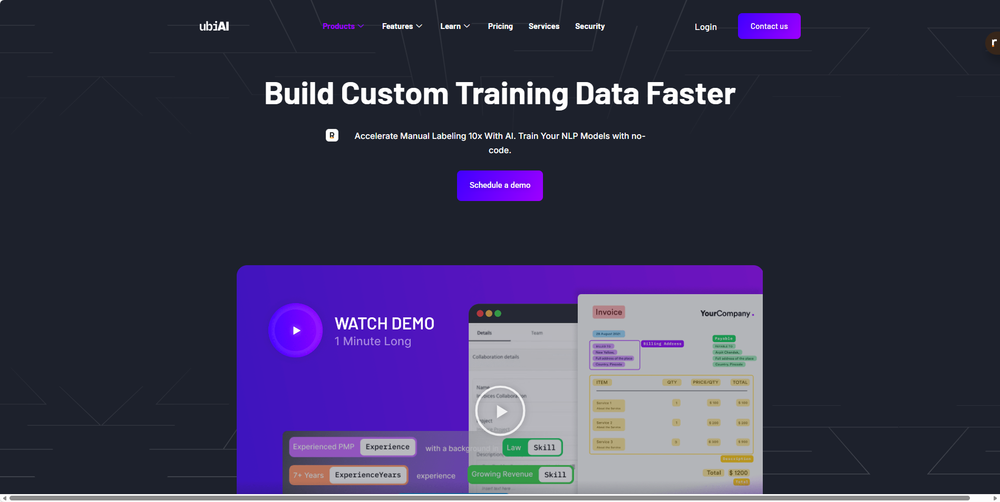
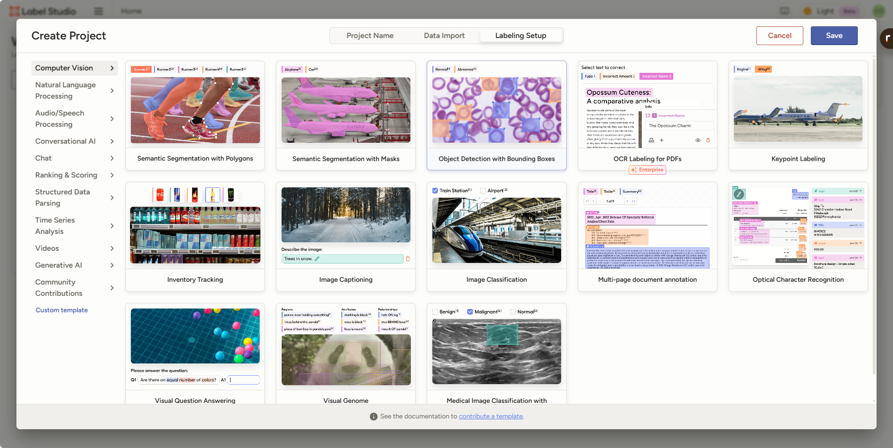
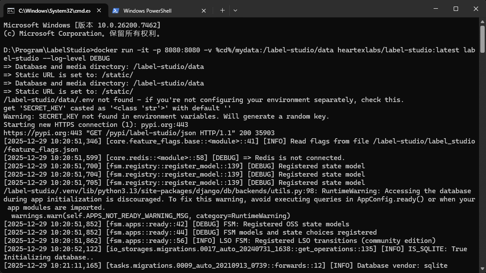

## ubiai




## LabelStudio



### install

```sh
docker run -it -p 8080:8080 -v %cd%/mydata:/label-studio/data heartexlabs/label-studio:latest label-studio --log-level DEBUG
```

-v %cd%/mydata:/label-studio/data
    挂载本地目录到容器中，实现数据持久化。
    %cd%：这是 Windows 命令行中的变量，表示当前目录（在 Linux/macOS 中应写作 $(pwd)）。
    所以 %cd%/mydata 指的是你当前文件夹下的 mydata 子目录。
    它被挂载到容器内的 /label-studio/data 路径。

