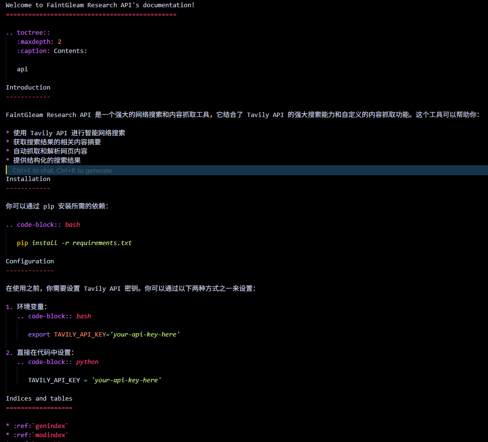
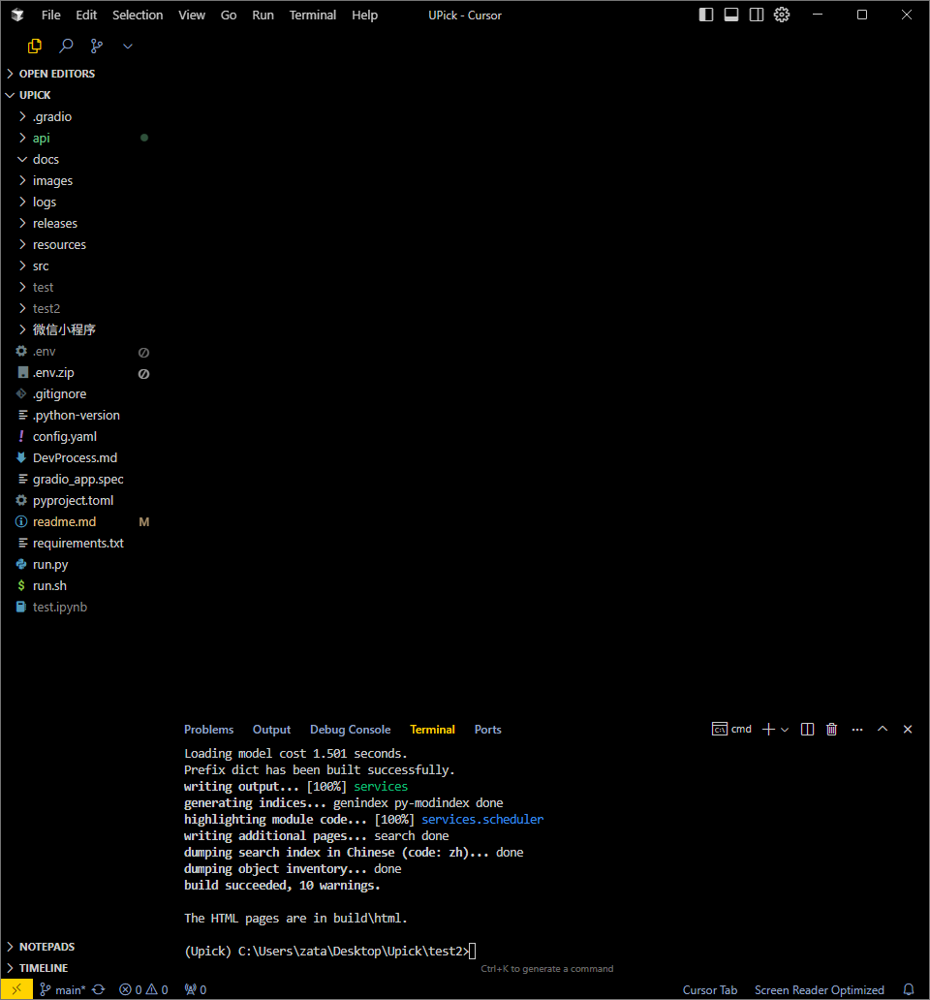
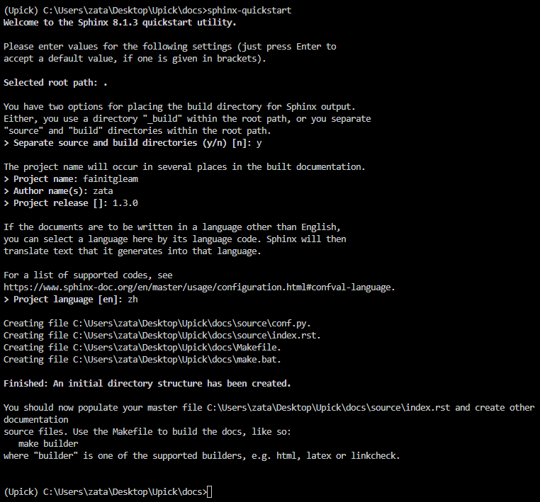
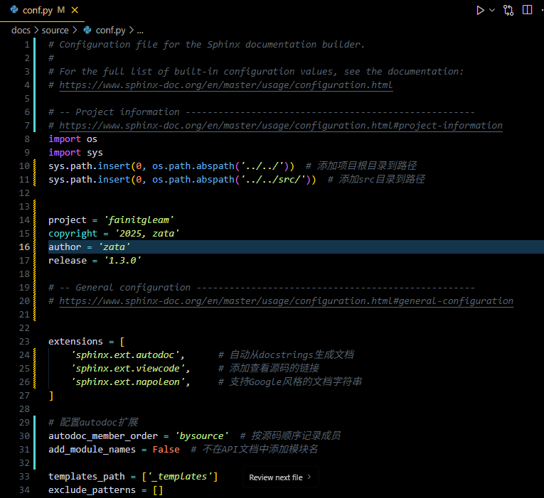
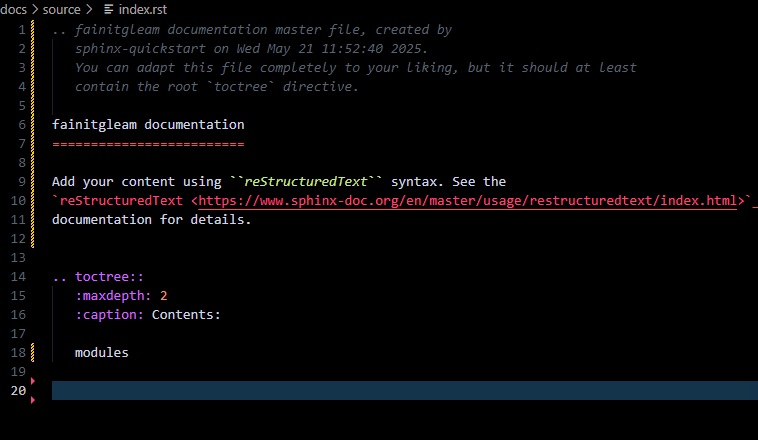
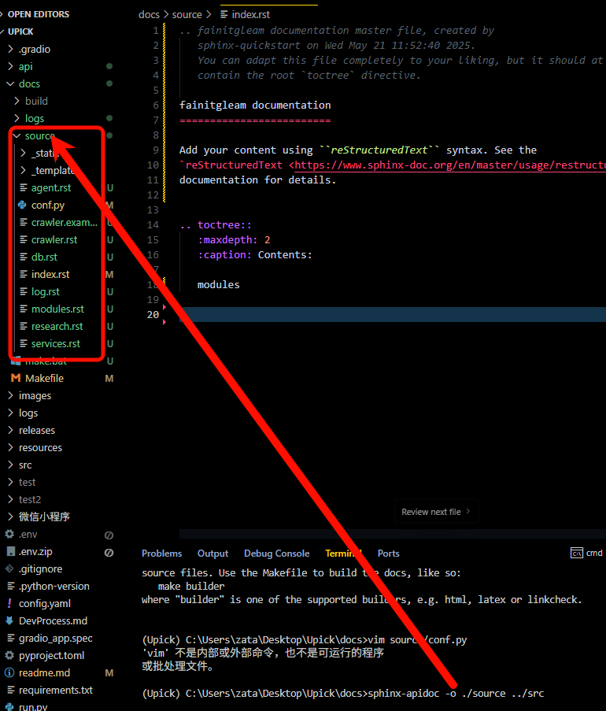
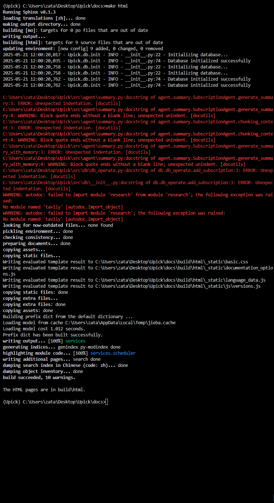
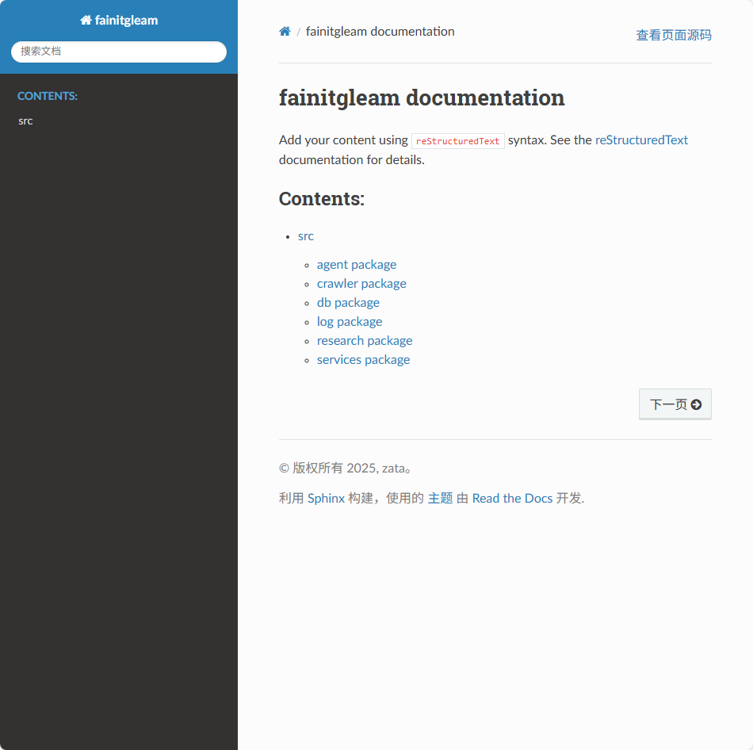
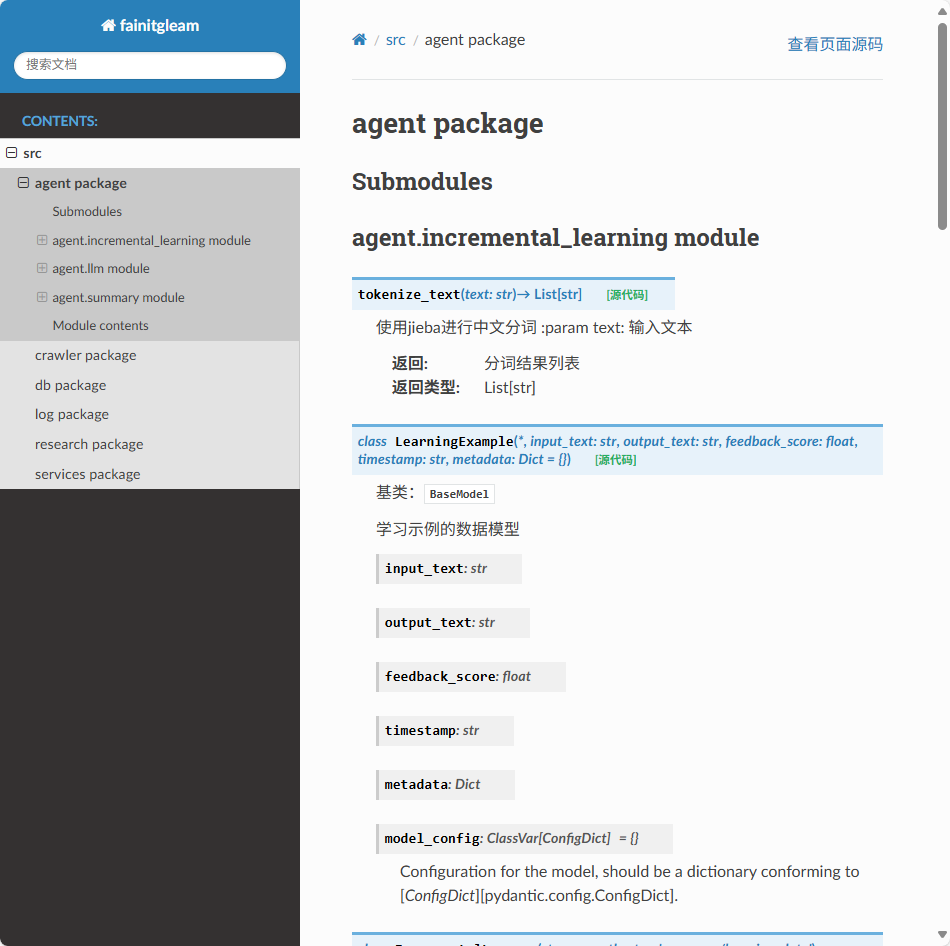
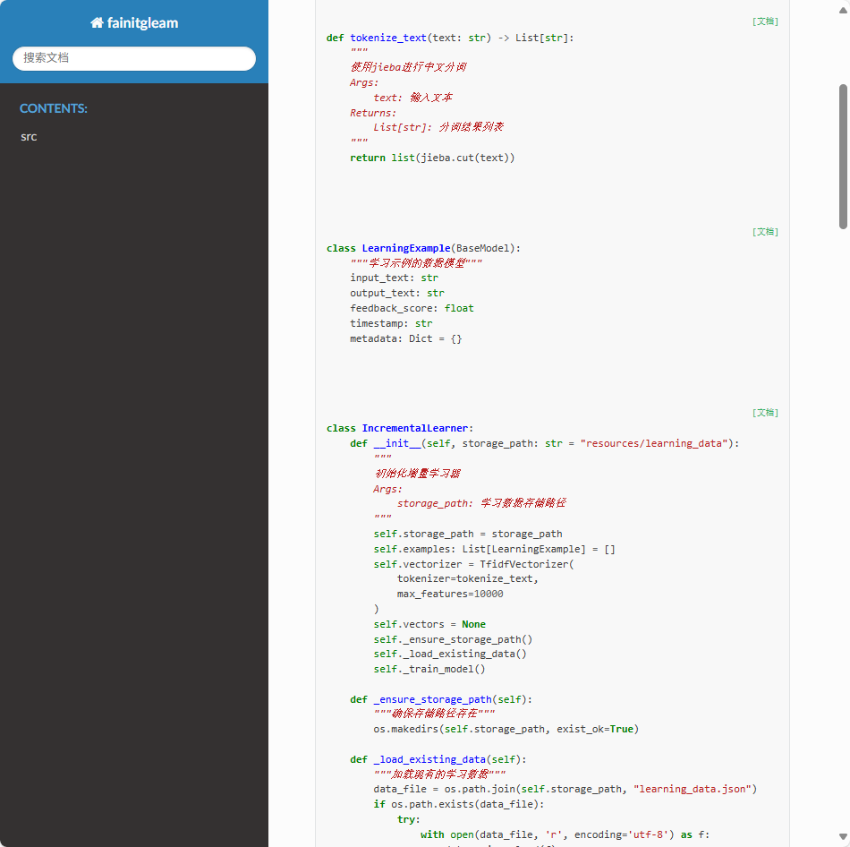

## api文档的必要性

虽然我一直在写python项目，也并没有前后端的区别，但是随着项目越变越大，越发感觉没有api文档，对于我的回顾来说是非常麻烦的，因此还是需要一个用于生成api的python插件或者说一个用于书写api文档的在线或离线工具，之前是有用过Sphinx来自动生成api文档，但是感觉存在使用太麻烦的问题，如果是小项目，可能配置都感觉很麻烦，书写格式，似乎有md格式可以使用，但是我还没有去尝试，使用了它默认的格式，头都昏了




## 那些api文档工具可以使用

我只是做了简单的了解，太具体的深度还没有做。

1. Sphinx 也就是我上面说到了，我只使用了python版本的，感觉并不是特别好用的
2. MkDocs 这个是一个比较新的框架，也是比较现代的版本
2. fastopenapi 这个是专门用于生成fastapi后端的项目[项目地址](https://github.com/mr-fatalyst/fastopenapi)


## 具体工具使用

### Sphinx

以我的fainigleam项目为例


```bash 
mkdir docs && cd docs

sphinx-quickstart  # 第一个选y，后面看着填

vim source/conf.py  # 具体怎么改看下面

vim source/index.rst  # 具体怎么改看下面

sphinx-apidoc -o ./source ../src

make html

```


1. 创建docs文件夹，并cd进去


2.sphinx-quickstart


3.修改 `source/conf.py`文件

```py
# conf.py
import os
import sys
sys.path.insert(0, os.path.abspath('../../'))  # 添加项目根目录到路径
sys.path.insert(0, os.path.abspath('../../src/'))  # 添加src目录到路径


#######################################
project = 'XXXXX'
copyright = 'XXXXXX'
author = 'XXXXX'
release = 'X.X.X'
#######################################


extensions = [
    'sphinx.ext.autodoc',      # 自动从docstrings生成文档
    'sphinx.ext.viewcode',     # 添加查看源码的链接
    'sphinx.ext.napoleon',     # 支持Google风格的文档字符串
]

# 配置autodoc扩展
autodoc_member_order = 'bysource'  # 按源码顺序记录成员
add_module_names = False  # 不在API文档中添加模块名

templates_path = ['_templates']
exclude_patterns = []

language = 'zh'


html_theme = 'sphinx_rtd_theme'  # 使用ReadTheDocs主题
html_static_path = ['_static']

```




4. 修改 `source/index.rst`文件

```rst
########################################################
fainitgleam documentation
=============
.. toctree::
   :maxdepth: 2
   :caption: Contents:
#########################################################

# 前面都不变的，就这里增加一个modules
   modules
   
```




5. 执行
    ```
    sphinx-apidoc -o ./source ../src
    ```
    


6. make html




7.就可以打开静态页面查看了






### MkDocs 

在为Python项目选择一个可以长期使用的文档工具时，我们追求的是**易用性**、**专业外观**和**强大功能**的最佳平衡。综合考量，2025年的最佳选择是 **MkDocs** 配合 **Material for MkDocs** 主题及 **mkdocstrings** 插件。这个组合将成为你未来所有项目的首选。

#### 为什么是这个组合？

  * **现代且极其易用**：你只需使用最熟悉的 **Markdown** 语言来编写文档，几乎没有学习成本。通过`mkdocs serve`命令即可开启实时预览，大大提升了编写效率和体验。
  * **专业且外观精美**：**Material for MkDocs** 是一个功能极其强大的主题，能让你用最简单的配置，生成世界级的、响应式的现代化文档网站。内置搜索、深/浅色模式切换、代码高亮等功能一应俱全。
  * **功能强大，足以应对未来需求**：通过 **mkdocstrings** 插件，它可以直接读取你代码中的文档字符串（docstrings），自动生成清晰、美观的API参考文档，完美解决了API文档的需求。

简单来说，这个组合让你用最简单的方式，获得专业级的输出，是兼顾了现在与未来的理想选择。

#### 快速上手指南

只需四步，即可搭建并运行你的专业文档网站。

**1. 安装必要的库**

在你的终端中运行以下命令：

```bash
pip install mkdocs mkdocs-material mkdocstrings-python
```

**2. 创建新项目** （如果还没有软件项目）

```bash
mkdocs new my-project
cd my-project
```

**如果已有软件项目**

```bash
# 创建 docs 文件夹，用于存放所有 .md 文档文件
mkdir docs

# 创建 mkdocs.yml 配置文件，它将位于项目根目录
touch mkdocs.yml

# 创建一个首页文档
touch docs/index.md
```

这会创建一个名为 `my-project` 的新目录，包含一个基础的 `mkdocs.yml` 配置文件和一个 `docs` 目录（用于存放你的Markdown文档）。

**3. 配置 `mkdocs.yml` 文件**

这是最关键的一步。用以下内容替换 `mkdocs.yml` 文件的全部内容，这是一个包含了主题、API文档生成和中文支持的黄金配置：

```yaml
# 网站名称
site_name: "我的项目名称"
site_description: "项目的简短描述"

# 主题配置
theme:
  name: material
  language: zh # 设置语言为中文
  features:
    - navigation.tabs # 导航栏使用标签页
    - navigation.sections # 左侧导航支持章节收起
    - content.code.copy # 代码块支持一键复制
    - content.code.annotate # 支持代码块注释
    - search.suggest # 搜索时提供建议
    - search.highlight # 高亮搜索结果
  palette: # 调色盘，用于实现深/浅色模式切换
    - scheme: default
      toggle:
        icon: material/brightness-7
        name: 切换到深色模式
    - scheme: slate
      toggle:
        icon: material/brightness-4
        name: 切换到浅色模式

# 插件配置
plugins:
  - search # 内置搜索插件
  - mkdocstrings: # API文档生成插件
      handlers:
        python: # 指定处理Python代码
          options:
            show_root_heading: true # 为模块显示一个顶层标题

# 导航栏配置
nav:
  - 首页: index.md
  - API 参考:
    - '模块A': 'api/module_a.md'
    - '模块B': 'api/module_b.md'
  - 指南:
    - '安装指南': 'guides/installation.md'
```

**4. 编写内容并运行**

  * 在 `docs/` 目录下创建和编辑你的 `.md` 文件。

  * 例如，在 `docs/api/module_a.md` 文件中，你只需写入以下一行代码，`mkdocstrings`就会自动为你生成整个模块的API文档：

    ```markdown
    ::: my_project.module_a
    ```

    (请将 `my_project.module_a` 替换为你的实际Python模块路径)

  * 在项目根目录下运行服务：

    ```bash
    mkdocs serve
    ```

现在，打开浏览器访问 `http://127.0.0.1:8000`，即可看到你专业、美观且功能强大的文档网站。

#### 其他选择（何时考虑？）

  * **Sphinx**：当你需要为一个极其庞大、复杂的传统开源库（如Python官方文档本身）构建文档，且需要PDF/ePub等多种输出格式时，可以考虑它。但请准备好应对其更陡峭的学习曲线（reStructuredText语法）。
  * **pdoc**：当你的需求**仅仅**是快速、零配置地从代码生成一个纯API参考页面，而不需要任何额外的教程或指南时，pdoc是一个轻量级的选择。