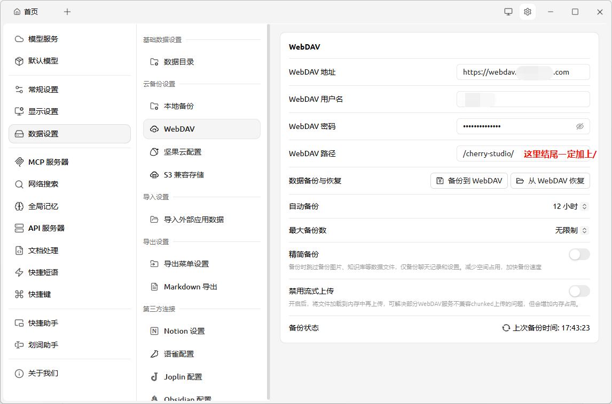

# Cherry Studio 详细使用教程

Cherry Studio 是一款备受推崇的桌面端跨平台 AI 客户端，被誉为"AI 领域的瑞士军刀”[1]。它本身不提供大模型算力，而是作为一个统一的图形界面，让你能够将各大云端 API（如 DeepSeek、OpenAI、Claude、Gemini）以及本地模型（如 Ollama）汇聚在一起使用 [1]。

它主打隐私安全（数据保存在本地）、多模型对比、内置 300+ 智能助手以及强大的**知识库和代码助手（Code Agent）**功能 [2][3][4][5]。

以下是一份从零开始的 Cherry Studio 详细使用教程：

**第一步：下载与安装**

- **支持系统**：Windows (64 位)、macOS (10.15+)、Linux[1][6]。
- **下载途径**：
    - 前往官方网站 ([cherry-ai.com](https://cherry-ai.com)) 或 GitHub 仓库 ([CherryHQ/cherry-studio](https://github.com/CherryHQ/cherry-studio)) 的 Releases 页面下载对应的安装包 [3][6][7]。
- **安装**：双击下载的安装包，按提示“下一步”即可完成，开箱即用 [6]。

**第二步：核心配置——接入 AI 模型**

因为 Cherry Studio 是一个“客户端”，你需要为它配置 API 密钥（API Key）或连接本地模型才能开始对话 [6][8]。

1. **接入云端模型（以 DeepSeek 或第三方 API 为例）**
    如果你有官方的 API Key，或者使用中转平台（如硅基流动、海鲸 AI 等）的 API：
    - 打开 Cherry Studio，点击左下角的“设置”（齿轮图标 ⚙️）[6][9]。
    - 在左侧菜单中选择“模型服务” (Providers)[9]。
    - 你会看到许多内置的服务商列表。你可以直接点击对应的服务商（如 OpenAI、Anthropic），或者点击“添加”创建一个**“自定义服务商” (Custom)**[9]。
    - **填写关键参数**（以自定义 OpenAI 兼容接口为例）：
        - **API 地址 (Base URL)**：填入服务商提供的地址（例如 `https://api.deepseek.com/v1` 或你的中转 API 地址）。注意通常需以 `/v1` 结尾。
        - **API 密钥 (API Key)**：填入你的 `sk-xxxxxx` 密钥 [9]。
    - **添加模型**：
        - 在配置界面的下方，找到“模型列表”或“管理模型”[6]。
        - 手动输入需要使用的模型 ID（例如 `deepseek-chat`, `gpt-4o`, `claude-3-5-sonnet`），点击添加或回车 [6][9]。
        - 勾选这些模型使其生效，并可以将最常用的设为“默认模型”[6]。

2. **接入本地模型（通过 Ollama 或 LM Studio）**
    如果你的电脑配置较好，想免费且断网使用 AI：
    - 确保电脑上已安装并运行 Ollama，并且已经拉取了模型（如 `ollama run qwen2.5`）。
    - 在 Cherry Studio 设置 -> 模型服务中，找到 Ollama。
    - 默认 API 地址通常为 `http://127.0.0.1:11434`。
    - 软件会自动拉取你本地已安装的模型列表，勾选即可使用 [4][6]。

**第三步：日常基础使用**

1. **基础对话与多模型同开（对比模式）**
    - **基础对话**：回到主界面，点击左侧导航栏的“聊天”图标，在顶部下拉菜单选择你刚才配置好的模型，即可在下方输入框提问。
    - **多模型同开（强烈推荐）**：如果你想看同一问题不同 AI 的回答哪个更好。在聊天界面，点击聊天框顶部的"+"号或模型图标，可以同时勾选 2 个或更多的模型（比如同时勾选 GPT-4o 和 Claude 3.5）。发送一句话，屏幕会分栏同时展示不同模型的回答 [1][6][7]。

2. **文件解析与多模态对话**
    - 如果你选择的模型支持多模态（如 `gpt-4o` 或 `claude-3-5-sonnet` 等），你可以直接将 PDF、Word、Excel 文档或图片拖拽到输入框中 [3][6]。
    - 软件会自动解析文档内容，你可以针对文档进行提问、总结和提取信息 [3][6]。

3. **使用内置的 300+ 智能助手（Agent）**
    - 不想每次都写长长的 Prompt（提示词）？
    - 点击左侧导航栏的“助手” (Assistants/Agents) 模块 [8]。
    - 里面内置了涵盖编程、写作、翻译、学术、营销等领域的 300 多种设定好的助手 [4]。
    - 找到你需要的助手（例如“小红书爆款文案生成器”或"Python 专家”），点击它并选择对应的运行模型，即可直接进入专用对话流 [4]。
    - **自定义助手**：你也可以点击“新建助手”，输入你自己的系统提示词（System Prompt），为其设置特定图标并保存，打造专属助理 [6][7]。

**第四步：进阶功能探索**

1. **构建个人本地知识库 (Knowledge Base)**
    Cherry Studio 最受欢迎的特性之一是其本地知识库功能，适合处理超大型私人文档集，不会把你的机密数据随意传给第三方云端：
    - 在左侧菜单找到“知识库”[2][9]。
    - 新建一个知识库，选择一个用于进行向量化的 Embedding 模型（通常各 API 服务商都有提供，如 OpenAI 的 `text-embedding-3-small`）。
    - 导入你的文件夹、PDF 论文库或纯文本 [2]。
    - 处理完成后，在聊天界面可以关联该知识库，AI 的回答就会基于你的文档进行检索和生成，实现完美的私有知识问答 [2][9]。

2. **Code Tools（AI 编程助手 Agent）**
    自 1.5.7 版本起，Cherry Studio 深度整合了 AI 程序员工具：
    - 点击界面左侧或顶部的"Code Tool"[5]。
    - 你可以在这里直接调用像 Claude Code、Gemini CLI、Qwen Code 等原生终端 AI 编程工具 [5]。
    - 指定你的本地代码项目文件夹，授予权限后，AI 可以直接读取你的项目代码，甚至帮你自动修改文件和执行终端命令（相当于拥有了类似 Cursor 的项目级编辑能力）[5]。

3. **MCP 服务器接入 (Model Context Protocol)**
    MCP 是一种让大模型能够使用外部工具的协议。
    - 在设置中找到 MCP 服务器 [9]。
    - 你可以配置并启动不同的 MCP 插件，比如让 AI 具备联网搜索网页、查询本地数据库、或者调用外部 API 的能力 [9]。

4. **WebDAV 云端同步与备份**
    因为 Cherry Studio 是本地客户端，更换电脑时聊天记录不在云端。
    - 在“设置 -> 数据同步”中，你可以配置 WebDAV（如坚果云，或自带 NAS 的 WebDAV）。配置后，你的所有配置、助手和聊天记录都可以安全地加密备份并多端同步 [6]。

**💡 实用小贴士 (Tips)**

- **显示 Token 消耗**：在“设置 -> 界面/显示”中，可以开启“显示预估 Token 数”，这能帮你清楚地知道每次提问花费了多少 API 额度 [8]。
- **快捷唤醒全局搜索**：可以使用快捷键唤出全局搜索或全局翻译小窗口，不打断你当前在其他软件（如浏览器、Word）中的工作流 [3]。
- **快捷键换行**：通常 Enter 是发送，Shift + Enter 是换行（可在设置中修改）。

**总结**

Cherry Studio 的使用逻辑是：“下载软件” -> “填好 API Key" -> “选择模型开始聊天或建知识库”[6][8]。当你把基础配置跑通后，它将是你提高生产力的最强桌面工具 [7][9]。

**资料来源**

- help
- skywork.ai
- jimmysong.io
- cherry-ai.com
- medium.com
- cherry-ai.com
- github.io
- github.com
- wanjiedata.com
- atalk-ai.com

## 注意事项

