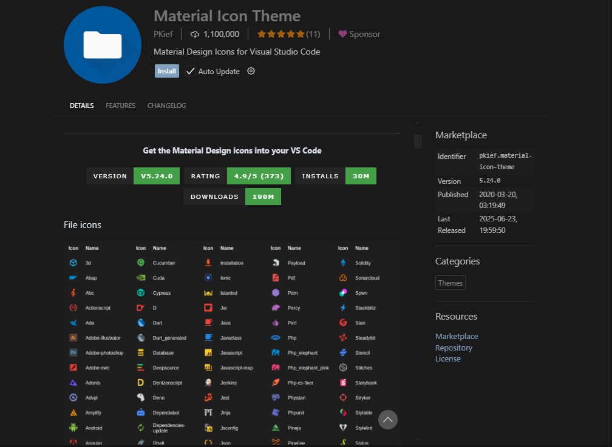
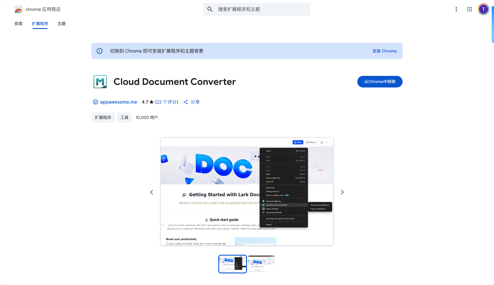
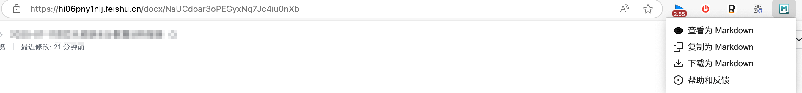
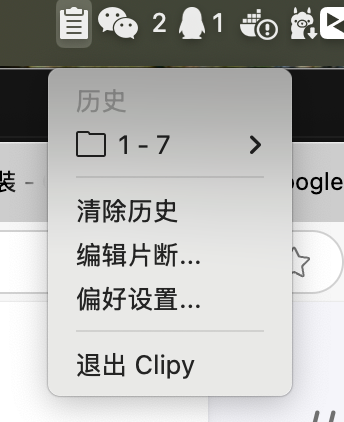

### IDE插件

#### Material Icon Theme  好看的图标主题




### 浏览器插件

#### 飞书文档下载为md文件 Cloud Document Converter



注意：只能下载飞书文档，飞书表格不行


### macOS 工具

#### Clipy - 剪贴板管理器
**官网：** https://clipy-app.com/



免费开源的 macOS 剪贴板历史管理工具，支持：
- 📋 自动保存剪贴板历史记录
- ✂️ 快捷文本片段管理
- ⌨️ 快捷键快速访问（默认 `⌘ + Shift + V`）
- 🖼️ 支持文本和图像格式

**安装方式：**
```bash
brew install --cask clipy
```

**使用场景：** 开发者复制代码片段、办公人员管理常用文本、提高复制粘贴效率