参考：
https://blog.csdn.net/weixin_46474921/article/details/132841711

## 安装及设置

### 1. 下载安装

[VScode官网](https://code.visualstudio.com/)
注意，这一步最好全部打勾


### 2. 设置默认terminal为cmd


### 自动fetch远程分支

Git 默认不会自动从远程拉取状态更新。只有当你显式运行 `git fetch` 或 `git pull` 时，本地仓库才会更新远程分支引用。如果你希望在 VS Code / Cursor 中自动感知远程分支变化，需要开启自动 fetch：

**设置路径**：`Settings` → 搜索 `git.autofetch` → 勾选启用

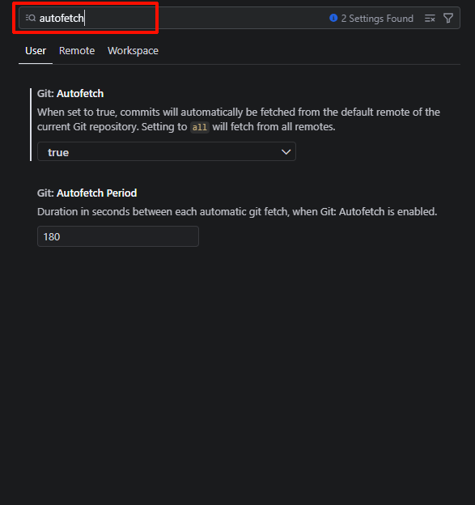

建议同时设置自动 fetch 间隔（默认 3 分钟）：

```json
{
  "git.autofetch": true,
  "git.autofetchPeriod": 180
}
```

**注意**：如果仓库的 remote 名不是默认的 `origin`，VS Code 的 Git 插件和 GitHub Pull Requests 插件可能无法正确识别上下文。需要在 `settings.json` 中显式配置：

```json
{
  "githubPullRequests.remotes": ["zata", "origin", "upstream"]
}
```

配置完成后执行 `Cmd+Shift+P` → `Developer: Reload Window` 生效。

### 设置文件自动保存

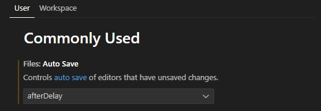

### vscode右侧的预览窗口设置

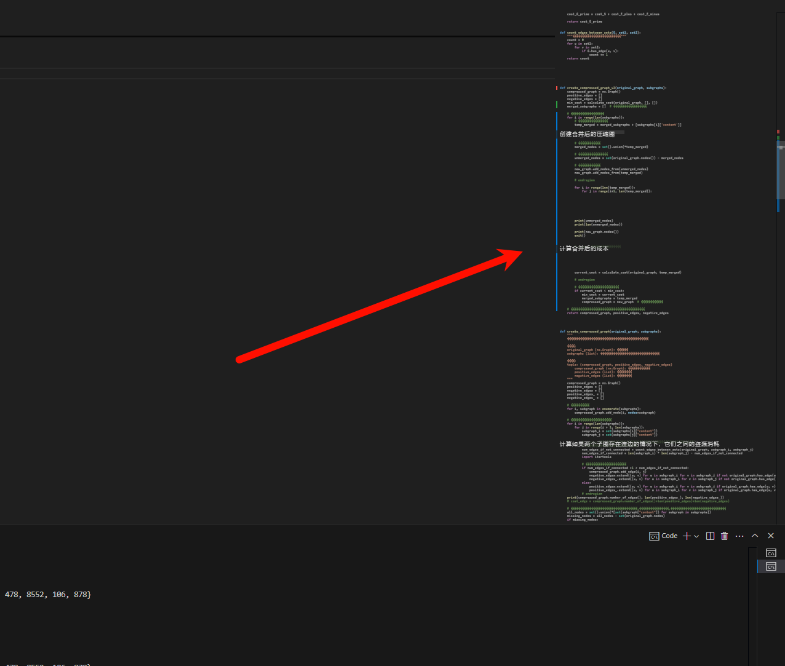

设置方法，在设置里面搜索minimap


### vscode写markdown插入图片时放在指定目录

参考 https://juejin.cn/post/7244809769794289721

打开粘贴选项

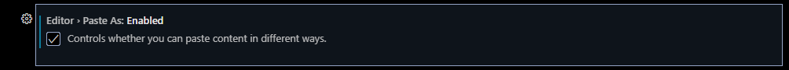


```bash
**/*.md      images/${documentDirName}/${fileName}   # 以原始文件名放到 ./assets/<md文件名>/<图片文件名>
**/*.md      images/${documentBaseName}/${documentBaseName}.${fileExtName}   # 重新以md文件名命名图片名
**/*.md      images/${documentBaseName}/image.${fileExtName}   # 以image.png重命名放到images/文件名    文件夹下
```

### vscode折叠代码 ctrl+k ctrl+0


### Diff Editor settings

1. 取消相同的代码被折叠

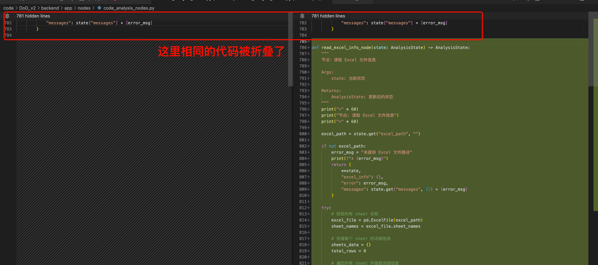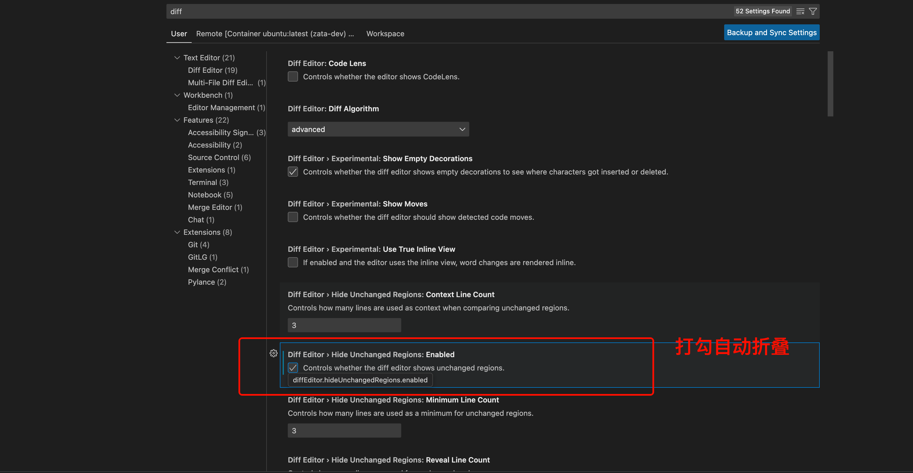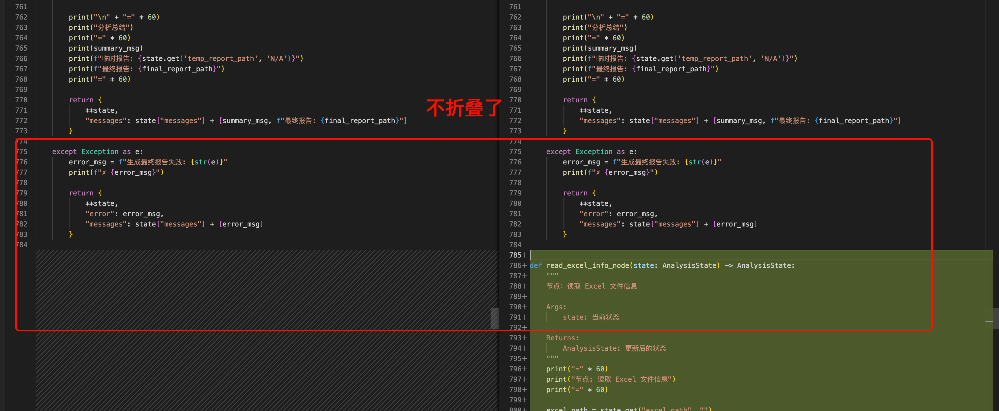

2. diff 双栏变一栏

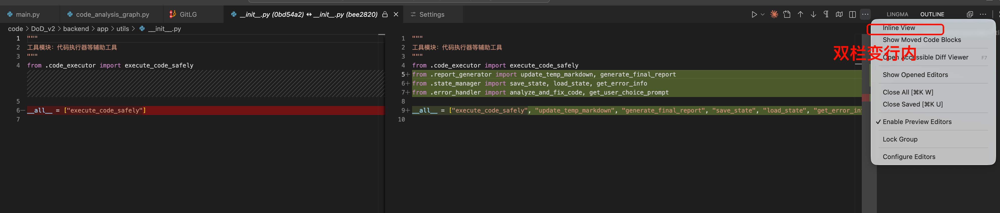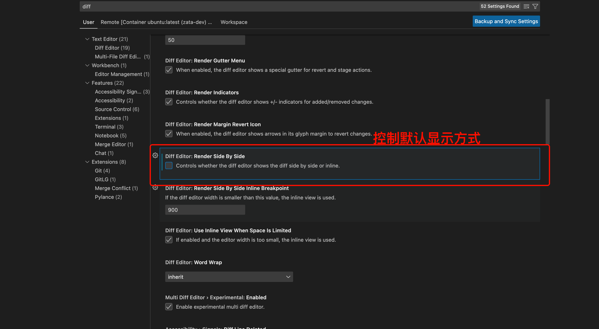

---

---

---

## vscode 插件

```json
GitLG
Office Viewer
Markdown Preview Mermaid Support
```


1. GitLG
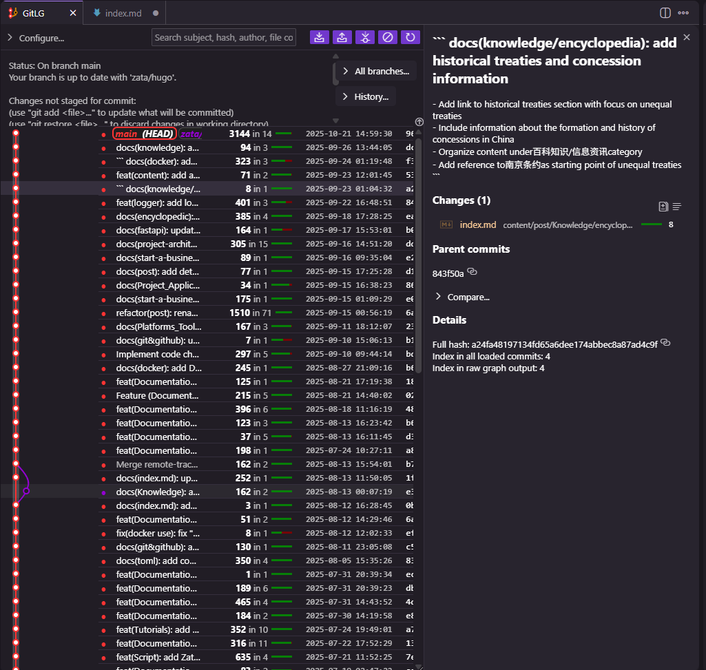

2. office viewer
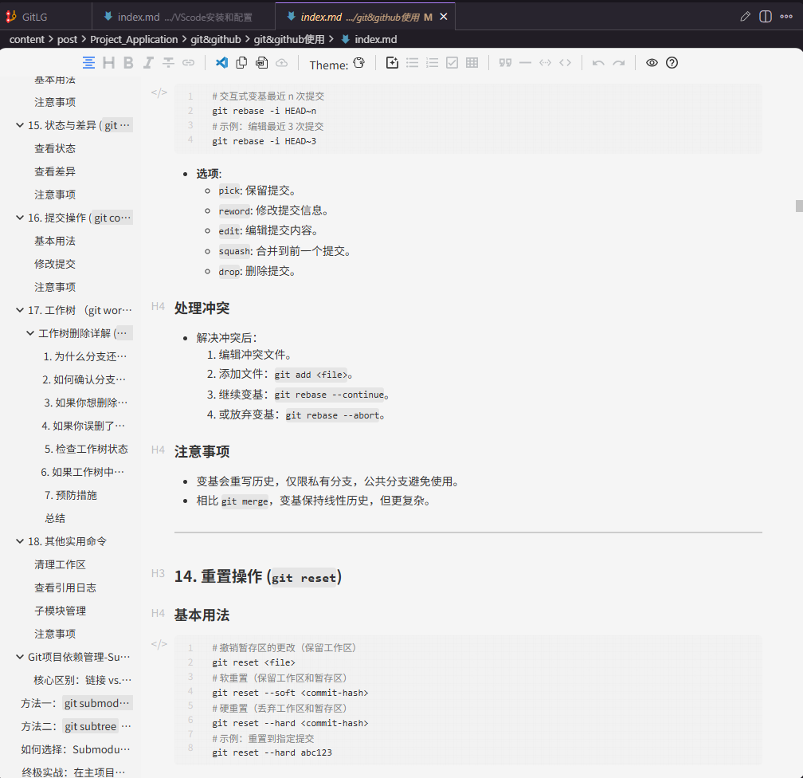

`但是有一个非常严重的问题，就是说如果安装了office viewer 会导致vscode自己的image paste失效`

不过我发现一个解决方案，就是改下配置，然后不要用ctrl+v粘贴，而是用鼠标右键然后paste
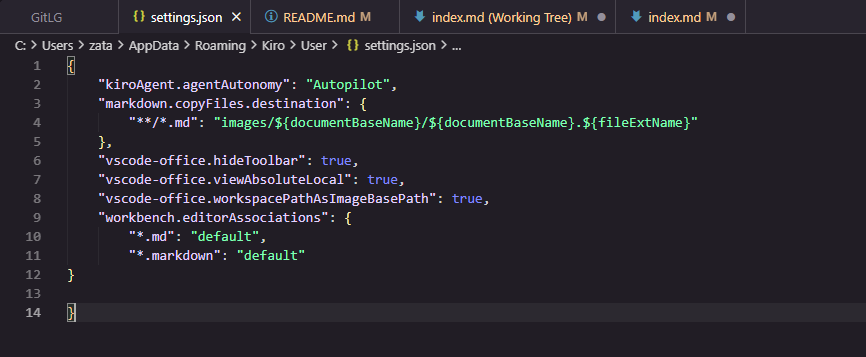  
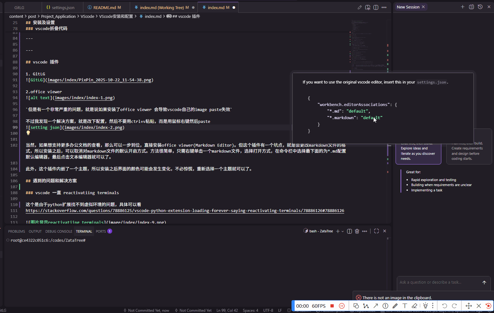

当然，如果想支持更多办公文档的查看，那么可以一步到位，直接安装office viewer(Markdown Editor)。但这个插件有一个坑点，就是会更改markdown文件的格式，所以安装之后，可以取消对markdown文件的默认开启方式。方法很简单，只需右键单击一个markdown文件，选择打开方式，在命令栏中选择最下面的为*.md配置默认编辑器，最后点击文本编辑器就可以了。

此外，这个插件内嵌了一个主题，所以安装之后界面的颜色可能会发生变化，不必惊慌，重新选择一个主题就可以了。

3. Markdown Preview Mermaid Support（作者：Matt Bierner）
特点：这是下载量最高、最基础的 Mermaid 插件。安装后，它会无缝集成到 VS Code 原生的 Markdown 预览功能中。
用法：在 .md 文件中输入 ```mermaid 代码块，然后点击 VS Code 右上角的“预览”按钮（或快捷键 Ctrl+Shift+V / Cmd+Shift+V），就能直接在右侧看到渲染出的图表。

## 遇到的问题和解决方案

### vscode 一直 reactivatiing terminals

这个是由于python扩展找不到虚拟环境的问题，具体可以看
https://stackoverflow.com/questions/78886125/vscode-python-extension-loading-forever-saying-reactivating-terminals/78886126#78886126

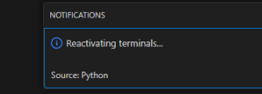

我的解决方法是把python Locator换成js


### 安装工具包之后，桌面cmd窗口可用，但是vscode/cursor不可用

cmd加载成功，但是 cursor ternimal没有生效。
解决办法：完全退出cursor，然后重启cursor

### GitHub Pull Requests 插件一直 Loading

现象：安装 `GitHub Pull Requests and Issues` 插件后，VS Code 侧边栏一直处于 loading 状态，无法正常显示当前仓库的 PR。

优先检查三个点：

```bash
git remote -v
gh auth status
gh pr list --repo OWNER/REPO --state all --limit 10
```

这次遇到的原因是仓库 remote 名不是默认的 `origin`，而是自定义的 `zata`。VS Code 的 GitHub PR 插件默认主要识别 `origin` 和 `upstream`，如果仓库使用了其他 remote 名，插件可能找不到 GitHub 仓库上下文，于是一直 loading。

解决方法：在 VS Code 的 `settings.json` 中显式配置插件要识别的 remote 名：

```json
"githubPullRequests.remotes": [
  "zata",
  "origin",
  "upstream"
]
```

然后执行：

```text
Cmd+Shift+P
Developer: Reload Window
```

如果还是 loading，打开下面这个输出面板看具体报错：

```text
View -> Output -> GitHub Pull Requests
```

另外要注意：如果 PR 已经 merge，插件的 open PR 列表里可能不会显示。可以用命令确认：

```bash
gh pr list --repo OWNER/REPO --state all --limit 10
gh pr view PR_NUMBER --repo OWNER/REPO
```
