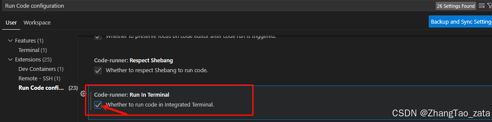
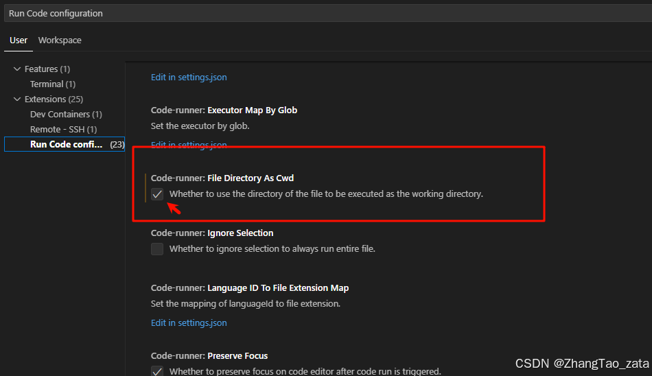

参考：
https://blog.csdn.net/weixin_46474921/article/details/132841711

## 安装及设置

### 1. 下载安装

[VScode官网](https://code.visualstudio.com/)
注意，这一步最好全部打勾


### 2. 设置默认terminal为cmd


### 3. 修改Code Runner 的配置（右键运行）

`首先你要安装好Code Runner 插件`

- 修改点击右键运行时的运行环境，改为终端运行



- 修改右键运行时工作路径



4. 设置文件自动保存


### vscode右侧的预览窗口设置


设置方法，在设置里面搜索minimap


### vscode写markdown插入图片时放在指定目录

参考 https://juejin.cn/post/7244809769794289721

打开粘贴选项


```bash
**/*.md      images/${documentDirName}/${fileName}   # 以原始文件名放到 ./assets/<md文件名>/<图片文件名>
**/*.md      images/${documentBaseName}/${documentBaseName}.${fileExtName}   # 重新以md文件名命名图片名
**/*.md      images/${documentBaseName}/image.${fileExtName}   # 以image.png重命名放到images/文件名    文件夹下
```

### vscode折叠代码 ctrl+k ctrl+0


### Diff Editor settings

1. 取消相同的代码被折叠


2. diff 双栏变一栏


---

---

---

## vscode 插件

1. GitLG


2.office viewer


`但是有一个非常严重的问题，就是说如果安装了office viewer 会导致vscode自己的image paste失效`

不过我发现一个解决方案，就是改下配置，然后不要用ctrl+v粘贴，而是用鼠标右键然后paste
  


当然，如果想支持更多办公文档的查看，那么可以一步到位，直接安装office viewer(Markdown Editor)。但这个插件有一个坑点，就是会更改markdown文件的格式，所以安装之后，可以取消对markdown文件的默认开启方式。方法很简单，只需右键单击一个markdown文件，选择打开方式，在命令栏中选择最下面的为*.md配置默认编辑器，最后点击文本编辑器就可以了。

此外，这个插件内嵌了一个主题，所以安装之后界面的颜色可能会发生变化，不必惊慌，重新选择一个主题就可以了。

## 遇到的问题和解决方案

### vscode 一直 reactivatiing terminals

这个是由于python扩展找不到虚拟环境的问题，具体可以看
https://stackoverflow.com/questions/78886125/vscode-python-extension-loading-forever-saying-reactivating-terminals/78886126#78886126


我的解决方法是把python Locator换成js


### 安装工具包之后，桌面cmd窗口可用，但是vscode/cursor不可用

cmd加载成功，但是 cursor ternimal没有生效。
解决办法：完全退出cursor，然后重启cursor
