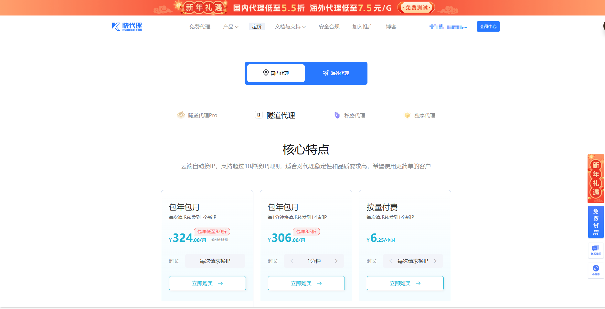

## 参考资料

[知乎-爬虫代理商](https://zhuanlan.zhihu.com/p/33576641)


## 代理商
### 快代理

  注册了没一会之后，有客服打电话进来


### 亮数据

[亮数据](https://www.bright.cn/pricing/web-scraper)


## 使用自己的VPN去做代理


 使用 Clash 实现爬虫 IP 自动旋转教程

本教程基于 Clash（Clash for Windows / Clash Verge 等）客户端，教你如何利用 Clash 的多个节点实现爬虫时的 IP 自动旋转，避免单个 IP 被目标网站封禁。适合中小规模爬虫，节点越多旋转效果越好。

 前提条件
- 已安装 Clash 客户端（如 Clash Verge、Clash for Windows）
- 有机场订阅，包含多个可用节点（节点越多越好，至少 10+ 个才能有效旋转）
- 爬虫代码使用 Python（推荐 requests 或 Scrapy）

 方法一：配置 Proxy Group 实现自动负载均衡（推荐，最简单，无需代码）

这是最简单的方式，利用 Clash 内置的 `load-balance` 策略，让每个请求自动分配到不同节点，实现自然 IP 轮换。

 步骤
1. 打开 Clash 配置文件（config.yaml），找到 `proxy-groups` 部分。
2. 添加或修改一个名为 `AutoRotate` 的组：

```yaml
proxy-groups:
  - name: AutoRotate
    type: load-balance          # 负载均衡，自动轮换节点
    proxies:
      - 节点名称1
      - 节点名称2
      - 节点名称3
      # 将订阅中所有可用节点都列在这里
    strategy: consistent-hashing  # 推荐，同一域名请求尽量保持同一节点（避免 session 问题）
    # strategy: round-robin       # 另一种方式，严格轮询
    url: http://www.gstatic.com/generate_204
    interval: 300                 # 每 5 分钟健康检查一次
    lazy: true                    # 可选，延迟测试
```

3. 将默认流量规则指向这个组（通常修改 `PROXY` 或 `Auto` 组为 `AutoRotate`）：

```yaml
proxy-groups:
  - name: PROXY
    type: select
    proxies:
      - AutoRotate
      # 其他备用组...
```

4. 保存配置，重启 Clash 或刷新订阅。

### 爬虫中使用
在 Python 代码中设置 Clash 的本地代理，所有请求自动走旋转组：

```python
import requests

proxies = {
    "http": "http://127.0.0.1:7890",
    "https": "http://127.0.0.1:7890"
}

# 示例请求
resp = requests.get("https://ipinfo.io/ip", proxies=proxies)
print("当前 IP:", resp.text.strip())
```

优点：零代码维护，Clash 自动剔除坏节点，适合大多数场景。

方法二：通过 Clash API 在代码中强制切换节点（精细控制）

适合想每 N 次请求强制换一次 IP 的场景。

 步骤
1. 在 config.yaml 中启用外部控制 API：

```yaml
external-controller: 127.0.0.1:9090
secret: your_secret_token   # 强烈建议设置密码
```

2. 创建一个 `type: select` 的组（便于 API 切换）：

```yaml
proxy-groups:
  - name: AutoRotate
    type: select
    proxies:
      - 节点1
      - 节点2
      # 所有节点
```

3. Python 代码实现自动切换：

```python
import requests
import random
import time

API_URL = "http://127.0.0.1:9090"
SECRET = "your_secret_token"  # 如果设置了
GROUP_NAME = "AutoRotate"

headers = {"Authorization": f"Bearer {SECRET}"} if SECRET else {}

# 获取所有节点列表
def get_proxies():
    resp = requests.get(f"{API_URL}/proxies", headers=headers)
    return resp.json()["proxies"][GROUP_NAME]["all"]

proxies_list = get_proxies()

# 切换到随机节点
def switch_proxy():
    new_proxy = random.choice(proxies_list)
    requests.put(f"{API_URL}/proxies/{GROUP_NAME}", json={"name": new_proxy}, headers=headers)
    print(f"切换到节点: {new_proxy}")
    time.sleep(2)  # 等待切换生效

# 代理设置
proxies = {"http": "http://127.0.0.1:7890", "https": "http://127.0.0.1:7890"}

# 示例爬虫循环
for i in range(100):
    if i % 10 == 0 and i > 0:  # 每 10 次请求换一次 IP
        switch_proxy()
    
    resp = requests.get("https://example.com", proxies=proxies)
    # 你的爬取逻辑
```

注意事项与最佳实践
- 节点质量很重要：使用有大量住宅/移动节点的机场，避免数据中心节点容易被识别。
- 控制请求频率：加 `time.sleep(random.uniform(1, 5))`，随机 User-Agent。
- 检查当前 IP：访问 https://ipinfo.io/ip 或 http://httpbin.org/ip 验证旋转是否生效。
- 大规模爬虫仍推荐专业住宅代理池（如亮数据、Oxylabs、芝麻代理），Clash 适合中小规模。
- 遵守目标网站 robots.txt 和法律规定，避免恶意爬取。

按照以上步骤配置后，你的爬虫就能自动或手动旋转 IP，大幅降低被封风险。祝爬取顺利！
```
