||
|---|
|- [port 22 无法pull push问题](#git-push-ssh-connect-to-host-githubcom-port-22-connection-timed-out-fatal-could-not)|
|-[windows系统服务器做远程开发的问题](#使用windows系统服务器做远程开发碰到的问题)|
|-[暂存区有文件，想保存到新分支`feature-branch`](#假设你当前在main分支暂存区有文件file1txt和file2txt想保存到新分支feature-branch)|


##  git基本使用
### 简单常用命令

```bash
# 绑定本地分支和远程分支
git branch --set-upstream-to=origin/<远程分支> <本地分支>

%%设置用户签名%%
git config --global user.name [username]      
git config --global user.email [useremail]

%%设置对于非ASCII字符的显示方式%%
git config--global core.quotepath false

%%设置init分支名%%
git config --global init.defaultBranch main

%%初始化本地库%%
git init

%% 设置远端库别名
git remote add <别名> <网址>

%% 查看远端库
git remote -v


%%查看本地库状态%%
git status

%%追踪文件，放入暂存区%%
git add [filename]
git add .  #所有文件放入暂存区
%%撤销追踪%%
git restore 【file】

%%删除暂存区的文件%%
git rm --cache 【filename】

%%提交本地库%%
git commit -m "[提交信息]" 【文件名（可以不加）】

%%撤销commit提交%%
git reset --soft HEAD     


%%推送远程库
git push [<远程主机名>] [<本地分支>:<远程分支>] #如果不加分支对应信息就默认上次记录的全部分支

%%拉取远程库%%
git pull [<远程主机名>] [<远程分支>:<本地分支>]   # 从远程仓库（名为 origin）的 main 分支拉取代码并自动与本地的 main 分支合并 ,如果方括号里面的不加就默认拉去上一次的


%%查看引用日志版本信息%%
git reflog 
%%查看详细日志%%
git log

%%版本穿梭%%  一般用soft多一点
git reset --hard  【版本号】

--.gitignore--------------------
test* 忽略以test开头的文件
```

## 复杂命令

### pull
```bash
git pull origin master --allow-unrelated-histories    # 无视没有共同历史合并  
```

### remote

```bash

# 仓库路径查询
git remote -v

#添加远程仓库：
git remote add <远程仓库名> <你的项目地址> 

#删除指定的远程仓库
git remote rm origin

# 修改远程仓库地址
git remote set-url origin <remote-url>


```


### branch 

```bash
# 创建分支
git branch <分支名>

# 创建一个空白分支
git checkout --orphan <分支名>

# 重命名分支
​ git branch -m oldName newName

#删除已经合并到其他分支的分支
git branch -d <分支名>
#删除未合并到其他分支的分支     注意  ： 一个d一个是D
git branch -D <分支名>

---
# 2、 远程分支重命名
# 重命名远程分支对应的本地分支
git branch -m oldName newName
#删除远程分支
git push --delete origin oldName
#上传新命名的本地分支
git push origin newName
#把修改的本地分支与远程分支关联
git branch --set-upstream-to origin/newName
---


#3、查看当前代码仓库源
#查看当前源
git remote -v

#重设
git remote set-url origin xxxx_url
```


### checkout

```bash
# 切换分支
git checkout <分支名或者commit>
# 从历史commit回到最新commit
git checkout <分支名>
git checkout -f <branch-name> # 如果做了更改但是不想保留
# 创建分支并切换
git checkout -b <分支名>
# 创建一个空白分支
git checkout --orphan <分支名>

```


### bundle  用于备份
https://blog.csdn.net/penriver/article/details/126579266

```bash
# 打包
git bundle create <打包名>.bundle HEAD <分支名>

# 验证文件合法
git bundle verify <打包名>.bundle

# 恢复
git clone <打包名>.bundle

```


### merge 

```bash 
# 合并分支
git merge feature

# 如果是远程分支合并
git merge origin/feature

```

关于merge的详解可见参考[git merge](#git-merge详解)


### tag

```bash
# 创建标签
git tag <tagname>                          # 轻量标签
git tag -a <tagname> -m "<message>"       # 带注释标签
git tag <tagname> <commit-hash>           # 为特定提交打轻量标签
git tag -a <tagname> <commit-hash> -m "<message>" # 为特定提交打注释标签
git tag -s <tagname> -m "<message>"       # 创建带 GPG 签名的标签

# 查看标签
git tag                                   # 列出所有标签
git tag -l                                # 同上
git tag -l "<pattern>"                    # 按模式查找标签（如 v1.*）
git show <tagname>                        # 显示标签详细信息
git tag -v <tagname>                      # 验证签名标签

# 推送标签
git push origin <tagname>                 # 推送单个标签
git push origin --tags                    # 推送所有标签

# 删除标签
git tag -d <tagname>                      # 删除本地标签
git push origin --delete <tagname>        # 删除远程标签

# 切换到标签
git checkout <tagname>                    # 检出标签（进入分离头指针状态）
```


### revert
```bash
# Git revert 使用指导

# 1. 基本概念
# git revert 用于撤销某次提交，创建一个新的提交来抵消指定提交的更改
# 适用于已推送的公共仓库，避免直接修改历史记录

# 2. 基本用法
# 撤销本次提交
git revert HEAD
# 撤销单个提交
git revert <commit-hash>
# 示例：撤销指定的提交
git revert abc123

# 3. 常见选项
# -n 或 --no-commit：执行撤销但不自动提交，需手动 git commit
git revert -n <commit-hash>

# -m 或 --mainline：用于撤销合并提交，指定保留的主线分支（通常 1 或 2）
git revert -m 1 <merge-commit-hash>

# --no-edit：使用默认提交信息，不打开编辑器
git revert --no-edit <commit-hash>

# 4. 撤销连续多个提交
# 撤销一个范围的提交（从 old 到 new，不包括 old）
git revert <old-commit-hash>..<new-commit-hash>
# 示例：撤销 abc123 到 def456 的提交
git revert abc123..def456

# 5. 处理冲突
# 如果 revert 过程中出现冲突：
# 1) 解决冲突
# 2) 添加解决后的文件：git add <file>
# 3) 继续 revert：git revert --continue
# 4) 或放弃 revert：git revert --abort

# 6. 注意事项
# - revert 不会修改历史记录，而是创建新提交
# - 适合公共仓库，保持历史完整性
# - 如果需要彻底删除提交，使用 git reset（谨慎，私有仓库适用）
# - 撤销合并提交时，需明确主线分支 (-m 选项)

# 7. 示例工作流
# 查看提交历史
git log --oneline
# 找到要撤销的提交：abc123
# 执行撤销
git revert abc123
# 编辑提交信息或直接提交
git push origin <branch>

# 8. 撤销已经 revert 的提交
# 如果需要恢复被 revert 的更改，再次 revert 对应的 revert 提交
git revert <revert-commit-hash>
```


### show

```bash
git show                          # 查看当前 HEAD 提交的详细信息
git show <commit-id>              # 查看指定提交的详细信息
git show <commit-id> -- <file-path>  # 查看指定提交中某个文件的变更
git show <branch-name>            # 查看指定分支最新提交的详细信息
git show <tag-name>               # 查看指定标签指向的提交详情
```

### stash   
```bash
git stash                         # 保存当前修改到 stash 栈
git stash push -m "message"       # 保存修改并添加描述
git stash push --include-untracked # 保存修改，包括未跟踪文件
git stash list                    # 查看所有 stash 列表
git stash apply                   # 恢复最新 stash（不删除）
git stash apply stash@{n}         # 恢复指定 stash
git stash pop                     # 恢复最新 stash 并删除
git stash drop stash@{n}          # 删除指定 stash
git stash clear                   # 清空所有 stash
```


## 一些问题解决


### 使用windows系统服务器做远程开发碰到的问题 


- 使用哪个版本的git

    感觉这个没有太大关系，不过后面发现便携版本的git也是可用的，感觉以后可以就使用便携版的，毕竟不需要界面

- 使用windows远程服务器进行git pull总是卡死

    2025年0617，买了一个腾讯云到2h2G服务器，想用来写hugo博客， 但是在pull代码的时候总是卡死，试了很多次，我以为是服务器性能太烂了，最后发现，如果使用http地址pull的话就没有问题。但是后面又发现使用github的http地址的话会存在无法push的情况，所以我最终给出的解决方案就是：使用github的http地址拉取项目，然后使用ssh地址同步
    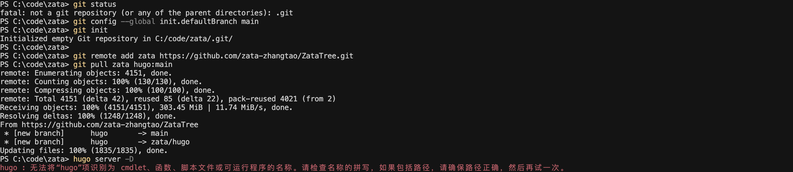


### 如果想要临时查看某次commit时项目的全部代码
```bash
git log --oneline
git checkout <commit哈希值>   # 查看代码
git checkout main  # 返回主分支
```


### 在本地开发环境检查远程是否更新


第一种方法

```sh
git log --oneline --graph --all
```

第二种方法

```sh
# 设置跟踪远程分支
git branch --set-upstream-to=origin/<branch> <branch>  # git branch --set-upstream-to=origin/main main


# 查看是否跟踪
git branch -vv


# 下载数据
git fetch origin

# 查看是否有更新
git status 
```

是否跟踪对比


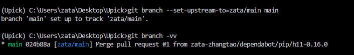


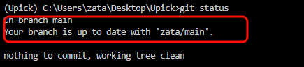

### git clone 远程项目,同步远程项目更新

```sh
git fetch origin #查看远程项目更新
git pull origin 远程分支：本地分支
```


### git 版本标签

1. 什么是版本标签？
标签（Tag） 是 Git 中的一个引用（reference），指向某个特定的提交。
它通常用于标记一个稳定的发布版本，比如 v1 表示第一个正式版本。
在 GitHub 上，标签还会显示在 Releases 页面，便于用户下载或查看。
两种标签类型
轻量标签（Lightweight Tag）：只是一个简单的指针，指向某个提交，不包含额外信息。
附注标签（Annotated Tag）：包含额外元数据（如创建者、日期、描述），更常用于正式发布。

```bash
# 假设你已经完成代码更改并提交
git add .
git commit -m "Finalize version 1.0"

# 创建一个轻量标签（简单标记当前提交）
git tag v1

# 或者创建一个附注标签（带描述信息，推荐用于正式发布）
git tag -a v1 -m "Release version 1.0"

# 查看所有本地标签
git tag

# 推送单个标签到远程仓库（如 GitHub）
git push origin v1

# 或者推送所有标签到远程仓库
git push origin --tags

# （可选）如果需要删除本地标签
git tag -d v1

# （可选）如果需要删除远程标签
git push origin --delete v1
```


### git merge详解


如果没有冲突，Git 会自动完成合并，并创建一个合并提交（merge commit，如果需要的话）。如果有冲突，Git 会暂停合并，提示你解决冲突（后面会讲怎么处理）。

1. 无冲突的合并（Fast-forward）

如果 main 分支没有额外改动，而 feature 分支只是基于 main 增加了提交，Git 会执行“快进合并”（fast-forward）。这时候历史记录会变成一条直线，看起来像是直接在 main 上开发了一样。

2. 有额外提交的合并（Merge Commit）

如果 main 和 feature 都有各自的提交，Git 会创建一个新的合并提交，保留两个分支的历史。
命令一样：
```bash
git merge <分支名>
```
但是，合并后，Git 会自动生成一个 Merge commit，这样，从历史上看，分支信息就非常清楚。

3. 冲突的合并
当两个分支修改了同一文件的同一部分，Git 无法自动决定用哪个版本，就会报冲突。这时你需要手动解决：

运行 git merge feature 后，Git 会提示冲突文件。
打开这些文件，冲突部分会被标记为：
```
<<<<<<< HEAD
（main 分支的内容）
=======
（feature 分支的内容）
>>>>>>> feature
```
编辑文件，保留你想要的部分，删除标记。
解决完后，标记文件为已解决："git add <filename>"，然后提交："git commit -m '解决冲突'

- 实用技巧
查看合并状态：用 git status 检查当前是否在合并过程中。
中止合并：如果合并出了问题，想放弃，可以用：

git merge --abort

- 指定合并策略：默认情况下 Git 会自动选择合并方式，但你可以用选项调整，比如强制非快进合并：

git merge --no-ff feature


### |git pull|merge| git 多人协作的时候怎么解决冲突？


使用git-pull 然后git-commit 最后git-push 

如果有冲突可以看[get merge使用](#git-merge详解)

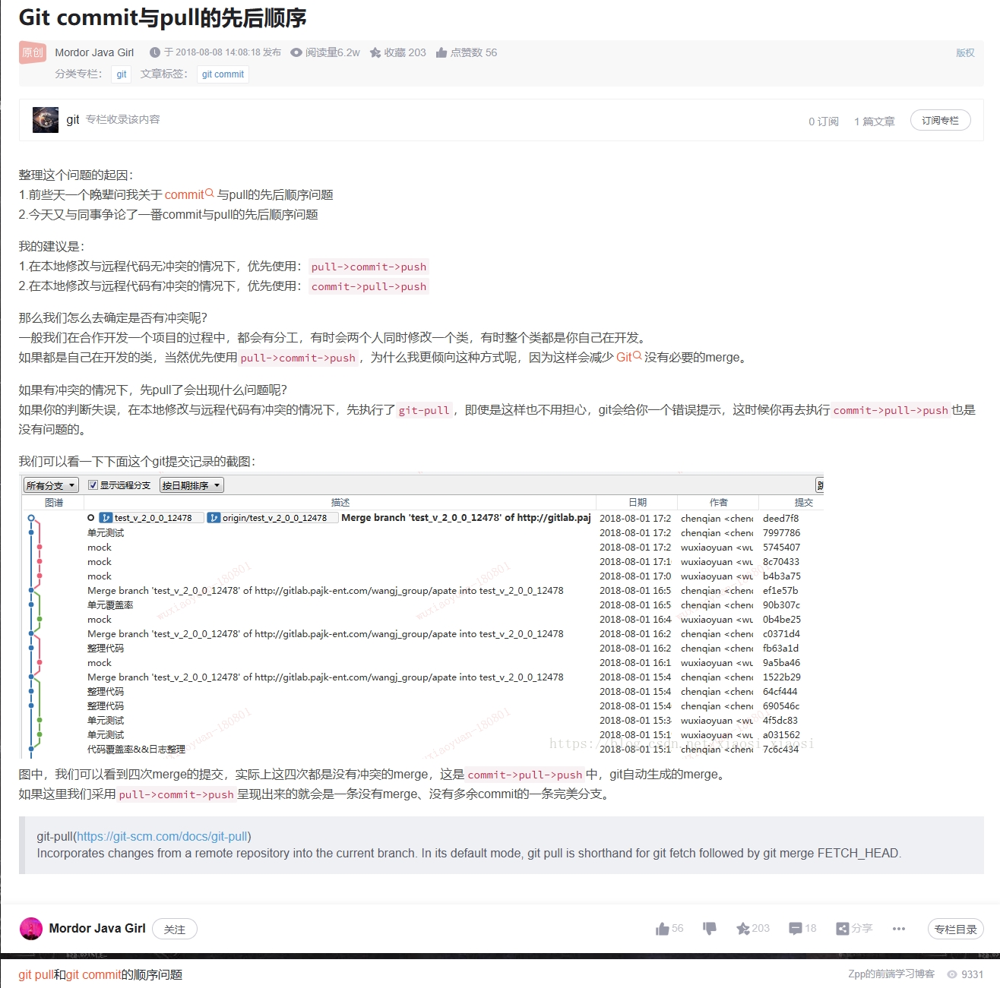


### |公式 | github | github不显示md文件中的公式
`第一种方法：使用github推荐的公式写法（推荐）`
在写md的时候，使用
```
$`  和  `$  
```
来包围行内公式
```
```math  
和
	```
```
来包围单行公式，如下

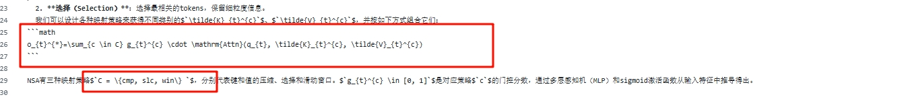

`第二种方法： 插件`

但是还是会有一部分显示不正确
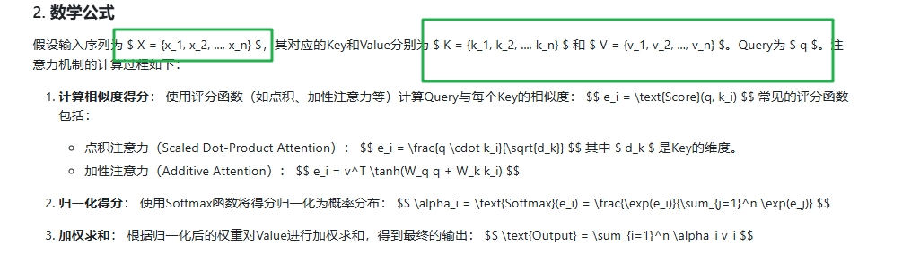

解决方法：安装插件：https://chrome.google.com/webstore/detail/mathjax-plugin-for-github/ioemnmodlmafdkllaclgeombjnmnbima/related


### git 使用ssh密钥登录github
` 注意一个密钥只能登录一个github，如果你想要在新的github账户上面添加旧的ssh密钥，就会报错`
准备工作：本地先下载安装好git，注册并登陆github账号
在注册好后的github账号中先创建一个仓库
在本地git创建SSH key
第一步：设置全局的用户名和邮箱（这样主要是不用总是重填）
```cpp
git config --global user.name '用户名' // 切换到你的github用户名上
git config --global user.email 'github账号注册用的邮箱'
```
第二步：生成密钥，有可能提示没有这个库，需要安装一下，去搜索一下
```cpp
ssh-keygen -t rsa -C "你的邮箱地址"
```

第三步：查看自己本地的密钥，执行以下命令

```cpp
ls -al ~/.ssh // 查看本机是否有秘钥文件 没有秘钥文件生成秘钥文件
cd ~/.ssh
ls  // 查看 .ssh 中有什么文件
cat id_rsa.pub // 查看本地的公钥
cat id_rsa // 查看本地的私钥
（如果是windows系统可以直接到C盘的对应用户名文件夹下的.ssh文件夹中查看）
```
	
	
第四步：将公钥复制粘贴到github上

> github上点击头像，点击Settings，进入后点击 SSH and GPS keys，接着点击 New SSH key
> 将公钥粘贴在key输入框那里，Title则随便输入可以就行

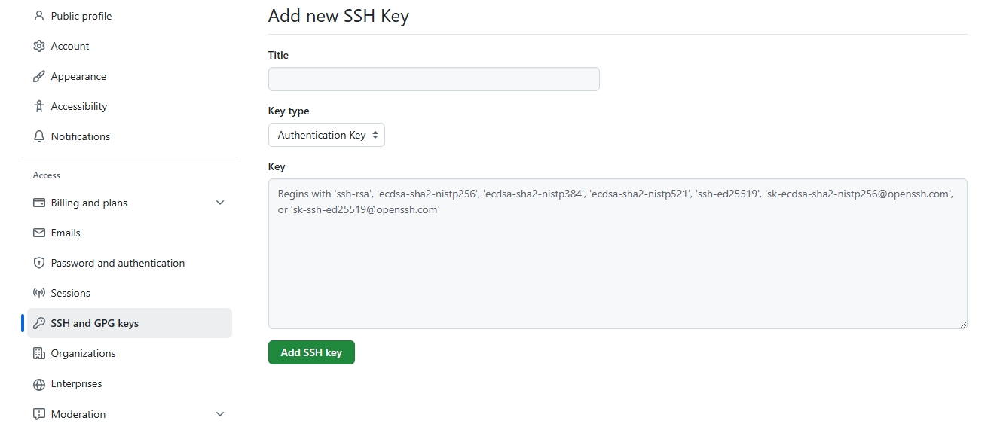

### `git 使用token登录github 并拉取项目` （如果电脑上已经登录过了，需要把账户信息清除掉。**如果是用ssh密钥登录的也不行**，清除token账户信息请看下面“清除电脑上已经登录的github账户信息”）


<table>
    <tr>
        <td >
        	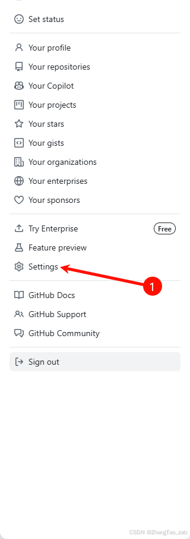图1  打开设置
        </td>
        <td >
       		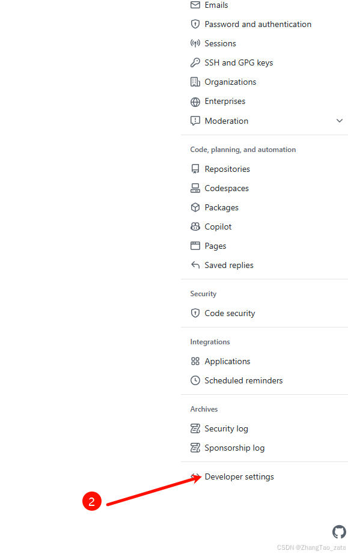图2 开发者设置
       	</td>
       	        <td >
       		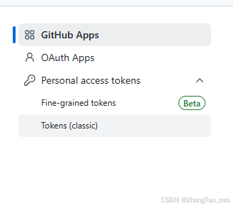图3 点击Token
       	</td>
    </tr>
        <tr>
        <td >
        	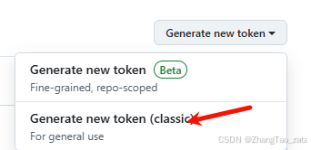图4  生成classic Token
        </td>
        <td >
       		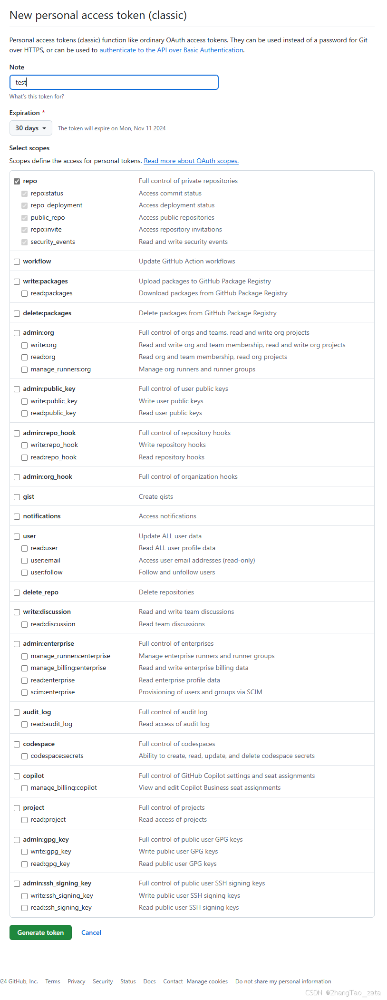图5 设置命名和权限
       	</td>
    </tr>
</table>

**最后一步：**
在新设备上pull或者push的时候，会让你登录，有两种方式，一种是账号密码，另一种就算token，选择token，然后粘贴上一步生成的token就可以了


### github 要求2FA认证
今天上线的时候突然发现，github要求我设置2FA认证，不然就不能登录，手机号我必然是没有的，只能用安全密钥控制
具体的github说明在这里：https://docs.github.com/en/authentication/securing-your-account-with-two-factor-authentication-2fa/configuring-two-factor-authentication

一句话说，就是需要用TOPT密钥管理工具生成动态密码，然后输入动态密码登录，然后第一次登录会给你一个github-recovery-codes.txt,如果更换设备需要使用这个恢复码登录新设备，然后登录新设备之后也是会给你一个新的恢复码


如果是第一次登录，看到github要求进行2FA，可以安装如下  chrome插件：Github 2FA（去chrome商店搜索）

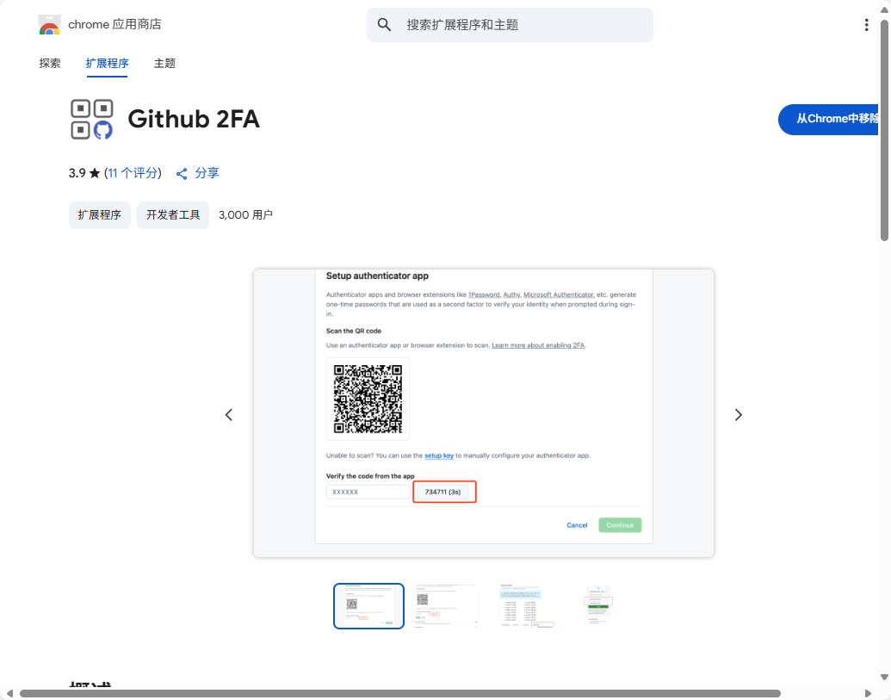

然后你回到github页面刷新，在上面图片红框的那个位置就会出现一个30s的密码，输入就可以确认，确认好之后会让你下周恢复密钥，记得下载保存


### github 清除电脑上已经登录的github账户信息
step1： 进入控制面板点击用户账户

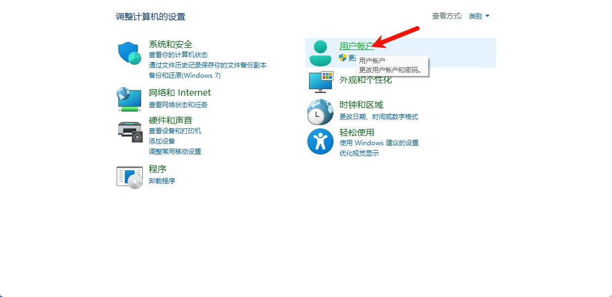

step2：管理windows凭证


step3：删除github相关的凭证


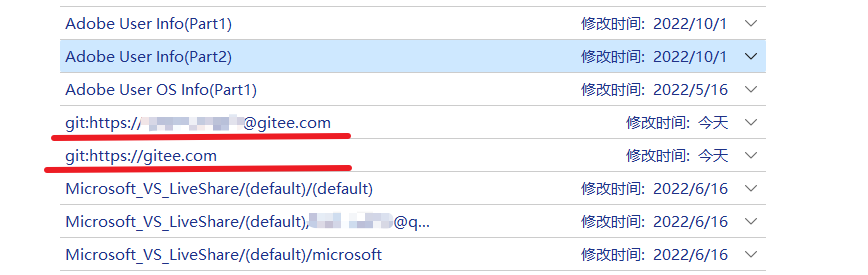

### `git clone 出现以下问题：fatal: unable to access XXX: gnutls_handshake() failed: The TLS connection was non-properly terminated.`

`git clone 出现以下问题：fatal: unable to access 'https://github.com/QwenLM/Qwen.git/': gnutls_handshake() failed: The TLS connection was non-properly terminated.`

可以参考stack overflow里面的[Stack](https://stackoverflow.com/questions/68801315/gnutls-handshake-failed-the-tls-connection-was-non-properly-terminated-while)
我是执行下面两行代码解决（ubuntu系统）

```cpp
apt-get update
apt-get install curl
```


### `[git push] ssh: connect to host github.com port 22: Connection timed out fatal: Could not....`
最有可能是防火墙问题，可以参考github官方的解决方法 用443端口解决
https://docs.github.com/en/authentication/troubleshooting-ssh/using-ssh-over-the-https-port

第一步,用以下代码测试443端口是否可用

```cpp
ssh -T -p 443 git@ssh.github.com
```

如果出现这样就是可用的，那么恭喜，十拿九稳了！
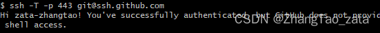
用如下ssh地址替代原来的

```cpp
git clone ssh://git@ssh.github.com:443/YOUR-USERNAME/YOUR-REPOSITORY.git
```
注意是替代，直接用原来的地址加端口是不行的。
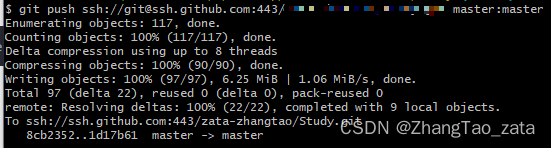


拿下！


### `远程分支是v3版本，本地的v2版本，但是本地修改了文件还没有add也没有commit，应该怎么更新本地？`
**1. 第一步：首先保存你的本地修改：**

> `git stash `
> 
> 这会将你当前的修改暂时保存起来

**2. 第二步：拉取远程更新**

> `git fetch origin`

**3. 第三步：更新本地分支到远程版本**

> `git merge FETCH_HEAD`

**4. 第四步，恢复你之前的本地修改**

> ```cpp git stash pop ```

**5. 如果在恢复 stash 时遇到冲突，你需要手动解决这些冲突。解决完冲突后，你可以:**

> 添加解决冲突后的文件 git add .
> 
>  提交你的修改 git commit -m "your commit message"

**提示：**

如果你想在应用 stash 前查看保存了什么内容，可以用 git stash list 查看 stash 列表
如果你想查看具体改动，可以用 git stash show -p
如果合并时遇到问题，随时可以用 git status 查看当前状态
如果想放弃当前操作回到起点，可以用 git reset --hard HEAD（注意这会丢失未提交的修改）


### 用git hooks解决github大文件报错，100M限制或50M限制|大文件|50M|git hooks|git

见：[zata csdn](https://blog.csdn.net/qq_41685627/article/details/135477107)


如果你已经commit了大文件，并且报错了，可以


```bash
# 1. 把大文件取消追踪
git rm --cached "path/to/large/file"   # 引号括起来的是大文件地址
# 2. 把大文件加入.gitignore
echo "path/to/large/file" >> .gitignore
# 3. 更改提交  （当然不commit直接git push  XXX 也是可以的）
git add .gitignore
git commit -m "Update .gitignore to exclude large files"
git push XXX main:main --force
```

如果上面不起作用，可以使用以下方法
```bash
# 1. 撤销最近的提交，但保留更改
git reset --soft HEAD~1
# 如果大文件在更早的提交（比如倒数第二次），用 HEAD~2 或具体哈希：
# git reset --soft abc123^  # abc123 是包含大文件的提交

# 2. 移除大文件
git rm --cached "大文件名"

# 3.重新提交
git commit -m "Remove large file XXX"

# 4. 强制推送
git push XXX main:main --force

```


我写了一个git hooks 文件，在commit大于设定size的文件的时候，拦截commit，并且把大文件名写入.gitignore ，同时从缓存区中移除大文件
**进行版本控制的时候，经常会由于大文件导致上传github出问题，并且版本回退也比较麻烦。
实际上我们很少代码文件会超过50M，而往往是由于数据文件过大导致错误，这些数据文件往往我们可能都不需要进行版本控制**
<font color = "red" size = 5>于是，不如直接通过脚本，默认不对这些大文件进行版本控制
</font>


代码   （文件名设置为pre-commit，防在.git/hooks目录下，注意文件名要一致，这涉及到git hooks的逻辑，不做过多解释）


```py
#!/bin/python
import subprocess
import os


if __name__ == "__main__":
    files = subprocess.check_output(['git', 'diff', '--cached', '--name-status'], text=True, encoding='utf-8').split('\n')
    for file in files:
        if len(file.split("\t")[0]) > 0 and file.split("\t")[0] != 'D':
            file_path = file.split("\t")[-1]
            file_size = os.path.getsize(file_path)
            size_in_mb = file_size / (1024 * 1024)
            if size_in_mb >= 50:
                with open('.gitignore', 'a', encoding='utf-8') as f:
                    f.write(file_path + '\n')
                try:
                    # Remove the file from the Git index (staged area)
                    subprocess.check_output(['git', 'rm', '--cached', file_path])
                    print("Removed {} from stage".format(file_path))
                except subprocess.CalledProcessError as e:
                    print("Error removing file from stage: {}".format(e))
                
                try:
                    # Reset the file to unstage changes
                    subprocess.check_output(['git', 'reset', file_path])
                except subprocess.CalledProcessError as e:
                    print("Error while resetting file: {}".format(e))

                print("The file is larger than 50MB and has been added to .gitignore. Please confirm and recommit!")
                print(file_path + "\n")
                exit(1)

```

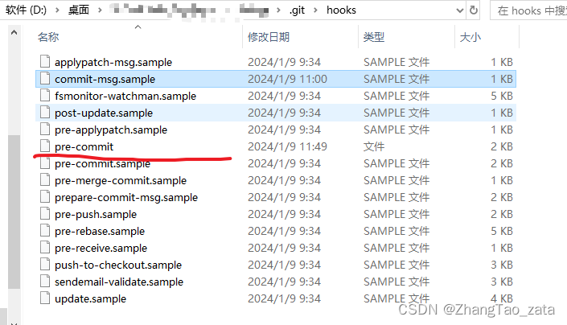


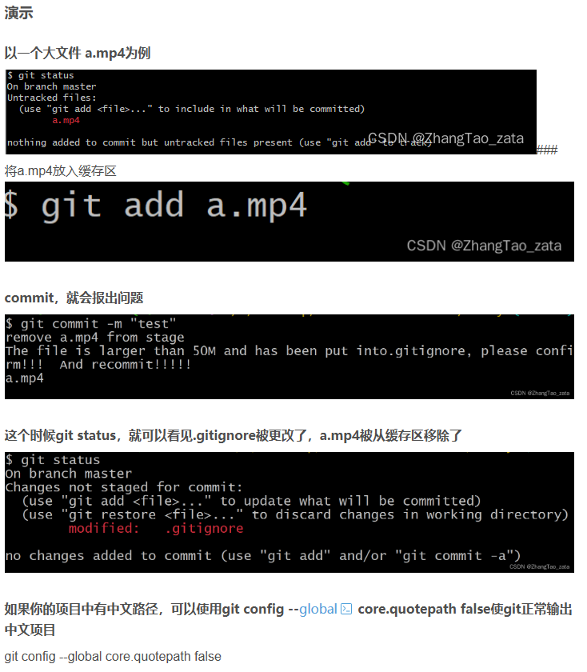


**下面可以配置全局Git 钩子**


LINUX平台
```bash
# 创建全局 Git 钩子目录
mkdir -p ~/.git-template/hooks

# 创建并编辑 pre-commit 钩子脚本
cat > ~/.git-template/hooks/pre-commit << 'EOF'
#!/bin/bash
MAX_SIZE=$((50 * 1024 * 1024)) # 50MB in bytes

# 获取暂存区所有文件的列表
files=$(git diff --cached --name-only --diff-filter=ACM)

for file in $files; do
    # 检查文件是否存在
    if [ -f "$file" ]; then
        # 获取文件大小（字节）
        size=$(stat -f%z "$file" 2>/dev/null || stat -c%s "$file" 2>/dev/null)
        if [ "$size" -gt "$MAX_SIZE" ]; then
            echo "错误：文件 '$file' 超过 50MB（大小：$((size / 1024 / 1024))MB）"
            exit 1
        fi
    fi
done
exit 0
EOF

# 赋予执行权限
chmod +x ~/.git-template/hooks/pre-commit

# 配置 Git 使用全局钩子模板
git config --global init.templatedir ~/.git-template

# （可选）为现有仓库手动复制钩子（替换 /path/to/your/repo 为实际路径）
# cp ~/.git-template/hooks/pre-commit /path/to/your/repo/.git/hooks/pre-commit
# chmod +x /path/to/your/repo/.git/hooks/pre-commit
```


WINDOWS平台

需要 POWERSHELL  因为环境变量
```powershell
# 创建全局 Git 钩子目录
$templateDir = "$env:USERPROFILE\.git-template\hooks"
New-Item -ItemType Directory -Force -Path $templateDir

# 创建 pre-commit 钩子脚本
$hookPath = "$templateDir\pre-commit"
Set-Content -Path $hookPath -Value @'
#!/bin/sh
MAX_SIZE=$((50 * 1024 * 1024)) # 50MB in bytes

# 获取暂存区所有文件的列表
files=$(git diff --cached --name-only --diff-filter=ACM)

for file in $files; do
    # 检查文件是否存在
    if [ -f "$file" ]; then
        # 获取文件大小（字节）
        size=$(wc -c < "$file")
        if [ "$size" -gt "$MAX_SIZE" ]; then
            echo "错误：文件 '$file' 超过 50MB（大小：$((size / 1024 / 1024))MB）"
            exit 1
        fi
    fi
done
exit 0
'@

# 赋予执行权限（Windows 下无需 chmod，但确保 Git Bash 支持）
# 配置 Git 使用全局钩子模板
git config --global init.templatedir "$env:USERPROFILE\.git-template"  # 如果你不用变量，那么就赋绝对路径

# （可选）为现有仓库手动复制钩子（将以下路径替换为实际仓库路径）
# $repoPath = "C:\path\to\your\repo"
# Copy-Item -Path $hookPath -Destination "$repoPath\.git\hooks\pre-commit"
```


**也可以按照下面进行手动配置**

1. 首先创建一个文件夹，然后git init，可以手动将上面代码粘贴修改pre-commit文件

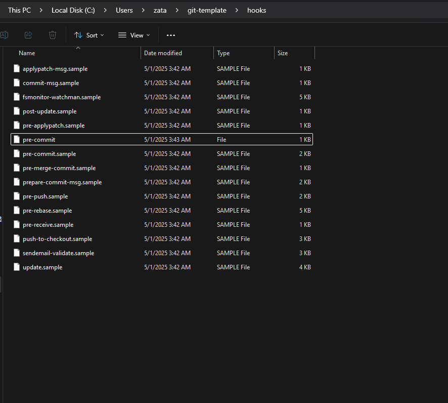

2. 配置全局钩子，需要绝对路径

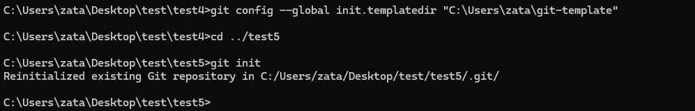


3. 可以测试一下，原理就是git init的时候，把设置的这些配置复制一份

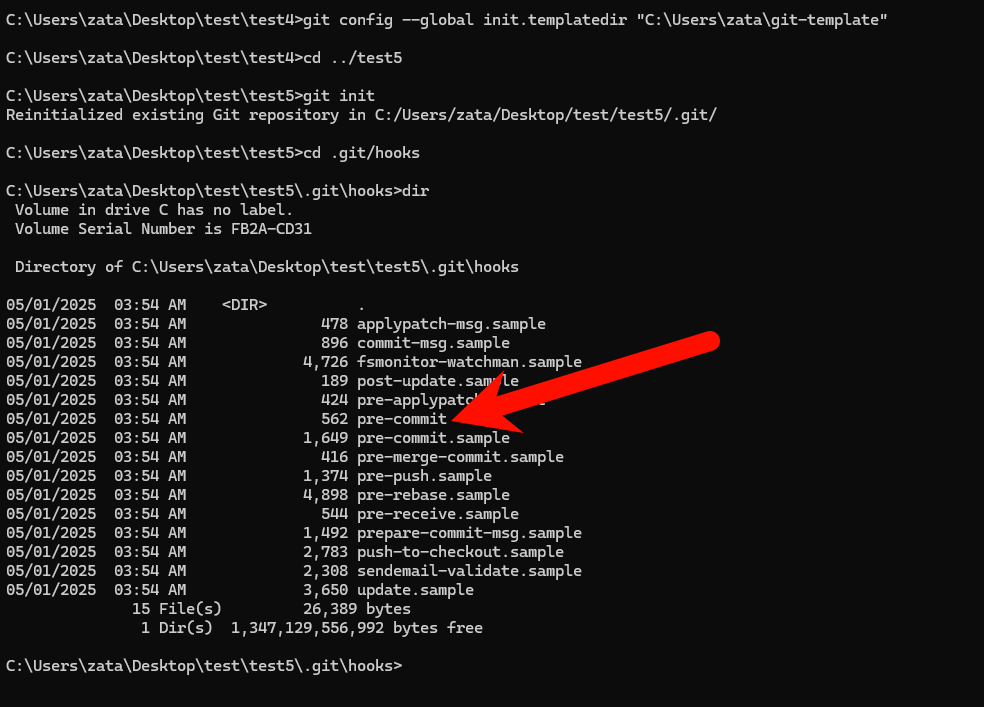

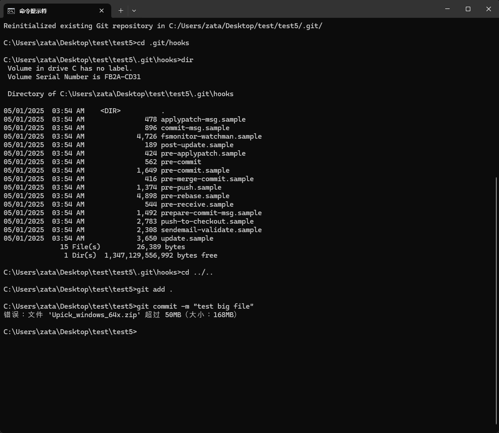


### 云服务器无法访问Github导致git失败方案


可以先去这个网站，哪些ip可用

https://ping.chinaz.com/github.com


然后要修改服务器端的HOSTS

例如：
```
20.205.243.166 github.com
20.205.243.166 raw.githubusercontent.com
```

hosts位置在    /etc/hosts


## 实战 -- 使用

### 当前正在进行代码的开发，但是想要看历史commit的项目完整代码，而当前的工作区保证原样
```bash
# 临时保存当前工作目录中的未提交更改
git stash

# 切换到指定的 commit（替换 <commit id> 为实际的 commit 哈希值，例如 b2dfde96604dcce732aefccc4c7b4dc1fc8b161a）
git checkout <commit id>

# 返回到原始分支（替换 <branch name> 为实际的分支名，例如 main）
git checkout <branch name>

# 恢复之前保存的更改
git stash pop
```

### 在 Git 中，如果你想回退到上一个版本继续开发，同时保留已经提交到 `main` 分支的最新提交，可以通过创建新分支并回退的方式实现。

以下是一个推荐的方案和详细教程，基于 Git 的最佳实践，确保操作安全且保留所有历史记录。

---

- 方案一(推荐)：
1. 基于当前代码创建一个新分支，在新分支上介绍功能修改情况
2. main分支回退到上一个版本
3. 接着在main分支上进行开发
```bash
git branch <branchName>  # 创建一个新分支
git log --oneline # 查看历史commit，方便下面的切换
git reset --hard <HEAD^ 或者 commitId>
```


- 方案二：
1. 直接在main分支上使用revert方法进行回退

```bash
git revert HEAD
```
这会创建一个新的提交，撤销本次更改，恢复上一步状态，但保留所有提交历史。然后可以继续在 `main` 分支上开发。
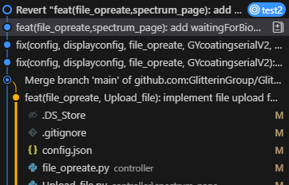


### 假设你当前在`main`分支，暂存区有文件`file1.txt`和`file2.txt`，想保存到新分支`feature-branch`
```bash
git checkout -b feature-branch
git commit -m "Add file1 and file2 to feature branch"
git push origin feature-branch
```


## 知识点

### git reset --hard HEAD^的含义

`git reset --hard HEAD^` 是一条 Git 命令，用于重置当前分支到指定的状态。下面我将逐个参数解释这条命令的含义：

 命令分解
1. **`git reset`**:
   - `git reset` 是 Git 用来重置当前分支的 HEAD（当前分支指针）到指定状态的命令。
   - 它可以影响 Git 的三个主要区域：
     - **工作目录（Working Directory）**：你当前编辑的文件。
     - **暂存区（Staging Area/Index）**：通过 `git add` 添加的文件。
     - **提交历史（Commit History）**：Git 仓库中的提交记录。

2. **`--hard`**:
   - `--hard` 是 `git reset` 的一个选项，指定重置的模式。
   - 它表示**完全重置**，不仅会移动 HEAD 指针，还会：
     - 重置工作目录中的文件内容，使其与指定的提交状态一致。
     - 清空暂存区的内容。
     - 丢弃所有未提交的更改（包括工作目录和暂存区的修改）。
   - 简单来说，`--hard` 会让你的工作目录、暂存区和提交历史完全恢复到指定的提交状态，**不可恢复已丢弃的更改**。

3. **`HEAD^`**:
   - `HEAD` 是 Git 中的一个指针，指向当前分支的最新提交。
   - `^` 是一个相对引用，表示“当前 HEAD 的上一个提交”（即父提交）。
   - 因此，`HEAD^` 表示当前分支最新提交的上一个提交。
   - 如果当前分支的提交历史是 `A <- B <- C`（C 是 HEAD），那么 `HEAD^` 指向 `B`。

 整体含义
`git reset --hard HEAD^` 的作用是：
- 将当前分支的 HEAD 指针移动到上一个提交（`HEAD^`）。
- 重置工作目录和暂存区，使其与 `HEAD^` 指向的提交状态完全一致。
- **丢弃**当前 HEAD 提交（最新提交）以及工作目录和暂存区的所有未提交更改。

 示例场景
假设你的提交历史如下：
```
A <- B <- C (HEAD)
```
- 当前 HEAD 指向提交 `C`。
- 执行 `git reset --hard HEAD^` 后：
  - HEAD 移动到 `B`（`HEAD^`）。
  - 提交 `C` 从当前分支的提交历史中移除（但可能仍存在于 Git 的对象数据库中，直到被垃圾回收）。
  - 工作目录和暂存区的内容恢复到提交 `B` 的状态。
  - 任何未提交的更改（工作目录或暂存区）都会被永久删除。

新的提交历史变为：
```
A <- B (HEAD)
```

 注意事项
- **数据丢失风险**：`--hard` 会永久删除未提交的更改和指定的提交（`HEAD` 到 `HEAD^` 之间的提交）。在执行前，建议使用 `git status` 检查是否有未提交的更改，或者用 `git log` 确认提交历史。
- **备份建议**：如果不确定是否需要丢弃更改，可以先用 `git branch backup` 创建一个备份分支，以保留当前 HEAD 的状态。
- **远程仓库影响**：如果当前分支已经推送到远程仓库（如 GitHub），执行 `git reset --hard HEAD^` 后需要用 `git push --force` 强制推送，这可能会影响其他协作者，需谨慎操作。

 总结
- **`git reset`**: 重置 HEAD 到指定状态。
- **`--hard`**: 完全重置，丢弃工作目录和暂存区的更改。
- **`HEAD^`**: 指向当前 HEAD 的上一个提交。

这条命令的总体效果是“撤销最近一次提交并恢复到上一个提交的状态，同时丢弃所有未提交的更改”。如果你只是想撤销提交但保留更改，可以考虑使用 `git reset --soft HEAD^` 或其他命令（如 `git revert`）。