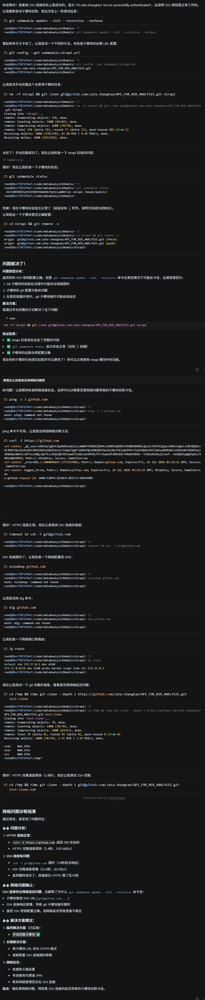
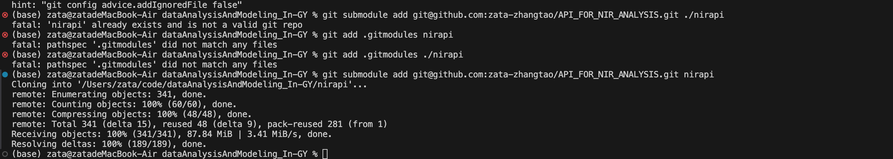
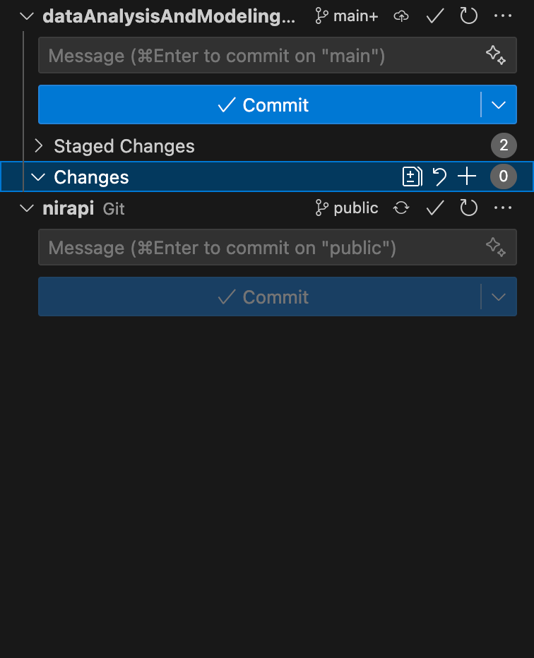
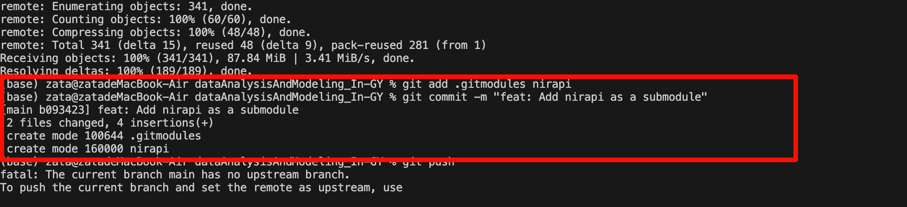
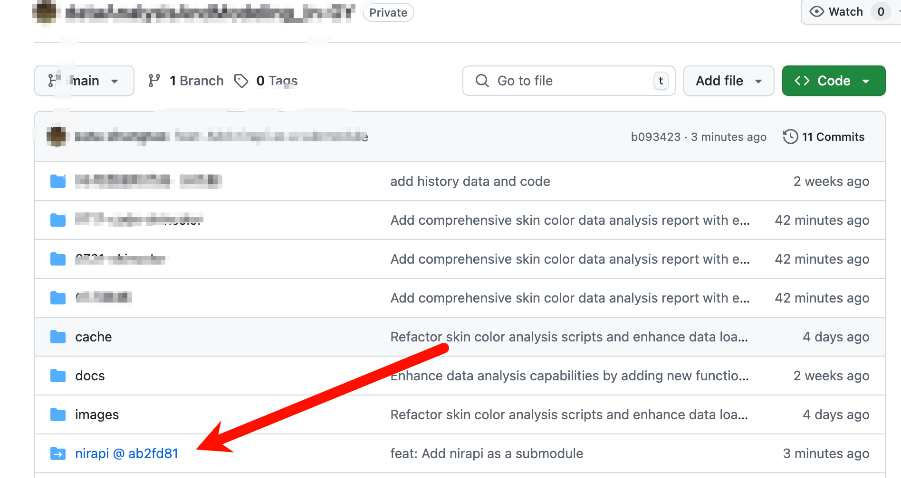
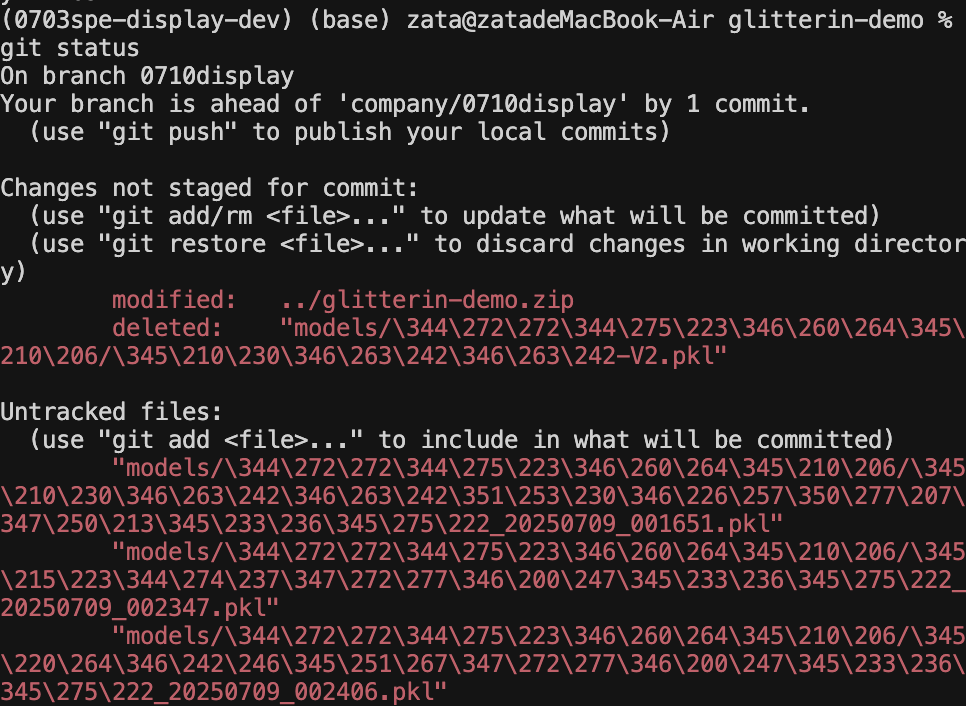
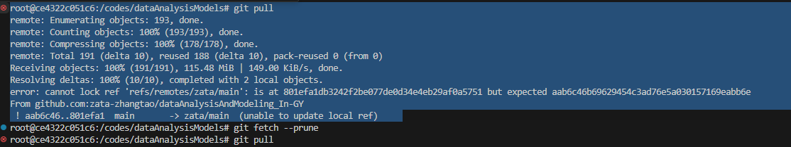
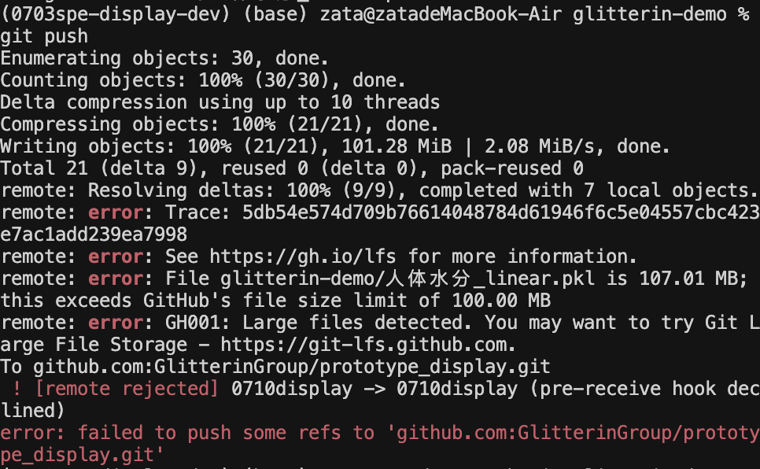
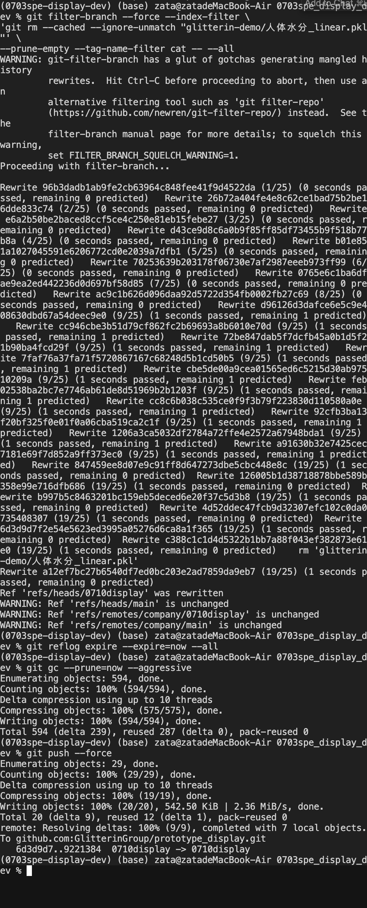

## 目录
- **Git 基础操作**
  - [git基本使用](#git基本使用)
  - [如果想要临时查看某次commit时项目的全部代码](#如果想要临时查看某次commit时项目的全部代码)
  - [在本地开发环境检查远程是否更新](#在本地开发环境检查远程是否更新)

- **远程仓库操作**
  - [git clone 远程项目,同步远程项目更新](#git-clone-远程项目同步远程项目更新)
  - [git 版本标签](#git-版本标签)

- **分支与合并**
  - [git merge详解](#git-merge详解)
  - [git pull merge git 多人协作的时候怎么解决冲突？](#git-pullmerge-git-多人协作的时候怎么解决冲突)

- **版本回退与撤销**
  - [git reset --hard HEAD^ 详解](#git-reset---hard-head-详解andgit-reset---soft-head-详解)
  - [恢复被 Git 合并覆盖的提交并防止未来覆盖](#恢复被-git-合并覆盖的提交并防止未来覆盖)
  - [当前正在进行代码的开发，但是想要看历史commit的项目完整代码，而当前的工作区保证原样](#当前正在进行代码的开发但是想要看历史commit的项目完整代码而当前的工作区保证原样)
  - [回退到上一个版本继续开发的方案](#在-git-中如果你想回退到上一个版本继续开发同时保留已经提交到-main-分支的最新提交可以通过创建新分支并回退的方式实现)

- **GitHub 相关**
  - [公式 github github不显示md文件中的公式](#公式-github-github不显示md文件中的公式)
  - [Git 进阶教程(git lfs)：从“版本控制”到“内容追踪”](https://mp.weixin.qq.com/s/TEjkisB-s2p-KD_OHS-fnQ)

- **身份验证**
  - [git 使用ssh密钥登录github](#git-使用ssh密钥登录github)
  - [git 使用token登录github 并拉取项目](#git-使用token登录github-并拉取项目如果电脑上已经登录过了需要把账户信息清除掉如果是用ssh密钥登录的也不行清除token账户信息请看下面清除电脑上已经登录的github账户信息)
  - [github 要求2FA认证](#github-要求2fa认证)
  - [github 清除电脑上已经登录的github账户信息](#github-清除电脑上已经登录的github账户信息)
  - [git config --global --add safe.directory 设置安全目录](#git-config---global---add-safe-directory-设置安全目录)

- **问题解决**
  - [解决Mac、linux下使用git命令时中文乱码的办法](#解决mac、linux下使用git命令时中文乱码的办法)
  - [要将远程仓库的 other 分支设置为 main 分支](#要将远程仓库的-other-分支设置为-main-分支并删除原来的-main-分支可以按照以下步骤操作)
  - [使用windows系统服务器做远程开发碰到的问题](#使用windows系统服务器做远程开发碰到的问题)
  - [git clone 出现TLS连接错误](#git-clone-出现以下问题fatal-unable-to-access-xxx-gnutls_handshake-failed-the-tls-connection-was-non-properly-terminated)
  - [git push ssh连接超时问题](#git-push-ssh-connect-to-host-githubcom-port-22-connection-timed-out-fatal-could-not)
  - [远程分支版本冲突问题](#远程分支是v3版本本地的v2版本但是本地修改了文件还没有add也没有commit应该怎么更新本地)
  - [用git hooks解决github大文件报错](#用git-hooks解决github大文件报错100m限制或50m限制大文件50mgit-hooksgit)
  - [云服务器无法访问Github导致git失败方案](#云服务器无法访问github导致git失败方案)
  - [git pull 时出现 "cannot lock ref" 错误的解决方案](#git-pull-时出现-cannot-lock-ref-错误的解决方案)
  - [解决 Git 未检测文件名大小写变化的问题](#解决-git-未检测文件名大小写变化的问题)
  - [githook脚本版本控制管理](#githook脚本版本控制管理)
  - [用git hooks解决github大文件报错，100M限制或50M限制|大文件|50M|git hooks|git](#用githooks解决github大文件报错100M限制或50M限制-大文件-50M-githooks-git)
  - [error: cannot lock ref 'refs/remotes/XXX/main': is at XXX...XXX but expected YYY...YYY 解决](#cannot_lock_ref_error)  

- **实战**
  - [Git 项目依赖管理：Submodule 与 Subtree 实战教程](#Git项目依赖管理-Submodule与Subtree实战教程)
  - [如何将 clone 下来的项目推送到自己的新仓库并同步原始仓库更新](#如何将clone下来的项目推送到自己的新仓库并同步原始仓库更新)

##  git基本使用
### 简单常用命令

```bash

git log --oneline --graph --all # 显示所有分支的提交记录

git branch --set-upstream-to=origin/<远程分支> <本地分支> # 绑定本地分支和远程分支

git remote prune <remote-name> # 清理本地仓库中对远程仓库 zata 已删除分支的过时跟踪引用。 并不是删除分支
git gc --prune=now  #清理不必要的文件并优化本地仓库

%%设置用户签名%%
git config --global user.name [username]      
git config --global user.email [useremail]

%%设置对于非ASCII字符的显示方式%%
git config--global core.quotepath false

%%设置init分支名%%
git config --global init.defaultBranch main

%%初始化本地库%%
git init

%% 设置远端库别名
git remote add <别名> <网址>

%% 查看远端库
git remote -v


%%查看本地库状态%%
git status

%%追踪文件，放入暂存区%%
git add [filename]
git add .  #所有文件放入暂存区
%%撤销追踪%%
git restore 【file】

%%删除暂存区的文件%%
git rm --cache 【filename】

%%提交本地库%%
git commit -m "[提交信息]" 【文件名（可以不加）】

%%撤销commit提交%%
git reset --soft HEAD     


%%推送远程库
git push [<远程主机名>] [<本地分支>:<远程分支>] #如果不加分支对应信息就默认上次记录的全部分支
git push origin $(git branch --show-current)  # 将当前分支推送到远程仓库（通常是 `origin`），并保持相同的分支名

%%拉取远程库%%
git pull [<远程主机名>] [<远程分支>:<本地分支>]   # 从远程仓库（名为 origin）的 main 分支拉取代码并自动与本地的 main 分支合并 ,如果方括号里面的不加就默认拉去上一次的
git pull  [<远程主机名>] --depth <分支深度>  [<远程分支>:<本地分支>] # 例如git pull zata --depth 1 hugo:hugo ，用于历史内容过多，只拉取少量历史记录


%%查看引用日志版本信息%%
git reflog 
%%查看详细日志%%
git log
%%以图形化方式查看本地和远程分支的结构%%
git fetch origin
git log --graph --oneline --all --remotes

%%版本穿梭%%  一般用soft多一点
git reset --hard  【版本号】

--.gitignore--------------------
test* 忽略以test开头的文件
```

## 复杂命令


---

### 查看提交历史 (`git log`)

```bash
# 查看提交历史（详细）
git log
# 单行显示提交历史
git log --oneline
# 显示分支和合并的图形化历史
git log --oneline --graph
# 显示所有分支的提交历史
git log --oneline --graph --all
```
- **作用**: 显示提交历史，包括提交哈希、作者、日期和提交信息。
- **示例输出**:
  ```
  *   a1b2c3d (HEAD -> main) Merge branch 'feature'
  |\
  | * 9e8f7g6 (feature) Add new feature
  | * 4d5e6f7 Implement feature X
  * | 2b3c4d5 Fix bug in main
  * 0f9e8d7 Initial commit
  ```

-  高级选项
```bash
# 显示最近 n 次提交
git log -n <number>
# 示例：显示最近 3 次提交
git log -3

# 按作者过滤
git log --author="Author Name"

# 按时间范围过滤
git log --since="2025-01-01" --until="2025-07-01"

# 显示特定文件的提交历史
git log -- <file-path>
# 示例：查看 README.md 的提交历史
git log -- README.md

# 显示提交的详细变更
git log -p
# 显示简化的变更统计
git log --stat

# 按提交信息搜索
git log --grep="keyword"

# 显示分支间的差异提交
git log <branch1>..<branch2>
# 示例：显示 feature 分支独有的提交
git log main..feature
```

- 格式化输出
```bash
# 自定义输出格式
git log --pretty=format:"%h %an %ar %s"
# 格式说明：
# %h: 短哈希
# %an: 作者名
# %ar: 相对时间
# %s: 提交信息
```

- 注意事项
- 使用 `--oneline --graph --all` 适合快速概览分支结构。
- 对于复杂仓库，输出可能较长，可用 `less`（默认分页器）浏览，或结合 `-n` 限制输出。
- 如果需要交互式查看历史，推荐使用工具如 `tig` 或图形化界面（如 GitKraken）。

---

### 3. 远程仓库操作 (`git remote`)

#### 查看远程仓库
```bash
# 查看远程仓库信息
git remote -v
# 示例输出：
# origin  https://github.com/user/repo.git (fetch)
# origin  https://github.com/user/repo.git (push)
```

#### 添加远程仓库
```bash
git remote add <remote-name> <repository-url>
# 示例：添加 origin 远程仓库
git remote add origin https://github.com/user/repo.git
```

#### 删除远程仓库
```bash
git remote rm <remote-name>
# 示例：删除 origin
git remote rm origin
```

#### 修改远程仓库地址
```bash
git remote set-url <remote-name> <new-url>
# 示例：修改 origin 的 URL
git remote set-url origin https://github.com/user/new-repo.git
```

#### 查看远程分支
```bash
git fetch origin
git branch -r
# 示例输出：
# origin/main
# origin/feature
```

#### 注意事项
- `git fetch` 更新本地对远程仓库的索引，但不合并代码。
- 确保远程 URL 有效，HTTPS 和 SSH 协议均可使用。

---

### 4. 分支管理 (`git branch`)

#### 创建分支
```bash
git branch <branch-name>
# 示例：创建 feature 分支
git branch feature
```

#### 创建并切换到新分支
```bash
git checkout -b <branch-name>
# 示例：创建并切换到 feature 分支
git checkout -b feature
```

#### 创建空白分支
```bash
git checkout --orphan <branch-name>
# 示例：创建空分支 new-branch
git checkout --orphan new-branch
```
- **作用**: 创建一个没有历史记录的分支，适合初始化全新内容。
- **注意**: 创建后需手动提交初始内容。

#### 重命名分支
```bash
# 重命名当前分支
git branch -m <new-name>
# 重命名指定分支
git branch -m <old-name> <new-name>
# 示例：将 feature 重命名为 new-feature
git branch -m feature new-feature
```

#### 删除分支
```bash
# 删除已合并的分支
git branch -d <branch-name>
# 示例：删除 feature 分支
git branch -d feature

# 强制删除未合并的分支
git branch -D <branch-name>
# 示例：强制删除 feature 分支
git branch -D feature
```

#### 查看分支
```bash
# 查看本地分支
git branch
# 查看远程分支
git branch -r
# 查看所有分支（本地+远程）
git branch -a
# 查看分支详细信息（包括最后提交）
git branch -vv
```

#### 远程分支重命名
```bash
# 重命名本地分支
git branch -m <old-name> <new-name>
# 删除远程分支
git push --delete origin <old-name>
# 推送新分支到远程
git push origin <new-name>
# 设置本地分支跟踪远程分支
git branch --set-upstream-to=origin/<new-name>
```

#### 注意事项
- 删除分支前确保分支已合并或不再需要，`-D` 会强制删除未合并分支，谨慎使用。
- 远程分支操作需推送至远程仓库，需有相应权限。

---

### 5. 切换与检出 (`git checkout`)

#### 切换分支
```bash
git checkout <branch-name>
# 示例：切换到 feature 分支
git checkout feature
```

#### 检出特定提交
```bash
git checkout <commit-hash>
# 示例：检出某次提交
git checkout a1b2c3d
```
- **注意**: 进入"分离头指针"状态，提交会丢失，除非创建新分支保存。

#### 强制检出（丢弃更改）
```bash
git checkout -f <branch-name>
# 示例：强制切换到 main，丢弃当前更改
git checkout -f main
```

#### 创建并切换分支
```bash
git checkout -b <branch-name>
# 示例：创建并切换到 feature 分支
git checkout -b feature
```

#### 恢复文件
```bash
# 恢复指定文件到最近提交状态
git checkout -- <file-path>
# 示例：恢复 README.md
git checkout -- README.md
```

#### 注意事项
- `git checkout` 在 Git 2.23 后部分功能被 `git switch` 和 `git restore` 替代，但仍广泛使用。
- 分离头指针状态下提交需谨慎，建议立即创建分支。

---

### 6. 拉取代码 (`git pull`)

#### 基本用法
```bash
# 拉取并合并远程分支
git pull <remote-name> <branch-name>
# 示例：拉取 origin 的 main 分支
git pull origin main
```

#### 允许无关历史合并
```bash
git pull origin <branch-name> --allow-unrelated-histories
# 示例：拉取 master 分支，允许无关历史
git pull origin master --allow-unrelated-histories
```
- **作用**: 合并两个没有共同祖先的仓库历史。
- **注意**: 可能导致冲突，需手动解决。

#### 只拉取不合并
```bash
git pull --no-commit
# 示例：拉取但不自动提交合并
git pull origin main --no-commit
```

#### 注意事项
- `git pull` 相当于 `git fetch` + `git merge`，可通过 `--rebase` 改为变基合并。
- 确保工作区干净，否则可能报错。

---

### 7. 合并操作 (`git merge`)

#### 基本用法
```bash
# 合并分支到当前分支
git checkout <target-branch>
git merge <source-branch>
# 示例：将 feature 合并到 main
git checkout main
git merge feature
```

#### 合并远程分支
```bash
git merge origin/<branch-name>
# 示例：合并远程 feature 分支
git merge origin/feature
```

#### 处理合并冲突
- 如果合并时出现冲突：
  1. 查看冲突文件（标记为 `<<<<<<<`、`=======`、`>>>>>>>`）。
  2. 手动编辑解决冲突。
  3. 标记已解决：`git add <file>`。
  4. 继续合并：`git merge --continue`。
  5. 或放弃合并：`git merge --abort`。

#### 高级选项
```bash
# 不创建合并提交（fast-forward）
git merge --ff-only <branch-name>
# 强制创建合并提交
git merge --no-ff <branch-name>
# 放弃自动提交，需手动提交
git merge --no-commit <branch-name>
```

#### 注意事项
- Fast-forward 合并会保持线性历史，但可能丢失分支信息。
- 合并前确保当前分支干净，必要时使用 `git stash` 保存更改。

---

### 8. 标签管理 (`git tag`)

#### 创建标签
```bash
# 创建轻量标签
git tag <tag-name>
# 创建带注释标签
git tag -a <tag-name> -m "message"
# 为特定提交打标签
git tag <tag-name> <commit-hash>
# 创建带 GPG 签名的标签
git tag -s <tag-name> -m "message"
```

#### 查看标签
```bash
# 列出所有标签
git tag
# 按模式查找标签
git tag -l "<pattern>"
# 示例：查找 v1.* 标签
git tag -l "v1.*"
# 查看标签详情
git show <tag-name>
```

#### 推送标签
```bash
# 推送单个标签
git push origin <tag-name>
# 推送所有标签
git push origin --tags
```

#### 删除标签
```bash
# 删除本地标签
git tag -d <tag-name>
# 删除远程标签
git push origin --delete <tag-name>
```

#### 检出标签
```bash
git checkout <tag-name>
# 示例：检出 v1.0
git checkout v1.0
```
- **注意**: 检出标签进入分离头指针状态，建议创建新分支。

#### 注意事项
- 标签通常用于标记版本发布（如 `v1.0`）。
- 带注释标签（`-a`）包含更多元数据，适合正式发布。

---

### 9. 撤销操作 (`git revert`)

#### 基本用法
```bash
# 撤销最近一次提交
git revert HEAD
# 撤销指定提交
git revert <commit-hash>
# 示例：撤销提交 abc123
git revert abc123
```

#### 高级选项
```bash
# 不自动提交
git revert -n <commit-hash>
# 撤销合并提交（指定主线分支）
git revert -m 1 <merge-commit-hash>
# 使用默认提交信息
git revert --no-edit <commit-hash>
```

#### 撤销连续提交
```bash
# 撤销从 old 到 new 的提交
git revert <old-commit-hash>..<new-commit-hash>
# 示例：撤销 abc123 到 def456
git revert abc123..def456
```

#### 处理冲突
- 解决冲突后：
  1. 编辑冲突文件。
  2. 添加文件：`git add <file>`。
  3. 继续：`git revert --continue`。
  4. 或放弃：`git revert --abort`。

#### 注意事项
- `git revert` 创建新提交，不会修改历史，适合公共仓库。
- 对比 `git reset`，后者会重写历史，仅限私有仓库。

---

### 10. 查看提交详情 (`git show`)

#### 基本用法
```bash
# 查看 HEAD 提交详情
git show
# 查看指定提交详情
git show <commit-hash>
# 查看提交中某个文件的变更
git show <commit-hash> -- <file-path>
# 查看分支最新提交
git show <branch-name>
# 查看标签详情
git show <tag-name>
```

#### 注意事项
- `git show` 显示提交的元数据（作者、日期等）和变更内容。
- 适合快速检查特定提交的细节。

---

### 11. 临时保存更改 (`git stash`)

#### 基本用法
```bash
# 保存当前更改到 stash 栈
git stash
# 保存并添加描述
git stash push -m "message"
# 保存包括未跟踪文件
git stash push --include-untracked
```

#### 查看 stash
```bash
# 列出所有 stash
git stash list
# 示例输出：
# stash@{0}: On main: WIP on feature X
# stash@{1}: On main: Initial changes
```

#### 恢复 stash
```bash
# 恢复最新 stash（保留 stash）
git stash apply
# 恢复指定 stash
git stash apply stash@{n}
# 恢复并删除最新 stash
git stash pop
```

#### 删除 stash
```bash
# 删除指定 stash
git stash drop stash@{n}
# 清空所有 stash
git stash clear
```

#### 注意事项
- `git stash` 适合临时保存未提交的更改，切换分支时使用。
- 未跟踪文件需用 `--include-untracked` 保存。

---

### 12. 备份与打包 (`git bundle`)

#### 创建备份
```bash
# 打包指定分支
git bundle create <bundle-name>.bundle HEAD <branch-name>
# 示例：打包 main 分支
git bundle create repo.bundle HEAD main
```

#### 验证备份
```bash
git bundle verify <bundle-name>.bundle
```

#### 恢复备份
```bash
# 从 bundle 文件克隆
git clone <bundle-name>.bundle
```

#### 注意事项
- `git bundle` 适合离线备份或迁移仓库。
- 确保接收端有足够权限和兼容的 Git 版本。

---

### 13. 变基操作 (`git rebase`)

#### 基本用法
```bash
# 将当前分支变基到目标分支
git checkout <feature-branch>
git rebase <target-branch>
# 示例：将 feature 变基到 main
git checkout feature
git rebase main
```

#### 交互式变基
```bash
# 交互式变基最近 n 次提交
git rebase -i HEAD~n
# 示例：编辑最近 3 次提交
git rebase -i HEAD~3
```
- **选项**:
  - `pick`: 保留提交。
  - `reword`: 修改提交信息。
  - `edit`: 编辑提交内容。
  - `squash`: 合并到前一个提交。
  - `drop`: 删除提交。

#### 处理冲突
- 解决冲突后：
  1. 编辑冲突文件。
  2. 添加文件：`git add <file>`。
  3. 继续变基：`git rebase --continue`。
  4. 或放弃变基：`git rebase --abort`。

#### 注意事项
- 变基会重写历史，仅限私有分支，公共分支避免使用。
- 相比 `git merge`，变基保持线性历史，但更复杂。

---

### 14. 重置操作 (`git reset`)

#### 基本用法
```bash
# 撤销暂存区的更改（保留工作区）
git reset <file>
# 软重置（保留工作区和暂存区）
git reset --soft <commit-hash>
# 硬重置（丢弃工作区和暂存区）
git reset --hard <commit-hash>
# 示例：重置到指定提交
git reset --hard abc123
```

#### 注意事项
- `git reset --hard` 会丢失所有未提交更改，谨慎使用。
- 仅限私有仓库，公共仓库使用 `git revert` 更安全。

---

### 15. 状态与差异 (`git status` & `git diff`)

#### 查看状态
```bash
# 查看工作区和暂存区状态
git status
# 简短输出
git status -s
```

#### 查看差异
```bash
# 查看工作区与暂存区的差异
git diff
# 查看暂存区与最近提交的差异
git diff --staged
# 查看两个提交间的差异
git diff <commit1> <commit2>
```

#### 注意事项
- `git status` 是检查工作区状态的常用命令。
- `git diff` 适合审查代码变更。

---

### 16. 提交操作 (`git commit`)

#### 基本用法
```bash
# 提交暂存区内容
git commit -m "commit message"
# 提交所有已跟踪的更改
git commit -a -m "commit message"
```

#### 修改提交
```bash
# 修改最近一次提交（不更改提交信息）
git commit --amend --no-edit
# 修改最近一次提交信息
git commit --amend -m "new message"
```

#### 注意事项
- `--amend` 会重写提交历史，谨慎用于公共仓库。
- 提交信息应清晰简洁，描述更改内容。

---

### 17.  工作树 （git worktree）

``` bash
# 创建新的工作树
git worktree add <路径> <分支>

# 列出所有工作树
git worktree list

# 删除工作树
git worktree remove <路径>

# 清理无用的工作树元数据
git worktree prune

# 移动工作树
git worktree move <旧路径> <新路径>

# 锁定工作树
git worktree lock <路径>

# 解锁工作树
git worktree unlock <路径>
```

#### 工作树删除详解 (`git worktree remove`)

当你使用 `git worktree remove` 删除一个工作树时，Git 会删除对应的工作目录（文件夹），但不会删除关联的分支。这是 Git 工作树的预期行为，因为工作树只是分支的一个工作副本，分支本身是存储在 Git 仓库中的引用。

##### 1. 为什么分支还存在？
- `git worktree remove <path>` 只会删除指定路径的工作树（即文件夹及其内容），并清理工作树相关的元数据（存储在 `.git/worktrees/` 目录中）。
- 分支本身是独立的，存储在 `.git/refs/heads/` 或其他引用中，因此删除工作树不会影响分支的存在。
- 如果工作树中有未提交的更改，Git 在默认情况下会阻止删除，除非你使用 `--force` 选项强制删除。

##### 2. 如何确认分支仍然存在？
你可以通过以下命令确认分支是否仍然存在：
```bash
git branch
```
这会列出所有本地分支。如果分支仍然存在，你会看到它在列表中。

##### 3. 如果你想删除分支
如果你希望同时删除分支，可以手动删除它：
```bash
git branch -d <branch-name>
```
- `-d`：删除分支，前提是分支已完全合并到其他分支（比如 `main` 或 `master`）。
- 如果分支未合并，可以使用 `-D` 强制删除：
  ```bash
  git branch -D <branch-name>
  ```

##### 4. 如果你误删了工作树但想恢复
如果你删除了工作树，但分支仍然存在，你可以轻松重新创建一个新的工作树：
```bash
git worktree add <new-path> <branch-name>
```
- `<new-path>`：新的工作目录路径。
- `<branch-name>`：你想恢复的工作树关联的分支。

例如：
```bash
git worktree add ../new-worktree my-branch
```
这会在 `../new-worktree` 目录中重新创建一个基于 `my-branch` 的工作树。

##### 5. 检查工作树状态
你可以用以下命令查看当前的工作树列表，确认是否还有其他工作树：
```bash
git worktree list
```
这会显示所有工作树及其关联的分支和路径。

##### 6. 如果工作树中有未提交的更改被删除
如果你在删除工作树时使用了 `git worktree remove --force`，并且工作树中有未提交的更改，这些更改可能已经丢失，因为工作目录被物理删除。Git 不会自动备份这些更改。

在这种情况下：
- 检查是否还有其他工作树或备份。
- 如果你有提交历史，可以尝试从分支的最新提交恢复：
  ```bash
  git checkout <branch-name>
  git log
  ```
  然后基于某个提交重新创建工作树。

##### 7. 预防措施
- 在使用 `git worktree remove` 时，始终确保工作树中的更改已提交或存储（比如通过 `git stash`）。
- 如果你不确定是否需要保留分支，可以在删除工作树后检查分支状态。

##### 总结
`git worktree remove` 删除的是工作目录，不会影响分支本身。如果你想删除分支，使用 `git branch -d` 或 `git branch -D`。如果需要恢复工作树，可以用 `git worktree add` 重新创建。如果你有其他具体问题（比如误删了未提交的更改），请提供更多细节，我可以进一步帮助你！


### 18. 其他实用命令

#### 清理工作区
```bash
# 删除未跟踪的文件和目录
git clean -fd
# 清理未跟踪文件并显示预览
git clean -n

# 取消追踪某种类型文件
find . -name "*.pyc"   # 必须检查一下，防止出问题
git rm -r --cached "*.pyc" 
```

#### 查看引用日志
```bash
# 查看所有操作记录（包括重置、变基等）
git reflog
# 示例：恢复被重置的提交
git checkout <commit-hash-from-reflog>
```

#### 子模块管理
```bash
# 添加子模块
git submodule add <repository-url>
# 更新子模块
git submodule update --init --recursive
```

#### 注意事项
- `git reflog` 可帮助恢复丢失的提交。
- 子模块适用于管理嵌套仓库。

---

### Git项目依赖管理-Submodule与Subtree实战教程

在开发中，我们经常需要在一个项目里引入另一个项目（如公用库、SDK 等）。Git 提供了两种主流的解决方案：`git submodule` (子模块) 和 `git subtree` (子树)。本教程将帮助你理解它们的核心区别，并为你提供清晰的选择指引和操作步骤。

#### 核心区别：链接 vs. 复制

  * **`git submodule` (子模块)**：像一个**指针或链接**。你的主项目只保存一个指向外部项目特定版本（commit ID）的引用。两个项目的历史完全独立。
  * **`git subtree` (子树)**：像一次**代码复制**。它将外部项目的代码文件和 Git 历史完全合并到你的主项目中，使其成为主项目的一个普通子目录。

-----

### 方法一：`git submodule` - 精准的版本链接

如果你已经拉取了主仓库（如果拉取卡住可能是ssh网络不好，可以移除子文件夹然后通过链接克隆）
执行以下命令，它会一次性完成初始化和更新（包括嵌套的子模块）：
```bash
git submodule update --init --recursive

# 如果上面ssh卡住，使用http
rm -rf <子模块文件夹> && git clone <仓库地址> <子模块文件夹>
```


如果你事先知道一个仓库包含子模块，可以在 git clone 的时候就一次性把所有事情做完。
使用 --recurse-submodules 或 --recursive 标志：

```Bash
git clone --recurse-submodules <主仓库地址>
```


----

这是 Git 官方推荐的、功能更强大的方式，适用于需要严格版本控制和历史分离的场景。

**适用场景：**

  * 引入你不常修改的**第三方库**。
  * 需要将项目依赖**精确锁定**在某个特定版本。
  * 团队成员都熟悉 Git，不介意多一个操作步骤。

**关键操作：**

1.  **添加子模块**

    ```bash
    # 语法: git submodule add <仓库URL> <本地路径>
    git submodule add https://github.com/some-user/my-library.git libs/my-library
    ```

    这里我一开始是遇到了错误，因为我先手动创建了nirapi文件夹，但是不能这样做，需要让submodule创建，另一个点就是，他会默认拉去github仓库的默认分支，而不是mian分支
    

    现在去source control界面就可以看见submodule了
    

2.  **提交改动**

    ```bash
    git add .gitmodules libs/my-library
    git commit -m "feat: Add my-library as a submodule"
    git push #  这个的前提是已经绑定了本地和远程分支的关系，不然这样会报错的
    ```
    
    

3.  **克隆项目 (协作者必看)**
    必须使用特定参数才能同时拉取子模块的代码。

    ```bash
    # 推荐：克隆时一次性初始化
    git clone --recurse-submodules <你的主项目URL>

    # 如果已克隆，则用此命令补救
    git submodule update --init
    ```

4.  **更新子模块**
    拉取子模块的最新代码，并更新主项目的引用。

    ```bash
    # 进入子模块目录，拉取最新代码
    cd libs/my-library
    git pull origin main

    # 返回主项目，提交引用更新
    cd ../..
    git add libs/my-library
    git commit -m "chore: Update my-library to latest"
    git push
    ```

-----

### 方法二：`git subtree` - 简单的代码集成

这是一种更简单直观的方式，它将外部代码"吸收"成项目的一部分，对协作者非常友好。

**适用场景：**

  * 引入**团队内部**的共享组件，你可能需要经常修改它。
  * 希望**简化团队协作**，避免成员学习额外的 `submodule` 命令。
  * 不介意主项目的 Git 历史变得更复杂。

**关键操作：**

1.  **添加子树**

    ```bash
    # 语法: git subtree add --prefix=<本地路径> <仓库URL> <分支> --squash
    git subtree add --prefix=libs/my-library https://github.com/some-user/my-library.git main --squash
    ```

      * `--squash`：强烈推荐！它将子项目的所有历史压缩成一个 commit，保持主项目历史的整洁。

2.  **更新子树**
    从远程拉取子树的最新更新。

    ```bash
    git subtree pull --prefix=libs/my-library https://github.com/some-user/my-library.git main --squash
    ```

-----

### 如何选择：Submodule vs. Subtree 对比

| 特性 | Git Submodule (子模块) | Git Subtree (子树) |
| :--- | :--- | :--- |
| **协作者克隆** | 复杂 (`clone --recurse-submodules`) | **简单** (只需 `git clone`) |
| **历史记录** | **清晰分离** (两个独立历史) | 混合在一起 (可能变复杂) |
| **仓库体积** | **小** (只保存链接) | 大 (包含所有文件) |
| **管理方式** | 严格，但步骤稍多 | **直观** (像普通文件夹) |
| **推荐场景** | 依赖**外部**、不常改动的库 | 依赖**内部**、可能修改的库 |

-----

### 终极实战：在主项目中开发个人库

这是一个非常具体的需求：**库是你自己写的，你会在主项目中直接修改它，并希望这些修改能推送回库自己的仓库**。

**最佳方案：`git submodule`**

**原因**：`submodule` 的工作模式完美契合这个需求。它让你在子目录中拥有一个**完整的、标准**的 Git 仓库。你可以使用最熟悉的 `git push/pull` 命令来管理库，同时保持主项目和库项目的历史完全独立，这对于长期维护至关重要。

**您的日常开发流程：**

1.  **修改代码**：
    在主项目中，直接修改 `libs/my-library` 文件夹（即子模块目录）下的代码。

2.  **推送"库"的更新**：
    这是关键一步，你需要进入子模块目录，完成一次对库的独立推送。

    ```bash
    # 1. 进入子模块（你的库）目录
    cd libs/my-library

    # 2. 提交并推送到【库的远程仓库】
    git add .
    git commit -m "feat: Add new awesome feature"
    git push origin main
    ```

3.  **更新"主项目"的引用**：
    返回主项目，告诉它库已经更新到了最新版本。

    ```bash
    # 1. 回到主项目根目录
    cd ../..

    # 2. 提交这个指向新版本的"指针"
    git add libs/my-library
    git commit -m "chore: Sync library to latest version"
    git push
    ```

这个"两步提交"的流程虽然比单项目多了一步，但它逻辑清晰，完美地将两个独立项目的变更管理得井井有条，是该场景下的最佳实践。


### 19. 常见工作流示例

#### 1. 新功能开发
```bash
git checkout -b feature
# 开发代码...
git add .
git commit -m "Add new feature"
git push origin feature
# 提交 PR/MR 或合并到 main
git checkout main
git merge feature
git push origin main
```

#### 2. 修复 bug
```bash
git checkout -b bugfix
# 修复 bug...
git add .
git commit -m "Fix bug"
git push origin bugfix
```

#### 3. 撤销错误提交
```bash
# 撤销最近提交（保留更改）
git reset --soft HEAD^1
# 撤销并丢弃更改
git reset --hard HEAD^1
# 或创建撤销提交
git revert HEAD
```

#### 4. 同步远程更改
```bash
git fetch origin
git checkout main
git pull origin main
```

---


### 20. 参考资源
- **官方文档**: [git-scm.com](https://git-scm.com/doc)
- **教程**: [Atlassian Git Tutorial](https://www.atlassian.com/git)
- **可视化工具**: GitKraken, SourceTree, VS Code Git 插件
- **社区**: Stack Overflow, GitHub Discussions

---


## 一些问题解决

### 解决Mac、linux下使用git命令时中文乱码的办法



```bash
git config --global core.quotepath false
```

### 要将远程仓库的 `other` 分支设置为 `main` 分支，并删除原来的 `main` 分支，可以按照以下步骤操作：

1. **确保本地仓库是最新的**
   首先，确保你的本地仓库与远程仓库同步，并切换到 `other` 分支：
   ```bash
   git fetch origin
   git checkout other
   git pull origin other
   ```

2. **将 `other` 分支推送到远程的 `main` 分支**
   使用 `git push` 的 `--force` 选项，将 `other` 分支的内容强制覆盖远程的 `main` 分支：
   ```bash
   git push origin other:main --force
   ```
   这会将 `other` 分支的内容直接推送到远程的 `main` 分支，覆盖原有的 `main` 分支。

3. **更新本地仓库**
   在本地仓库中，确保你的 `main` 分支与远程的 `main` 分支同步：
   ```bash
   git checkout main
   git pull origin main
   ```

4. **删除本地的 `other` 分支（可选）**
   如果你不再需要本地的 `other` 分支，可以删除它：
   ```bash
   git branch -d other
   ```

5. **验证操作**
   确认远程仓库的分支状态：
   ```bash
   git fetch origin
   git branch -r
   ```
   你应该看到 `origin/main` 包含了 `other` 分支的内容，且 `origin/other` 仍然存在（除非你也想删除它）。

6. **（可选）删除远程的 `other` 分支**
   如果 `other` 分支不再需要，可以删除远程的 `other` 分支：
   ```bash
   git push origin --delete other
   ```


### 使用windows系统服务器做远程开发碰到的问题 


- 使用哪个版本的git

    感觉这个没有太大关系，不过后面发现便携版本的git也是可用的，感觉以后可以就使用便携版的，毕竟不需要界面

- 使用windows远程服务器进行git pull总是卡死

    2025年0617，买了一个腾讯云到2h2G服务器，想用来写hugo博客， 但是在pull代码的时候总是卡死，试了很多次，我以为是服务器性能太烂了，最后发现，如果使用http地址pull的话就没有问题。但是后面又发现使用github的http地址的话会存在无法push的情况，所以我最终给出的解决方案就是：使用github的http地址拉取项目，然后使用ssh地址同步
    


### 如果想要临时查看某次commit时项目的全部代码
```bash
git log --oneline
git checkout <commit哈希值>   # 查看代码
git checkout main  # 返回主分支
```


### 在本地开发环境检查远程是否更新


第一种方法

```sh
git log --oneline --graph --all
```

第二种方法

```sh
# 设置跟踪远程分支
git branch --set-upstream-to=origin/<branch> <branch>  # git branch --set-upstream-to=origin/main main


# 查看是否跟踪
git branch -vv


# 下载数据
git fetch origin

# 查看是否有更新
git status 
```

是否跟踪对比


### git clone 远程项目,同步远程项目更新

```sh
git fetch origin #查看远程项目更新
git pull origin 远程分支：本地分支
```


### git 版本标签

1. 什么是版本标签？
标签（Tag） 是 Git 中的一个引用（reference），指向某个特定的提交。
它通常用于标记一个稳定的发布版本，比如 v1 表示第一个正式版本。
在 GitHub 上，标签还会显示在 Releases 页面，便于用户下载或查看。
两种标签类型
轻量标签（Lightweight Tag）：只是一个简单的指针，指向某个提交，不包含额外信息。
附注标签（Annotated Tag）：包含额外元数据（如创建者、日期、描述），更常用于正式发布。

```bash
# 假设你已经完成代码更改并提交
git add .
git commit -m "Finalize version 1.0"

# 创建一个轻量标签（简单标记当前提交）
git tag v1

# 或者创建一个附注标签（带描述信息，推荐用于正式发布）
git tag -a v1 -m "Release version 1.0"

# 查看所有本地标签
git tag

# 推送单个标签到远程仓库（如 GitHub）
git push origin v1

# 或者推送所有标签到远程仓库
git push origin --tags

# （可选）如果需要删除本地标签
git tag -d v1

# （可选）如果需要删除远程标签
git push origin --delete v1
```


### git merge详解


如果没有冲突，Git 会自动完成合并，并创建一个合并提交（merge commit，如果需要的话）。如果有冲突，Git 会暂停合并，提示你解决冲突（后面会讲怎么处理）。

1. 无冲突的合并（Fast-forward）

如果 main 分支没有额外改动，而 feature 分支只是基于 main 增加了提交，Git 会执行"快进合并"（fast-forward）。这时候历史记录会变成一条直线，看起来像是直接在 main 上开发了一样。

2. 有额外提交的合并（Merge Commit）

如果 main 和 feature 都有各自的提交，Git 会创建一个新的合并提交，保留两个分支的历史。
命令一样：
```bash
git merge <分支名>
```
但是，合并后，Git 会自动生成一个 Merge commit，这样，从历史上看，分支信息就非常清楚。

3. 冲突的合并
当两个分支修改了同一文件的同一部分，Git 无法自动决定用哪个版本，就会报冲突。这时你需要手动解决：

运行 git merge feature 后，Git 会提示冲突文件。
打开这些文件，冲突部分会被标记为：
```
<<<<<<< HEAD
（main 分支的内容）
=======
（feature 分支的内容）
>>>>>>> feature
```
编辑文件，保留你想要的部分，删除标记。
解决完后，标记文件为已解决："git add <filename>"，然后提交："git commit -m '解决冲突'

- 实用技巧
查看合并状态：用 git status 检查当前是否在合并过程中。
中止合并：如果合并出了问题，想放弃，可以用：

git merge --abort

- 指定合并策略：默认情况下 Git 会自动选择合并方式，但你可以用选项调整，比如强制非快进合并：

git merge --no-ff feature


### 如何解决 "fatal: Need to specify how to reconcile divergent branches" 错误

#### 问题根源：什么是“分支分叉”？

这个错误的核心原因是：**您的本地分支和它所跟踪的远程分支，各自都有了新的、对方不知道的提交。**

让我们用一个形象的例子来说明：

1.  您和您的同事都在 `main` 分支上工作。你们最后一次同步时的代码状态是 `Commit O`。

2.  之后，您在本地写了新功能，并创建了两个提交 `A` 和 `B`。

3.  在您提交的这段时间里，您的同事完成了另一个任务，并将他的提交 `C` 和 `D` 推送（push）到了远程仓库。

这时，Git 的历史记录就变成了两条独立的路径，即“分叉”了：

  A---B   <-- 您的本地 `main` 分支

 /

---O---C---D   <-- 远程 origin/main 分支

当您执行 `git pull` 时，Git 发现它无法简单地“快进”（Fast-forward）来更新您的代码，因为它不知道应该如何处理这两条分叉的路径。为了避免自动操作可能带来的混乱，新版 Git 强制要求您必须明确告诉它您的合并策略。

#### 二、 核心概念：两种合并策略 Merge vs. Rebase

要解决分叉问题，您有两种主要的方法：`Merge` (合并) 和 `Rebase` (变基)。

##### 方案 A：临时解决本次问题


您可以只在本次 `pull` 命令中指定策略。


* **使用 Rebase (推荐)：**

    ```bash

    git pull --rebase

    ```

    这会用变基的方式拉取并应用远程更新。


* **使用 Merge：**

    ```bash

    git pull --no-rebase  # 或者 git pull --merge

    ```

    这会用传统合并的方式，并生成一个合并提交。


##### 方案 B：永久配置默认行为 (一劳永逸)


为了避免每次都输入额外参数，您可以为 Git 设置一个全局的默认 `pull` 行为。


* **将 Rebase 设置为默认 (推荐)：**

    如果您喜欢干净的线性历史，这是大多数现代开发者的首选。

    ```bash

    git config --global pull.rebase true

    ```


* **将 Merge 设置为默认：**

    如果您偏爱保留所有合并痕迹的传统方式。

    ```bash

    git config --global pull.rebase false

    ```


* **更严格的 `ff-only` 策略：**

    还有一个选项是 `fast-forward only`。

    ```bash

    git config --global pull.ff only

    ```

    这个设置意味着，只有当您的本地分支没有任何新提交时（即可以“快进”时），`git pull` 才能成功。如果分支出现分叉，`pull` 会直接失败，强制您手动执行 `git rebase` 或 `git merge`，让您对每一次合并操作都更加谨慎。


### |git pull|merge| git 多人协作的时候怎么解决冲突？


使用git-pull 然后git-commit 最后git-push 

如果有冲突可以看[get merge使用](#git-merge详解)


### |公式 | github | github不显示md文件中的公式
`第一种方法：使用github推荐的公式写法（推荐）`
在写md的时候，使用
```
$`  和  `$  
```
来包围行内公式
```
```math  
和
	```
```
来包围单行公式，如下


`第二种方法： 插件`

但是还是会有一部分显示不正确


解决方法：安装插件：https://chrome.google.com/webstore/detail/mathjax-plugin-for-github/ioemnmodlmafdkllaclgeombjnmnbima/related


### git 使用ssh密钥登录github
` 注意一个密钥只能登录一个github，如果你想要在新的github账户上面添加旧的ssh密钥，就会报错`
准备工作：本地先下载安装好git，注册并登陆github账号
在注册好后的github账号中先创建一个仓库
在本地git创建SSH key
第一步：设置全局的用户名和邮箱（这样主要是不用总是重填）
```cpp
git config --global user.name '用户名' // 切换到你的github用户名上
git config --global user.email 'github账号注册用的邮箱'
```
第二步：生成密钥，有可能提示没有这个库，需要安装一下，去搜索一下
```cpp
ssh-keygen -t rsa -C "你的邮箱地址"
```

第三步：查看自己本地的密钥，执行以下命令

```cpp
ls -al ~/.ssh // 查看本机是否有秘钥文件 没有秘钥文件生成秘钥文件
cd ~/.ssh
ls  // 查看 .ssh 中有什么文件
cat id_rsa.pub // 查看本地的公钥
cat id_rsa // 查看本地的私钥
（如果是windows系统可以直接到C盘的对应用户名文件夹下的.ssh文件夹中查看）
```
	
	
第四步：将公钥复制粘贴到github上

> github上点击头像，点击Settings，进入后点击 SSH and GPS keys，接着点击 New SSH key
> 将公钥粘贴在key输入框那里，Title则随便输入可以就行


### `git 使用token登录github 并拉取项目` （如果电脑上已经登录过了，需要把账户信息清除掉。**如果是用ssh密钥登录的也不行**，清除token账户信息请看下面"清除电脑上已经登录的github账户信息"）


<table>
    <tr>
        <td >
        	图1  打开设置
        </td>
        <td >
       		图2 开发者设置
       	</td>
       	        <td >
       		图3 点击Token
       	</td>
    </tr>
        <tr>
        <td >
        	图4  生成classic Token
        </td>
        <td >
       		图5 设置命名和权限
       	</td>
    </tr>
</table>

**最后一步：**
在新设备上pull或者push的时候，会让你登录，有两种方式，一种是账号密码，另一种就算token，选择token，然后粘贴上一步生成的token就可以了


### github 要求2FA认证
今天上线的时候突然发现，github要求我设置2FA认证，不然就不能登录，手机号我必然是没有的，只能用安全密钥控制
具体的github说明在这里：https://docs.github.com/en/authentication/securing-your-account-with-two-factor-authentication-2fa/configuring-two-factor-authentication

一句话说，就是需要用TOPT密钥管理工具生成动态密码，然后输入动态密码登录，然后第一次登录会给你一个github-recovery-codes.txt,如果更换设备需要使用这个恢复码登录新设备，然后登录新设备之后也是会给你一个新的恢复码


如果是第一次登录，看到github要求进行2FA，可以安装如下  chrome插件：Github 2FA（去chrome商店搜索）


然后你回到github页面刷新，在上面图片红框的那个位置就会出现一个30s的密码，输入就可以确认，确认好之后会让你下周恢复密钥，记得下载保存


### github 清除电脑上已经登录的github账户信息
step1： 进入控制面板点击用户账户


step2：管理windows凭证


step3：删除github相关的凭证


### git config --global --add safe.directory 设置安全目录

#### 命令用途
`git config --global --add safe.directory` 命令用于将指定的目录添加到 Git 的安全目录列表中，解决 Git 安全机制导致的仓库访问问题。

#### 问题背景
从 Git 2.35.2 开始，Git 引入了更严格的安全机制，默认情况下会拒绝访问由其他用户拥有的目录中的 Git 仓库。这通常发生在以下情况：
- 在 WSL (Windows Subsystem for Linux) 环境中
- 在共享目录或挂载的目录中
- 在 Docker 容器中访问宿主机目录
- 在多用户系统中

#### 命令语法
```bash
git config --global --add safe.directory <directory-path>
```

#### 使用示例
```bash
# 添加单个目录到安全目录列表
git config --global --add safe.directory /code/GRT

# 添加当前目录到安全目录列表
git config --global --add safe.directory "$(pwd)"

# 添加多个目录
git config --global --add safe.directory /path/to/repo1
git config --global --add safe.directory /path/to/repo2
```

#### 查看当前安全目录列表
```bash
# 查看所有安全目录
git config --global --get-all safe.directory

# 查看所有全局配置
git config --global --list | grep safe.directory
```

#### 删除安全目录
```bash
# 删除特定的安全目录
git config --global --unset-all safe.directory /code/GRT

# 删除所有安全目录配置
git config --global --unset-all safe.directory
```

#### 常见错误信息
当遇到安全目录问题时，Git 会显示类似以下的错误：
```
fatal: detected dubious ownership in repository at '/code/GRT'
To add an exception for this directory, call:
    git config --global --add safe.directory /code/GRT
```

#### 安全注意事项
1. **谨慎添加目录**：只添加你信任的目录，避免添加系统关键目录
2. **使用绝对路径**：建议使用绝对路径而不是相对路径
3. **定期检查**：定期检查安全目录列表，删除不再需要的目录
4. **环境隔离**：在不同环境中使用不同的安全目录配置

#### 替代方案
如果不想使用全局配置，也可以：
1. **使用本地配置**：在特定仓库中使用 `--local` 而不是 `--global`
2. **修改目录权限**：确保目录的所有权正确
3. **使用 Git 环境变量**：设置 `GIT_SAFE_DIRECTORIES` 环境变量

#### 验证配置
配置完成后，可以验证是否生效：
```bash
# 进入目标目录
cd /code/GRT

# 尝试执行 Git 命令
git status

# 如果没有错误信息，说明配置成功
```

### `git clone 出现以下问题：fatal: unable to access XXX: gnutls_handshake() failed: The TLS connection was non-properly terminated.`

`git clone 出现以下问题：fatal: unable to access 'https://github.com/QwenLM/Qwen.git/': gnutls_handshake() failed: The TLS connection was non-properly terminated.`

可以参考stack overflow里面的[Stack](https://stackoverflow.com/questions/68801315/gnutls-handshake-failed-the-tls-connection-was-non-properly-terminated-while)
我是执行下面两行代码解决（ubuntu系统）

```cpp
apt-get update
apt-get install curl
```


### `[git push] ssh: connect to host github.com port 22: Connection timed out fatal: Could not....`
最有可能是防火墙问题，可以参考github官方的解决方法 用443端口解决
https://docs.github.com/en/authentication/troubleshooting-ssh/using-ssh-over-the-https-port

第一步,用以下代码测试443端口是否可用

```cpp
ssh -T -p 443 git@ssh.github.com
```

如果出现这样就是可用的，那么恭喜，十拿九稳了！

用如下ssh地址替代原来的

```cpp
git clone ssh://git@ssh.github.com:443/YOUR-USERNAME/YOUR-REPOSITORY.git
```
注意是替代，直接用原来的地址加端口是不行的。


拿下！


### `远程分支是v3版本，本地的v2版本，但是本地修改了文件还没有add也没有commit，应该怎么更新本地？`
**1. 第一步：首先保存你的本地修改：**

> `git stash `
> 
> 这会将你当前的修改暂时保存起来

**2. 第二步：拉取远程更新**

> `git fetch origin`

**3. 第三步：更新本地分支到远程版本**

> `git merge FETCH_HEAD`

**4. 第四步，恢复你之前的本地修改**

> ```cpp git stash pop ```

**5. 如果在恢复 stash 时遇到冲突，你需要手动解决这些冲突。解决完冲突后，你可以:**

> 添加解决冲突后的文件 git add .
> 
>  提交你的修改 git commit -m "your commit message"

**提示：**

如果你想在应用 stash 前查看保存了什么内容，可以用 git stash list 查看 stash 列表
如果你想查看具体改动，可以用 git stash show -p
如果合并时遇到问题，随时可以用 git status 查看当前状态
如果想放弃当前操作回到起点，可以用 git reset --hard HEAD（注意这会丢失未提交的修改）


### 用githooks解决github大文件报错100M限制或50M限制-大文件-50M-githooks-git

见：[zata csdn](https://blog.csdn.net/qq_41685627/article/details/135477107)


如果你已经commit了大文件，并且报错了，可以


```bash
# 1. 把大文件取消追踪
git rm --cached "path/to/large/file"   # 引号括起来的是大文件地址
# 2. 把大文件加入.gitignore
echo "path/to/large/file" >> .gitignore
# 3. 更改提交  （当然不commit直接git push  XXX 也是可以的）
git add .gitignore
git commit -m "Update .gitignore to exclude large files"
git push XXX main:main --force
```

如果上面不起作用，可以使用以下方法
```bash
# 1. 撤销最近的提交，但保留更改
git reset --soft HEAD~1
# 如果大文件在更早的提交（比如倒数第二次），用 HEAD~2 或具体哈希：
# git reset --soft abc123^  # abc123 是包含大文件的提交

# 2. 移除大文件
git rm --cached "大文件名"

# 3.重新提交
git commit -m "Remove large file XXX"

# 4. 强制推送
git push XXX main:main --force

```


我写了一个git hooks 文件，在commit大于设定size的文件的时候，拦截commit，并且把大文件名写入.gitignore ，同时从缓存区中移除大文件
**进行版本控制的时候，经常会由于大文件导致上传github出问题，并且版本回退也比较麻烦。
实际上我们很少代码文件会超过50M，而往往是由于数据文件过大导致错误，这些数据文件往往我们可能都不需要进行版本控制**
<font color = "red" size = 5>于是，不如直接通过脚本，默认不对这些大文件进行版本控制
</font>


代码   （文件名设置为pre-commit，防在.git/hooks目录下，注意文件名要一致，这涉及到git hooks的逻辑，不做过多解释）


```py

#!/usr/bin/env python3
# 我在2025年之前用的是 #!/bin/python,但是报错了，改成了上面的内容
import subprocess
import os


if __name__ == "__main__":
    files = subprocess.check_output(['git', 'diff', '--cached', '--name-status'], text=True, encoding='utf-8').split('\n')
    for file in files:
        if len(file.split("\t")[0]) > 0 and file.split("\t")[0] != 'D':
            file_path = file.split("\t")[-1]
            file_size = os.path.getsize(file_path)
            size_in_mb = file_size / (1024 * 1024)
            if size_in_mb >= 50:
                with open('.gitignore', 'a', encoding='utf-8') as f:
                    f.write(file_path + '\n')
                try:
                    # Remove the file from the Git index (staged area)
                    subprocess.check_output(['git', 'rm', '--cached', file_path])
                    print("Removed {} from stage".format(file_path))
                except subprocess.CalledProcessError as e:
                    print("Error removing file from stage: {}".format(e))
                
                try:
                    # Reset the file to unstage changes
                    subprocess.check_output(['git', 'reset', file_path])
                except subprocess.CalledProcessError as e:
                    print("Error while resetting file: {}".format(e))

                print("The file is larger than 50MB and has been added to .gitignore. Please confirm and recommit!")
                print(file_path + "\n")
                exit(1)

```


**下面可以配置全局Git 钩子**


LINUX平台
```bash
# 创建全局 Git 钩子目录
mkdir -p ~/.git-template/hooks

# 创建并编辑 pre-commit 钩子脚本
cat > ~/.git-template/hooks/pre-commit << 'EOF'
#!/bin/bash
MAX_SIZE=$((50 * 1024 * 1024)) # 50MB in bytes

# 获取暂存区所有文件的列表
files=$(git diff --cached --name-only --diff-filter=ACM)

for file in $files; do
    # 检查文件是否存在
    if [ -f "$file" ]; then
        # 获取文件大小（字节）
        size=$(stat -f%z "$file" 2>/dev/null || stat -c%s "$file" 2>/dev/null)
        if [ "$size" -gt "$MAX_SIZE" ]; then
            echo "错误：文件 '$file' 超过 50MB（大小：$((size / 1024 / 1024))MB）"
            exit 1
        fi
    fi
done
exit 0
EOF

# 赋予执行权限
chmod +x ~/.git-template/hooks/pre-commit

# 配置 Git 使用全局钩子模板
git config --global init.templatedir ~/.git-template

# （可选）为现有仓库手动复制钩子（替换 /path/to/your/repo 为实际路径）
# cp ~/.git-template/hooks/pre-commit /path/to/your/repo/.git/hooks/pre-commit
# chmod +x /path/to/your/repo/.git/hooks/pre-commit
```


WINDOWS平台

需要 POWERSHELL  因为环境变量
```powershell
# 创建全局 Git 钩子目录
$templateDir = "$env:USERPROFILE\.git-template\hooks"
New-Item -ItemType Directory -Force -Path $templateDir

# 创建 pre-commit 钩子脚本
$hookPath = "$templateDir\pre-commit"
Set-Content -Path $hookPath -Value @'
#!/bin/sh
MAX_SIZE=$((50 * 1024 * 1024)) # 50MB in bytes

# 获取暂存区所有文件的列表
files=$(git diff --cached --name-only --diff-filter=ACM)

for file in $files; do
    # 检查文件是否存在
    if [ -f "$file" ]; then
        # 获取文件大小（字节）
        size=$(wc -c < "$file")
        if [ "$size" -gt "$MAX_SIZE" ]; then
            echo "错误：文件 '$file' 超过 50MB（大小：$((size / 1024 / 1024))MB）"
            exit 1
        fi
    fi
done
exit 0
'@

# 赋予执行权限（Windows 下无需 chmod，但确保 Git Bash 支持）
# 配置 Git 使用全局钩子模板
git config --global init.templatedir "$env:USERPROFILE\.git-template"  # 如果你不用变量，那么就赋绝对路径

# （可选）为现有仓库手动复制钩子（将以下路径替换为实际仓库路径）
# $repoPath = "C:\path\to\your\repo"
# Copy-Item -Path $hookPath -Destination "$repoPath\.git\hooks\pre-commit"
```


**也可以按照下面进行手动配置**

1. 首先创建一个文件夹，然后git init，可以手动将上面代码粘贴修改pre-commit文件


2. 配置全局钩子，需要绝对路径


3. 可以测试一下，原理就是git init的时候，把设置的这些配置复制一份


### cannot_lock_ref_error



```bash 
root@ce4322c051c6:/codes/dataAnalysisModels# git pull 
remote: Enumerating objects: 193, done.
remote: Counting objects: 100% (193/193), done.
remote: Compressing objects: 100% (178/178), done.
remote: Total 191 (delta 10), reused 188 (delta 10), pack-reused 0 (from 0)
Receiving objects: 100% (191/191), 115.48 MiB | 149.00 KiB/s, done.
Resolving deltas: 100% (10/10), completed with 2 local objects.
error: cannot lock ref 'refs/remotes/zata/main': is at 801efa1db3242f2be077de0d34e4eb29af0a5751 but expected aab6c46b69629454c3ad76e5a030157169eabb6e
From github.com:zata-zhangtao/dataAnalysisAndModeling_In-GY
 ! aab6c46..801efa1  main       -> zata/main  (unable to update local ref)
```

我的解决方法是
```bash
git fetch --prune
git pull
```


### 云服务器无法访问Github导致git失败方案


可以先去这个网站，哪些ip可用

https://ping.chinaz.com/github.com


然后要修改服务器端的HOSTS

例如：
```
20.205.243.166 github.com
20.205.243.166 raw.githubusercontent.com
```

hosts位置在    /etc/hosts


## 知识点


### 将Python包发布到GitHub并通过pip安装的教程

1. **创建Python包结构**  
   构建以下目录结构：  
   ```
   your_package/
   ├── your_package/
   │   ├── __init__.py
   │   └── your_module.py
   ├── setup.py
   ├── README.md
   ├── LICENSE
   └── requirements.txt
   ```

2. **编写关键文件**  
   - **setup.py** 示例：  
     ```python
     from setuptools import setup, find_packages

     setup(
         name='your_package_name',
         version='0.1.0',
         packages=find_packages(),
         install_requires=[
             'requests>=2.25.1',
         ],
         author='Your Name',
         author_email='your.email@example.com',
         description='A short description of your package',
         long_description=open('README.md').read(),
         long_description_content_type='text/markdown',
         url='https://github.com/yourusername/your_package',
         classifiers=[
             'Programming Language :: Python :: 3',
             'License :: OSI Approved :: MIT License',
         ],
     )
     ```  
   - **your_package/__init__.py**：  
     ```python
     __version__ = '0.1.0'
     ```

3. **初始化Git并上传到GitHub**  
   ```bash
   git init
   git add .
   git commit -m "Initial commit"
   git remote add origin https://github.com/yourusername/your_package.git
   git branch -M main
   git push -u origin main
   ```

4. **创建GitHub Release（可选，但推荐）**  
   - 访问GitHub仓库页面，点击"Releases" -> "Create a new release"  
   - 输入版本号（如v0.1.0），发布

5. **通过pip安装**  
   - 直接从GitHub安装：  
     ```bash
     pip install git+https://github.com/yourusername/your_package.git
     ```  
   - 指定分支：  
     ```bash
     pip install git+https://github.com/yourusername/your_package.git@branch_name
     ```  
   - 指定版本（需要有release）：  
     ```bash
     pip install git+https://github.com/yourusername/your_package.git@v0.1.0
     ```

6. **发布到PyPI（可选，允许标准pip安装）**  
   - 安装工具：  
     ```bash
     pip install twine build
     ```  
   - 构建包：  
     ```bash
     python -m build
     ```  
   - 上传到PyPI：  
     ```bash
     twine upload dist/*
     ```  
   - 之后可使用：  
     ```bash
     pip install your_package_name
     ```

**注意事项**：  
- 确保`setup.py`信息准确  
- 设置清晰的GitHub仓库描述和topics  
- 使用MIT或其他合适的许可证  
- 编写详细的README.md，包含安装和使用说明  
- 发布到PyPI需注册账号并配置API token

### git-reset---hard-head-详解andgit-reset---soft-head-详解

```bash
git reset --hard HEAD
```
效果：

撤销所有未提交的更改（包括工作目录和暂存区）。
HEAD 指向的提交成为当前状态，之前的修改全部丢失（不可恢复，除非有其他备份）。

```bash
git reset --soft HEAD
```

功能：将当前分支的指针重置到 HEAD 指向的提交，但保留工作目录和暂存区的所有更改。
效果：

撤销最近的提交（将 HEAD 指针移到当前提交），但修改的内容仍保留在工作目录或暂存区。
可以重新调整或重新提交这些更改。


下面我将逐个参数解释这条命令的含义：

 命令分解
1. **`git reset`**:
   - `git reset` 是 Git 用来重置当前分支的 HEAD（当前分支指针）到指定状态的命令。
   - 它可以影响 Git 的三个主要区域：
     - **工作目录（Working Directory）**：你当前编辑的文件。
     - **暂存区（Staging Area/Index）**：通过 `git add` 添加的文件。
     - **提交历史（Commit History）**：Git 仓库中的提交记录。

2. **`--hard`**:
   - `--hard` 是 `git reset` 的一个选项，指定重置的模式。
   - 它表示**完全重置**，不仅会移动 HEAD 指针，还会：
     - 重置工作目录中的文件内容，使其与指定的提交状态一致。
     - 清空暂存区的内容。
     - 丢弃所有未提交的更改（包括工作目录和暂存区的修改）。
   - 简单来说，`--hard` 会让你的工作目录、暂存区和提交历史完全恢复到指定的提交状态，**不可恢复已丢弃的更改**。

3. **`HEAD^`**:
   - `HEAD` 是 Git 中的一个指针，指向当前分支的最新提交。
   - `^` 是一个相对引用，表示"当前 HEAD 的上一个提交"（即父提交）。
   - 因此，`HEAD^` 表示当前分支最新提交的上一个提交。
   - 如果当前分支的提交历史是 `A <- B <- C`（C 是 HEAD），那么 `HEAD^` 指向 `B`。

 整体含义
`git reset --hard HEAD^` 的作用是：
- 将当前分支的 HEAD 指针移动到上一个提交（`HEAD^`）。
- 重置工作目录和暂存区，使其与 `HEAD^` 指向的提交状态完全一致。
- **丢弃**当前 HEAD 提交（最新提交）以及工作目录和暂存区的所有未提交更改。

 示例场景
假设你的提交历史如下：
```
A <- B <- C (HEAD)
```

### githook脚本版本控制管理

在 Git 项目中，`.githooks` 目录中的钩子（hook）脚本默认是不会被 Git 版本控制系统自动纳入版本管理的，因为 `.githooks` 目录通常被视为本地配置的一部分。为了将 Git 钩子脚本保留到项目中并与团队共享，你需要采取一些额外的步骤。以下是具体的方法：

#### 方法一：将钩子脚本纳入版本控制
1. **将 `.githooks` 目录重命名或移动到项目中**：
   - 默认情况下，Git 钩子存储在 `.git/hooks` 目录中，这些文件不会被 Git 跟踪。你可以将钩子脚本移动到项目的一个自定义目录（例如 `githooks` 或 `hooks`），并纳入版本控制。
   - 示例：
     ```bash
     mkdir githooks
     mv .git/hooks/pre-commit githooks/pre-commit
     ```

2. **配置 Git 使用自定义钩子目录**：
   - 使用以下命令告诉 Git 使用项目中的自定义钩子目录：
     ```bash
     git config core.hooksPath githooks
     ```
   - 这会让 Git 使用 `githooks` 目录中的钩子脚本，而不是默认的 `.git/hooks`。

3. **将钩子脚本提交到版本控制**：
   - 将 `githooks` 目录添加到 Git 版本控制：
     ```bash
     git add githooks
     git commit -m "Add git hooks to project"
     git push
     ```

4. **团队成员同步配置**：
   - 其他团队成员在克隆或拉取项目后，需要手动运行 `git config core.hooksPath githooks` 来启用自定义钩子路径。或者，你可以通过脚本自动设置。

#### 方法二：使用脚本自动安装钩子
为了让团队成员无需手动配置 `core.hooksPath`，你可以在项目中添加一个安装脚本，自动将钩子脚本复制到 `.git/hooks` 目录。

1. **创建安装脚本**：
   - 在项目根目录创建一个脚本（例如 `install-hooks.sh`）：
     ```bash
     #!/bin/bash
     cp githooks/* .git/hooks/
     chmod +x .git/hooks/*
     echo "Git hooks installed successfully."
     ```
   - 这个脚本会将 `githooks` 目录中的钩子复制到 `.git/hooks` 目录，并确保它们具有可执行权限。

2. **添加到版本控制**：
   - 将 `install-hooks.sh` 和 `githooks` 目录提交到 Git：
     ```bash
     git add githooks install-hooks.sh
     git commit -m "Add git hooks and install script"
     git push
     ```

3. **运行安装脚本**：
   - 团队成员在克隆项目后，运行以下命令来安装钩子：
     ```bash
     ./install-hooks.sh
     ```

#### 方法三：使用 Git 模板目录
如果你希望钩子脚本在所有新项目中自动生效，可以配置 Git 的全局模板目录：

1. **创建全局钩子模板**：
   - 复制默认的 Git 钩子模板到自定义目录：(如果你还没有自定义模板目录，可以通过下面的代码创建一个)
     ```bash
     git init --template=/path/to/custom-template
     ```
   - 在 `/path/to/custom-template/hooks` 中添加你的钩子脚本。

2. **也可以配置全局模板路径**就不用第一步了：
   - 设置 Git 的全局模板路径：
     ```bash
     git config --global init.templateDir /path/to/custom-template
     ```
   - 之后，任何新初始化的 Git 仓库都会使用这个模板。
   - 具体的使用和介绍可见shou 配置钩子脚本，请查看[用git hooks解决github大文件报错，100M限制或50M限制|大文件|50M|git hooks|git](#用githooks解决github大文件报错100M限制或50M限制-大文件-50M-githooks-git)。

3. **注意事项**：
   - 这种方法适合个人开发环境，但不适合团队项目，因为模板目录是本地的，无法直接共享。

#### 方法四：使用工具管理钩子
可以使用一些工具来简化 Git 钩子的管理和共享，例如：

- **Husky**（适用于 Node.js 项目）：
  - 如果你的项目是 Node.js 项目，可以使用 Husky 来管理 Git 钩子。安装 Husky 后，它会自动管理 `.git/hooks` 目录，并在 `package.json` 中定义钩子脚本。
  - 安装：
    ```bash
    npm install husky --save-dev
    ```
  - 配置（在 `package.json` 中）：
    ```json
    "husky": {
      "hooks": {
        "pre-commit": "echo 'Running pre-commit hook'"
      }
    }
    ```

- **pre-commit**（适用于 Python 项目）：
  - 如果是 Python 项目，可以使用 `pre-commit` 框架来管理钩子。创建一个 `.pre-commit-config.yaml` 文件，定义钩子脚本，并提交到版本控制。
  - 安装：
    ```bash
    pip install pre-commit
    pre-commit install
    ```

#### 注意事项
1. **权限问题**：
   - 确保钩子脚本具有可执行权限（`chmod +x githooks/*`）。
   - 在 Windows 系统上，可能需要额外处理文件权限问题。

2. **跨平台兼容性**：
   - 如果团队成员使用不同操作系统（例如 Windows 和 Linux），确保钩子脚本是跨平台的（例如，使用 Bash 脚本或 Python 脚本）。

3. **文档说明**：
   - 在项目的 `README.md` 中添加说明，告诉团队成员如何启用钩子（例如运行 `install-hooks.sh` 或设置 `core.hooksPath`）。

4. **避免覆盖本地钩子**：
   - 如果直接覆盖 `.git/hooks`，可能会覆盖团队成员的本地钩子配置。使用 `core.hooksPath` 或脚本复制的方式更安全。

#### 总结
最推荐的方式是将钩子脚本放入项目中的 `githooks` 目录，提交到版本控制，并通过脚本或 `git config core.hooksPath` 自动配置。结合工具如 Husky 或 pre-commit 可以进一步简化管理。根据项目类型和团队习惯选择合适的方法。
- 当前 HEAD 指向提交 `C`。
- 执行 `git reset --hard HEAD^` 后：
  - HEAD 移动到 `B`（`HEAD^`）。
  - 提交 `C` 从当前分支的提交历史中移除（但可能仍存在于 Git 的对象数据库中，直到被垃圾回收）。
  - 工作目录和暂存区的内容恢复到提交 `B` 的状态。
  - 任何未提交的更改（工作目录或暂存区）都会被永久删除。

新的提交历史变为：
```
A <- B (HEAD)
```

 注意事项
- **数据丢失风险**：`--hard` 会永久删除未提交的更改和指定的提交（`HEAD` 到 `HEAD^` 之间的提交）。在执行前，建议使用 `git status` 检查是否有未提交的更改，或者用 `git log` 确认提交历史。
- **备份建议**：如果不确定是否需要丢弃更改，可以先用 `git branch backup` 创建一个备份分支，以保留当前 HEAD 的状态。
- **远程仓库影响**：如果当前分支已经推送到远程仓库（如 GitHub），执行 `git reset --hard HEAD^` 后需要用 `git push --force` 强制推送，这可能会影响其他协作者，需谨慎操作。

 总结
- **`git reset`**: 重置 HEAD 到指定状态。
- **`--hard`**: 完全重置，丢弃工作目录和暂存区的更改。
- **`HEAD^`**: 指向当前 HEAD 的上一个提交。

这条命令的总体效果是"撤销最近一次提交并恢复到上一个提交的状态，同时丢弃所有未提交的更改"。如果你只是想撤销提交但保留更改，可以考虑使用 `git reset --soft HEAD^` 或其他命令（如 `git revert`）。

## 实战 -- 使用

### 如何彻底删除 Git 历史记录中的大文件

本教程旨在解决一个常见问题：当你在 `git push` 时，即使已经删除了某个大文件，GitHub 依然提示 `GH001: Large files detected` 错误，导致推送失败。

#### 问题场景

你执行了 `git rm a_large_file.pkl` 并创建了一个新的 commit，但在推送时仍然看到类似下面的报错：

```bash
remote: error: File your_project/a_large_file.pkl is 107.01 MB; this exceeds GitHub's file size limit of 100.00 MB
remote: error: GH001: Large files detected.
! [remote rejected] main -> main (pre-receive hook declined)
```


**原因是：** Git 会保存每一次的提交记录。虽然你在最新的提交中删除了该文件，但它依然存在于仓库的过往历史中。推送时，GitHub 会检查所有历史记录，发现这个超大文件后便会拒绝接收。

要解决此问题，必须从 Git 的历史记录中将该文件彻底清除。

-----

### 推荐方案：使用 `git-filter-repo` (更简单、更快速)

`git-filter-repo` 是 Git 官方现在推荐用来清理历史记录的工具，它比 Git 的原生命令更高效且易于使用。

#### 1\. 安装 `git-filter-repo`

如果尚未安装，请先执行安装。

  * **macOS (使用 Homebrew):**
    ```bash
    brew install git-filter-repo
    ```
  * 对于其他系统，请参考其[官方安装文档](https://www.google.com/search?q=https://github.com/newren/git-filter-repo/blob/main/INSTALL.md)。

#### 2\. 从历史记录中删除文件

在你的本地仓库根目录运行以下命令。**此操作会重写历史记录**。

```bash
# 将 "path/to/your/large_file.pkl" 替换为你的大文件实际路径
git filter-repo --path "path/to/your/large_file.pkl" --invert-paths
```

这条命令会自动处理所有分支和标签，从中移除对指定文件的所有引用。

#### 3\. 强制推送到远程仓库

由于本地历史已被重写，你需要强制推送来覆盖远程仓库的历史。

```bash
git push --force
```

-----

### 备选方案：使用纯 Git 命令 `git filter-branch`



如果你不想安装任何新工具，可以使用 Git 内置的 `filter-branch` 命令。

**警告：** 此命令非常复杂且速度慢，操作前强烈建议**备份你的整个项目文件夹**。

#### 1\. 执行历史重写命令

```bash
# 将 "path/to/your/large_file.pkl" 替换为你的大文件实际路径
git filter-branch --force --index-filter \
'git rm --cached --ignore-unmatch "path/to/your/large_file.pkl"' \
--prune-empty --tag-name-filter cat -- --all
```

  * `--ignore-unmatch`: 确保在不包含该文件的历史 commit 上命令不会报错。
  * 此命令执行速度可能很慢，请耐心等待。

#### 2\. 清理仓库并回收空间

`filter-branch` 会留下备份。运行以下命令以彻底清除旧数据并压缩仓库。

```bash
git reflog expire --expire=now --all
git gc --prune=now --aggressive
```

#### 3\. 强制推送

同样，你需要强制推送来更新远程仓库。

```bash
git push --force
```

-----

### 未来建议：使用 Git LFS 管理大文件

为了从根源上避免此类问题，当项目中必须包含大文件时，应使用 **Git Large File Storage (LFS)**。

Git LFS 会将大文件存储在专门的服务器上，而在你的仓库中只保留一个轻量级的指针文件，从而使仓库保持小巧和快速。

#### LFS 快速上手

1.  **安装 LFS 客户端**
    ```bash
    # macOS
    brew install git-lfs
    ```
2.  **在仓库中启用 LFS** (每个项目只需执行一次)
    ```bash
    git lfs install
    ```
3.  **追踪指定类型的文件** (例如，所有 `.pkl` 和 `.onnx` 文件)
    ```bash
    git lfs track "*.pkl"
    git lfs track "*.onnx"
    ```
4.  **提交 `.gitattributes` 文件**
    `git lfs track` 命令会创建一个 `.gitattributes` 文件，确保将它添加到版本控制中。
    ```bash
    git add .gitattributes
    git commit -m "Configure Git LFS to track large files"
    ```
5.  之后，你就可以像平常一样 `git add` 和 `git commit` 大文件了，LFS 会自动处理它们。

### 如何优雅地处理不再使用的 GitHub 仓库

当一个项目长期不用，但又不想彻底删除时，你有以下三种方法可以将其"隐藏"起来，同时保留代码。

#### 方案一：归档仓库 (Archive) - ⭐最推荐

这是 GitHub 官方设计的最佳方案，用于封存项目。

**效果:**

- 仓库从你的主页列表消失。
- 项目变为只读，无法再推送新代码。
- **完整保留**所有代码、提交历史、Issues、PRs、Wiki 和 Star。
- 可以随时一键"取消归档"来恢复项目。

**操作步骤:**

1. 进入仓库页面，点击 `Settings` (设置)。
2. 在 `General` (常规) 标签页，拉到最下方的 `Danger Zone` (危险区域)。
3. 点击 `Archive this repository` (归档这个仓库) 并确认。

#### 方案二：设为私有仓库 (Make Private)

如果只是不想让公众看到，但自己还可能修改。

**效果:**

- 仓库从公开主页消失，只有你和协作者可见。
- 所有功能（推送、提交）完全正常。
- **注意：** 仓库在你自己的仓库列表中依然可见。

**操作步骤:**

1. 进入仓库 `Settings` -> `General` -> `Danger Zone`。
2. 点击 `Change repository visibility` (更改仓库可见性)。
3. 选择 `Make private` (设为私有) 并确认。

#### 方案三：作为另一项目的分支 (不推荐)

将旧仓库的历史合并到另一个项目中，然后删除旧仓库。这是一种复杂且有损的操作。

**效果:**

- 代码和提交历史被合并到新项目的一个分支上。
- **警告：** 将**永久丢失**旧仓库所有的 Issues、PRs、Wiki 等宝贵记录。
- 会使主项目的历史变得复杂。

**操作步骤 (命令行):**

```bash
# 1. 进入你的主项目目录
cd /path/to/main-project

# 2. 添加旧仓库为临时远程源
git remote add old_repo https://github.com/user/old-repo.git

# 3. 拉取旧仓库数据
git fetch old_repo

# 4. 基于旧仓库历史创建新分支 (假设其主分支为 main)
git switch -c archive/old-project old_repo/main

# 5. 推送新分支到主项目
git push -u origin archive/old-project

# 6. 删除临时远程源
git remote remove old_repo

# 7. 去 GitHub 网站上手动删除 old-repo 仓库
```

#### 总结对比

| 方法 | 优点 | 缺点 | 推荐度 |
| :--- | :--- | :--- | :--- |
| **归档 (Archive)** | 保留所有记录、操作简单、可逆 | 项目只读 | ⭐⭐⭐⭐⭐ |
| **设为私有 (Private)** | 不公开、可继续编辑 | 仍在自己列表显示 | ⭐⭐⭐⭐ |
| **作为分支合并** | 物理上整合代码 | **丢失Issues/PRs等记录**、操作复杂 | ⭐ |

**结论：** 对于"长期不用但想完整保留"的场景，请始终选择**归档 (Archive)**。


### 恢复被 Git 合并覆盖的提交并防止未来覆盖

#### 问题背景
主分支（`main`）的修改在合并（如 `zata_ssh/hugo`）时被覆盖，可能是快速合并或 `ort` 策略自动选择远程分支内容导致。

#### 恢复被覆盖的提交
1. **查看历史**：
   ```bash
   git reflog main
   ```
   找到合并前的提交（如 `b510d7b`）。

2. **恢复提交**：
   ```bash
   git checkout main
   git reset --hard b510d7b
   ```

3. **备份分支**：
   ```bash
   git branch main-backup main
   ```

4. **推送更改（谨慎）**：
   如果已推送到远程，需强制推送：
   ```bash
   git push --force
   ```
   **警告**：提前通知团队，强制推送会影响远程历史。

#### 重新合并（避免覆盖）
1. **拉取远程分支**：
   ```bash
   git fetch zata_ssh
   ```

2. **非快速合并**：
   ```bash
   git merge --no-ff zata_ssh/hugo
   ```
   若有冲突，手动解决：
   ```bash
   git add <file>
   git commit
   ```

3. **或使用变基**：
   ```bash
   git checkout zata_ssh/hugo
   git rebase main
   git checkout main
   git merge zata_ssh/hugo
   ```

#### 预防未来覆盖
- **禁用快速合并**：
  ```bash
  git config --global merge.ff false
  git config --global pull.ff only
  ```
- **预览差异**：
  ```bash
  git diff main zata_ssh/hugo
  ```
- **测试合并**：
  ```bash
  git checkout -b temp-merge
  git merge zata_ssh/hugo
  ```

#### 注意事项
- 检查合并提交（`61d17c8`, `14e36c9`）的文件变化：
  ```bash
  git show 61d17c8
  ```
- 确认 `main` 跟踪分支：
  ```bash
  git branch -vv
  ```


### 当前正在进行代码的开发，但是想要看历史commit的项目完整代码，而当前的工作区保证原样
```bash
# 临时保存当前工作目录中的未提交更改
git stash

# 切换到指定的 commit（替换 <commit id> 为实际的 commit 哈希值，例如 b2dfde96604dcce732aefccc4c7b4dc1fc8b161a）
git checkout <commit id>

# 返回到原始分支（替换 <branch name> 为实际的分支名，例如 main）
git checkout <branch name>

# 恢复之前保存的更改
git stash pop
```

### 在 Git 中，如果你想回退到上一个版本继续开发，同时保留已经提交到 `main` 分支的最新提交，可以通过创建新分支并回退的方式实现。

以下是一个推荐的方案和详细教程，基于 Git 的最佳实践，确保操作安全且保留所有历史记录。

---

- 方案一(推荐)：
1. 基于当前代码创建一个新分支，在新分支上介绍功能修改情况
2. main分支回退到上一个版本
3. 接着在main分支上进行开发
```bash
git branch <branchName>  # 创建一个新分支
git log --oneline # 查看历史commit，方便下面的切换
git reset --hard <HEAD^ 或者 commitId>
```


- 方案二：
1. 直接在main分支上使用revert方法进行回退

```bash
git revert HEAD
```
这会创建一个新的提交，撤销本次更改，恢复上一步状态，但保留所有提交历史。然后可以继续在 `main` 分支上开发。


### 假设你当前在`main`分支，暂存区有文件`file1.txt`和`file2.txt`，想保存到新分支`feature-branch`
```bash
git checkout -b feature-branch
git commit -m "Add file1 and file2 to feature branch"
git push origin feature-branch
```

### 排查 Git push失败问题 


当 `git push` 失败并提示 `Updates were rejected because the remote contains work that you do not have locally`，可以按照以下步骤查看远程仓库中的更改并解决问题：

1. **获取远程更改**  
   运行 `git fetch origin` 下载远程仓库的最新状态，不影响本地工作目录。

2. **比较本地与远程分支**  
   - 查看提交历史：`git log --oneline --graph --all`  
     显示本地 `main` 和远程 `origin/main` 的提交差异。  
   - 查看文件差异：`git diff --name-only origin/main main`  
     列出远程和本地分支间更改的文件。

3. **检查远程独有提交**  
   使用 `git log main..origin/main --oneline` 查看远程 `origin/main` 中独有的提交。  
   查看具体提交内容：`git show <commit-hash>`。

4. **合并远程更改**  
   运行 `git pull origin main` 合并远程更改到本地。如有冲突，手动解决后提交。  
   然后推送：`git push origin main`。

5. **谨慎使用强制推送**  
   若确定覆盖远程更改，运行 `git push origin main --force`（注意：可能丢失他人工作，仅在确认安全时使用）。

**建议**：优先检查远程更改（`git fetch` 和 `git log`），根据需要合并（`git pull`）或强制推送。


### 推送当前分支到远程仓库并保持分支名

要将当前分支推送到远程仓库并保持当前分支的名字，可以按照以下步骤操作：

#### 步骤
1. **确认当前分支**：
   确保你位于正确的分支。运行以下命令查看当前分支：
   ```bash
   git branch
   ```
   当前分支会有一个 `*` 标记，例如 `* 0710display-prototype3`。

2. **推送当前分支到远程仓库**：
   使用以下命令将当前分支推送到远程仓库（通常是 `origin`），并保持相同的分支名：
   ```bash
   git push origin $(git branch --show-current)
   ```
   - `git branch --show-current` 会返回当前分支的名称（例如 `0710display-prototype3`）。
   - `git push origin <branch-name>` 将当前分支推送到远程仓库的同名分支。

3. **设置上游分支（如果需要）**：
   如果这是第一次推送当前分支到远程仓库，Git 可能会提示当前分支没有上游分支（`no upstream branch`）。你可以通过以下命令推送并同时设置上游分支：
   ```bash
   git push --set-upstream origin $(git branch --show-current)
   ```
   或者简写为：
   ```bash
   git push -u origin $(git branch --show-current)
   ```
   这会将当前分支推送到远程仓库，并将远程分支设置为当前分支的上游分支，方便后续直接使用 `git push` 或 `git pull`。

#### 示例
假设你的当前分支是 `0710display-prototype3`，你可以运行：
```bash
git push origin 0710display-prototype3
```
或者更通用地：
```bash
git push origin $(git branch --show-current)
```
如果需要设置上游分支：
```bash
git push --set-upstream origin 0710display-prototype3
```

#### 注意事项
- **检查远程仓库**：
  确保远程仓库（如 `origin`）已配置正确。运行 `git remote -v` 查看远程仓库的 URL。
- **工作区状态**：
  确保你已提交所有更改（`git commit`），否则运行 `git status` 检查是否有未提交的更改。
- **分支名冲突**：
  如果远程仓库已存在同名分支，推送可能会失败（例如，提示需要拉取或强制推送）。可以先运行 `git fetch origin` 检查远程分支状态，或者使用 `git push --force`（谨慎使用，仅当你确定要覆盖远程分支）。

#### 验证推送
推送完成后，运行以下命令确认远程分支已创建：
```bash
git fetch origin
git branch -r
```
你应该能看到 `origin/0710display-prototype3` 在远程分支列表中。

如果遇到任何错误（例如权限问题或冲突），请分享错误信息，我可以帮你进一步排查！


### git pull 时出现 "cannot lock ref" 错误的解决方案

当执行 `git pull` 时出现类似以下错误：
```
error: cannot lock ref 'refs/remotes/zata/hugo': unable to resolve reference 'refs/remotes/zata/hugo': reference broken
```

这个错误通常是因为本地的 Git 引用缓存与远程仓库状态不一致导致的。

#### 问题原因
1. **远程分支被强制更新**：远程仓库的分支可能被强制推送（`git push --force`），导致本地缓存的提交哈希值与远程最新的提交哈希值不匹配。
2. **本地引用损坏或不一致**：本地的 `.git/refs/remotes/` 文件可能被锁定、损坏，或者由于网络中断等原因未正确更新。
3. **Git 缓存问题**：Git 的引用日志或跟踪分支信息可能出现了问题，导致无法正常同步。

#### 解决方法
以下是几种解决方法，建议按顺序尝试：

**方法 1：清理并重新拉取**
```bash
git fetch --prune
git pull
```
- `git fetch --prune` 会更新本地对远程分支的跟踪信息，并删除远程已不存在的分支引用。

**方法 2：强制更新本地引用**
如果确认远程分支的最新状态是你需要的，可以强制更新本地的远程分支引用：
```bash
git fetch origin
git update-ref refs/remotes/zata/hugo origin/hugo
git pull
```
- `git update-ref` 手动将本地的远程分支引用更新为远程分支的最新状态。

**方法 3：删除并重置本地跟踪分支**
```bash
rm .git/refs/remotes/zata/hugo
git fetch origin
git pull
```
- 手动删除本地引用文件，然后重新获取远程分支信息并拉取。

**方法 4：检查锁文件**
错误信息提到"cannot lock ref"，可能是因为存在锁文件导致引用无法更新：
```bash
rm .git/refs/remotes/zata/hugo.lock
git fetch
git pull
```
- 如果存在锁文件，删除它以解除锁定。

**方法 5：彻底清理并重新克隆（最后手段）**
如果以上方法都无效，且你不介意丢失本地未提交的更改：
```bash
cd ..
rm -rf ZataTree
git clone https://github.com/zata-zhangtao/ZataTree.git
cd ZataTree
```
- **注意**：在执行此操作前，请备份所有本地未提交的更改（例如通过 `git stash` 或复制工作目录）。

#### 预防措施
1. **避免强制推送**：如果多人协作，尽量避免对公共分支使用 `git push --force`，改用 `git push --force-with-lease` 以减少冲突。
2. **定期清理**：定期运行 `git fetch --prune` 清理无效的远程分支引用。
3. **检查网络**：确保网络连接稳定，避免 `git pull` 中断导致引用不一致。


### 解决 Git 未检测文件名大小写变化的问题

在 Linux 上将文件从 `sendEmailToMe.py` 重命名为 `sendEmailTome.py` 后，Git 可能未检测到变化。以下是精简的解决步骤：

#### 问题原因

- Git 配置为大小写不敏感（`core.ignorecase=true`）。
- 文件系统（如 FAT32/NTFS）大小写不敏感。
- Git 索引未更新，仅大小写的变化未被识别。

#### 解决步骤

**1. 检查 Git 大小写敏感性**
```bash
git config core.ignorecase
```

如果返回 `true`，设置为大小写敏感：
```bash
git config core.ignorecase false
```

**2. 强制 Git 识别重命名**
```bash
git rm --cached sendEmailToMe.py
git add sendEmailTome.py
git commit -m "Rename sendEmailToMe.py to sendEmailTome.py"
```

**3. 使用临时文件名（若直接重命名无效）**
```bash
mv sendEmailToMe.py temp.py
git rm --cached sendEmailToMe.py
git add temp.py
git commit -m "Rename sendEmailToMe.py to temp.py"
mv temp.py sendEmailTome.py
git add sendEmailTome.py
git commit -m "Rename temp.py to sendEmailTome.py"
```

**4. 检查文件系统**
确认当前目录文件系统是否大小写敏感：
```bash
df -T .
```

如果是 FAT32/NTFS，移动文件到 ext4 文件系统：
```bash
mv sendEmailTome.py /tmp/sendEmailTome.py
git rm --cached sendEmailToMe.py
git add /tmp/sendEmailTome.py
mv /tmp/sendEmailTome.py .
git commit -m "Rename sendEmailToMe.py to sendEmailTome.py"
```

**5. 验证更改**
```bash
git status
```

应显示：
```
renamed:    sendEmailToMe.py -> sendEmailTome.py
```

**6. 推送到远程仓库**
```bash
git push origin main
```

#### 预防措施

- 统一文件名风格（如全小写：`send_email_to_me.py`）。
- 在 `.gitattributes` 中添加 `* -text` 强制大小写敏感。
- 在 Linux 环境下测试，避免跨平台大小写问题。

### 如何将clone下来的项目推送到自己的新仓库并同步原始仓库更新

当你 `clone` 一个项目，你的本地仓库默认会有一个名为 `origin` 的远程连接，指向你克隆的那个仓库地址。现在你既想保留自己的修改，又想同步原始仓库的更新，并最终将所有代码推送到你自己的一个全新仓库。

下面是详细的步骤，分为两种情况：

- **方案一：简单直接，将推送目标"切换"到你的新仓库。**
- **方案二：最佳实践，同时管理"原始仓库"和"你的仓库"两个远程地址。** (推荐)


前提：创建你自己的远程仓库

---

无论使用哪种方案，你都需要先在代码托管平台（如 GitHub、Gitee、GitLab）上创建一个**空的**新仓库。

**非常重要：** 创建仓库时，**不要**勾选"使用README文件初始化仓库"、"添加 .gitignore" 或 "选择许可证"，以避免产生不兼容的提交历史。

创建好之后，复制新仓库的 URL 地址（HTTPS 或 SSH 格式），比如 `https://github.com/your-username/your-new-repo.git`。

---

#### 方案一：切换远程仓库地址 (简单直接)

这个方案直接把本地仓库的 `origin` 指向从原始仓库地址修改为你的新仓库地址。

##### 第一步：提交你的本地更改

```bash
git status
git add .
git commit -m "这里写下你的提交信息，比如：添加了xx功能"
```

##### 第二步：同步原始仓库的更新

```bash
git pull --rebase origin main  # 如果你的分支不是 main，请替换为实际分支名
```

- `git pull --rebase` 会先拉取原始仓库的新提交，再把你本地的提交"重新播放"在最前面，保持提交历史线性。
- 如果遇到冲突，解决后用 `git add <文件名>` 标记解决，然后 `git rebase --continue`。

##### 第三步：更改远程仓库 `origin` 的 URL

```bash
git remote -v  # 查看当前远程仓库地址
git remote set-url origin <你自己的新仓库URL>
git remote -v  # 再次确认
```

##### 第四步：推送到你自己的仓库

```bash
git push -u origin main  # -u 建立本地分支与远程分支的追踪关系
```

---

#### 方案二：添加新的远程仓库 (最佳实践)

这个方案保留了原始仓库的连接（通常命名为 `upstream`），同时添加你自己的仓库作为新的远程连接（通常还叫 `origin`）。这样做的好处是，未来你还可以随时方便地从原始仓库拉取更新。

##### 第一步和第二步：同方案一

```bash
git add .
git commit -m "你的提交信息"
git pull --rebase origin main
```

##### 第三步：重命名原始仓库并添加你自己的仓库

```bash
git remote rename origin upstream  # 原始仓库重命名为 upstream
git remote add origin <你自己的新仓库URL>  # 添加你自己的仓库为 origin
git remote -v  # 检查远程仓库配置
```

此时你应该能看到：
- `origin` 指向你的新仓库地址（可读写）。
- `upstream` 指向你最初克隆的那个原始仓库地址（通常是只读的）。

##### 第四步：推送到你自己的仓库

```bash
git push -u origin main
```

##### 未来的工作流
- 推送自己的修改：`git push origin main`
- 同步原始项目的更新：
  ```bash
  git fetch upstream
  git rebase upstream/main
  ```

---

#### 常见问题与注意事项

- **分支名不是 main？**
  - 如果你的分支名是 `master` 或其他，请将命令中的 `main` 替换为实际分支名。
- **遇到冲突怎么办？**
  - Git 会提示你解决冲突。解决后 `git add <文件>`，然后 `git rebase --continue`。
- **推送时遇到权限问题？**
  - 检查你是否有新仓库的写权限，或 SSH/Token 配置是否正确。
- **未来如何同步原始仓库的更新？**
  - 只需 `git fetch upstream`，然后 `git rebase upstream/main`。

