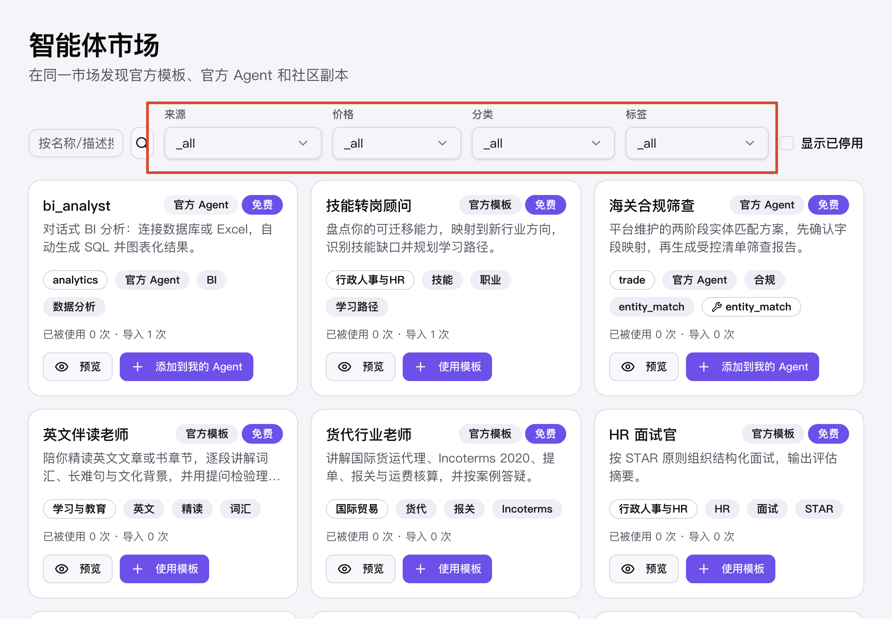
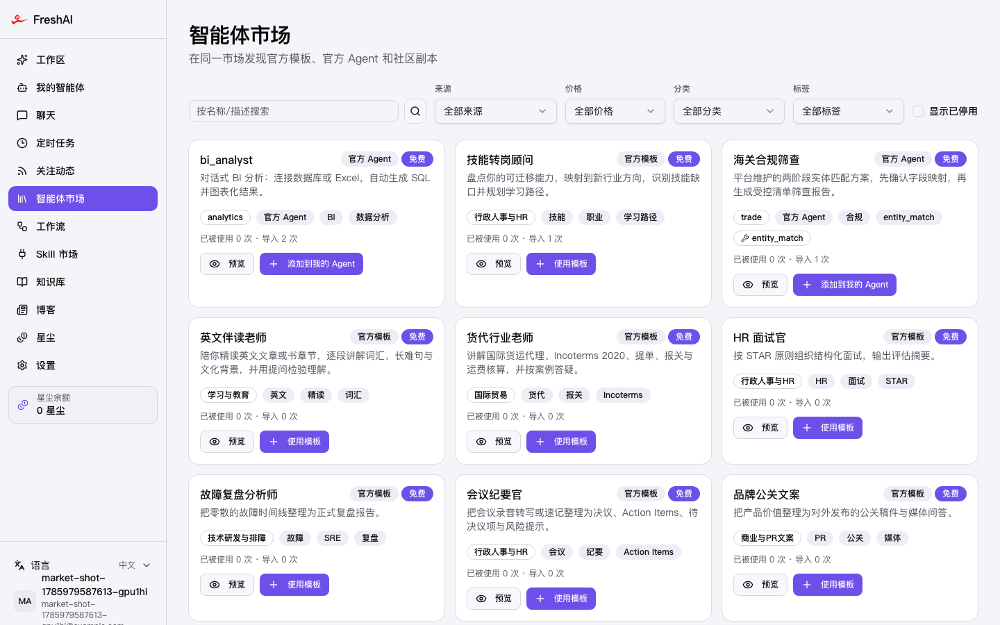
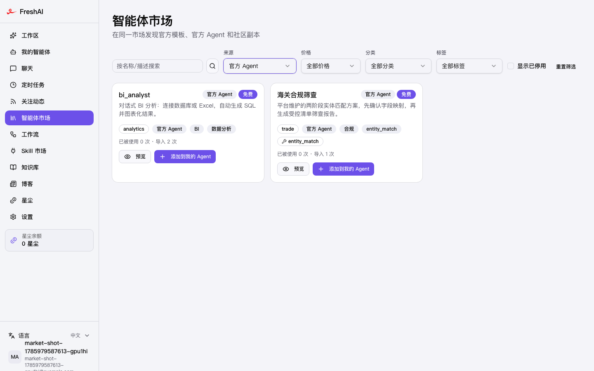

## 一个看起来像文案错误的 bug

前几天看智能体市场页面，发现一个奇怪的现象：页面上四个筛选下拉框——来源、价格、分类、标签——触发器里齐刷刷地显示着 `_all`。



第一反应：文案写错了，或者翻译 key 没配。这种问题见多了，大概率是 `t("xxx")` 的 key 在语言包里不存在，框架把 key 原样吐了出来。

打开代码一看，不对劲。每个选项明明都写了翻译文案：

```tsx
<SelectItem value="_all">{t("sourceAll")}</SelectItem>
<SelectItem value="official_template">{t("sourceOfficialTemplate")}</SelectItem>
```

语言包里 key 也都在。那 `_all` 到底是从哪冒出来的？

## 真相：组件库不是你以为的那个

线索藏在项目的 `components/ui/select.tsx` 里。这个文件的位置和命名，一看就是 shadcn/ui 的风格——而 shadcn 的 Select 底层是 Radix。但如果你真的打开它看 import：

```tsx
import { Select as SelectPrimitive } from "@base-ui/react/select"
const SelectValue = SelectPrimitive.Value
```

是 **Base UI**，不是 Radix。项目不知道什么时候做过组件库迁移，目录结构原封不动地保留了下来。

这两个库的 `Select.Value` 看着是同一个东西，行为却完全不同：

- **Radix** 的 `SelectValue` 很"贴心"：它会自动找到当前选中的 `SelectItem`，把它的子节点文本拿来显示。所以你只管写选项，显示的事它帮你办了。
- **Base UI** 的 `Select.Value` 很"实诚"：默认把当前 value 原样渲染出来。value 是什么就显示什么——在这个项目里，就是哨兵值 `_all`。

翻一下它的类型定义，官方用法写得明明白白，想显示文案？自己传个函数来格式化：

```tsx
// node_modules/@base-ui/react/select/value/SelectValue.d.ts
<Select.Value>
  {(value: string | null) => value ? labels[value] : 'No value'}
</Select.Value>
```

所以根本不存在什么文案错误。`_all` 是筛选状态的哨兵值，被 Base UI 原封不动地端上了桌。至于 `placeholder`，它只在"无值"时生效，而 `_all` 是一个货真价实的值，盖不住。

## 修复：把 value 翻译回人话

知道了根因，修法就很直接：给每个 `SelectValue` 传函数 children，显式地做一层 value → 文案的映射。

```tsx
// 修复前：placeholder 只管无值状态，_all 会被原样渲染
<SelectValue placeholder={t("sourceAll")} />

// 修复后：显式映射
<SelectValue>
  {(value: SourceFilter) => sourceFilterLabels[value]}
</SelectValue>
```

映射表复用已有的翻译 key，不新增任何文案：

```tsx
const sourceFilterLabels: Record<SourceFilter, string> = {
  _all: t("sourceAll"),
  official_template: t("sourceOfficialTemplate"),
  official_agent: t("sourceOfficialAgent"),
  community_agent: t("sourceCommunityAgent"),
}
```

分类、标签这种选项值是动态数据的，更简单，只需要特判哨兵值：

```tsx
<SelectValue>
  {(value: string) => (value === "_all" ? t("allCategories") : value)}
</SelectValue>
```

## 顺手扫一遍全仓：果然不止这一处

这类"库级行为差异"导致的 bug 有个特点：**它不可能只出现在一个地方**。凡是「value 和展示文案不一样」的 Select，都会露底。

按这个模式扫了一遍整个前端仓库，果然收获不小——一共改了 7 个文件、13 处。项目里的哨兵值花样还不少：

- `_all`：筛选器的"全部"占位；
- `__custom__` / `__unlimited__`：分享表单里的"自定义/不限"；
- `__agent_default__`、`model:{id}`：模型选择器的特殊值；
- `daily` / `weekly`：定时任务里的英文枚举，展示时应该是"每天/每周"。

也有两处不用动：value 和文案本来就相同的（比如协议选择器），以及本来就传了 children 的封装组件。扫的时候分清这两种情况，别误伤。

## 验证：走真实入口看一眼

改完先过静态检查（`tsc --noEmit`、eslint），然后写了个 Playwright 脚本走真实入口验证：起真实后端、注册真实用户、打开 `/app/market`，直接断言四个触发器的渲染文本。

默认状态，四个筛选器都显示中文文案：



再点开来源筛选选中「官方 Agent」，触发器显示对应文案，列表也真实地收窄到了 2 条官方 Agent：



## 几点收获

这个 bug 本身不大，但排查过程里有几个值得记住的点：

1. **目录结构会骗人。** `components/ui/select.tsx` 长得和 shadcn/Radix 一模一样，实际却是 Base UI。迁移过组件库的项目里，API 表面相似不代表行为一致。遇到"诡异渲染"，直接去 `node_modules` 里读类型定义和实现，比对着代码猜快得多。
2. **哨兵值要就地翻译。** `_all`、`__custom__` 这类哨兵值是很好的状态设计，但必须配一层显式的 value → 文案映射，不能指望组件库帮你回取选中项文本——它可能根本没这个功能。
3. **修一处，扫全仓。** 库级行为差异是"批发生产"bug 的，按「value ≠ 展示文案」的模式全仓扫一遍，一次清干净，比等用户一个个报上来体面得多。
