# 类图
## 类图的概念笔记

### 1. 什么是类图？
- 类图是 UML（统一建模语言）中最常用的一种静态结构图。
- 作用：展示系统中类的结构、属性、方法以及类与类之间的关系。
- 应用场景：软件设计、系统建模，帮助开发者理解和规划代码结构。

### 2. 类的基本组成
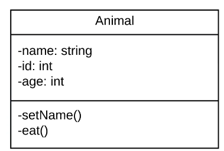

一个类通常用一个矩形框表示，分为三部分：
1. **顶部：类名**
   - 写类的名称（通常首字母大写）。
   - 如果是抽象类，类名用*斜体*表示。
2. **中间：属性**
   - 表示类的特性或数据（成员变量）。
   - 格式：`[可见性] 属性名 : 类型 [默认值]`
     - 可见性：`+`（public）、`-`（private）、`#`（protected）、`~`（package）。
      
      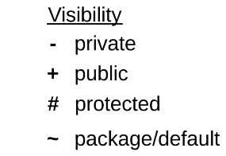
     - 示例：`-age : int = 18`
3. **底部：方法（操作）**
   - 表示类的行为或功能（成员函数）。
   - 格式：`[可见性] 方法名(参数) : 返回类型`
     - 示例：`+getAge() : int`

### 3. 类与类之间的关系

来源：https://juejin.cn/post/6844903893327937550

类图的核心是描述类之间的关系，常见的有以下几种：

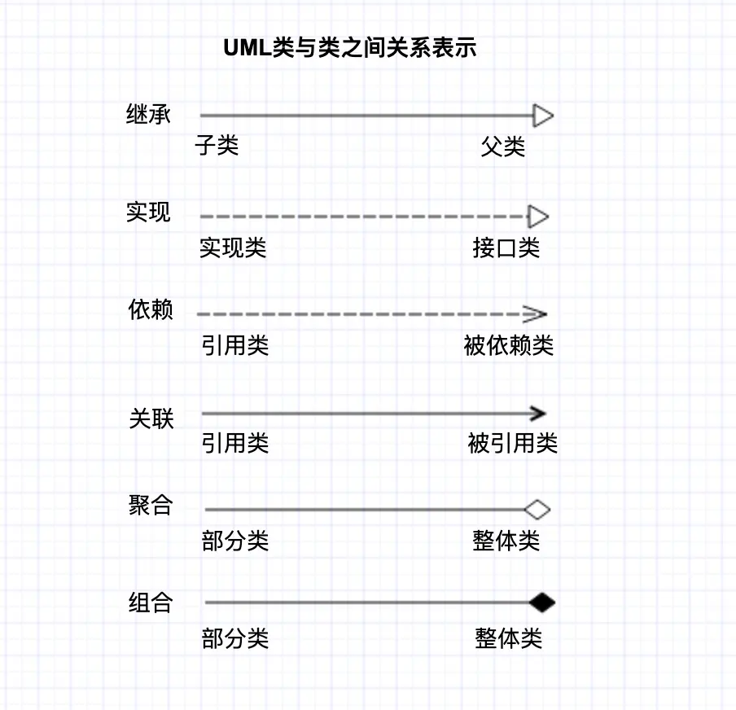

1. 继承关系（Generalization/extends）

继承关系也叫泛化关系，指的是一个类（称为子类、子接口）继承另外的一个类（称为父类、父接口）的功能，并可以增加它自己的新功能的能力，继承是类与类或者接口与接口之间最常见的关系。
继承用实线空心箭头表示，由子类指向父类。
下面写两个子类，Fish和Cat分别继承自Animal。
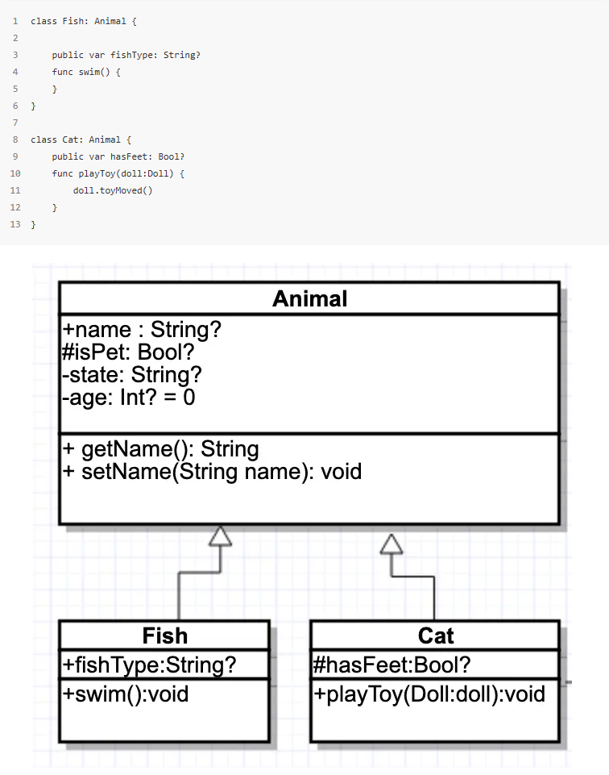

2. 实现关系（implements）

指的是一个class类实现interface接口（可以是多个）的功能；实现是类与接口之间最常见的关系；在Java中此类关系通过关键字implements明确标识，在iOS中我将其理解成代理的实现。
写一个洋娃娃类Doll，该类遵循了ToyAction协议，实现了玩具移动的方法。
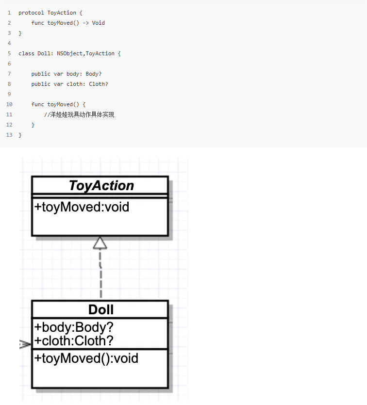

3. 依赖关系（Dependency）
 
可以简单的理解，就是一个类A使用到了另一个类B，而这种使用关系是具有偶然性的、、临时性的、非常弱的，但是B类的变化会影响到A；比如某人要过河，需要借用一条船，此时人与船之间的关系就是依赖；表现在代码层面，为类B作为参数被类A在某个method方法中使用。
在我们的上述代码中Cat的playToy方法中参数引用了Doll，因此他们是依赖关系。
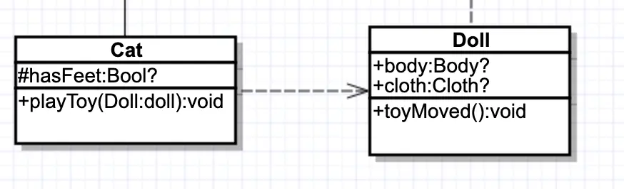

4. 关联关系（Association）

他体现的是两个类、或者类与接口之间语义级别的一种强依赖关系，比如我和我的朋友；这种关系比依赖更强、不存在依赖关系的偶然性、关系也不是临时性的，一般是长期性的，而且双方的关系一般是平等的、关联可以是单向、双向的；表现在代码层面，为被关联类B以类属性的形式出现在关联类A中，也可能是关联类A引用了一个类型为被关联类B的全局变量；
写一个Person类，他拥有一个宠物猫，他们之间的关系是关联。
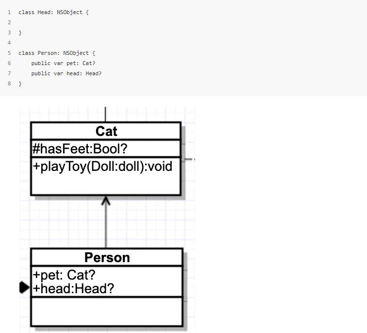

5. 聚合关系（Aggregation）
聚合是关联关系的一种特例，他体现的是整体与部分、拥有的关系，即has-a的关系，此时整体与部分之间是可分离的，他们可以具有各自的生命周期，部分可以属于多个整体对象，也可以为多个整体对象共享；比如计算机与CPU、公司与员工的关系等；表现在代码层面，和关联关系是一致的，只能从语义级别来区分；

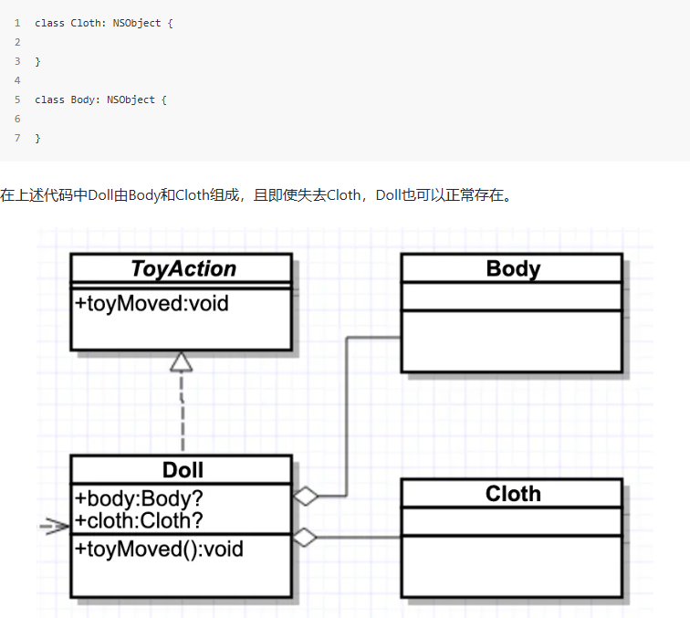

6. 组合关系（Composition）
组合也是关联关系的一种特例，他体现的是一种contains-a的关系，这种关系比聚合更强，也称为强聚合；他同样体现整体与部分间的关系，但此时整体与部分是不可分的，整体的生命周期结束也就意味着部分的生命周期结束；比如你和你的大脑；表现在代码层面，和关联关系是一致的，只能从语义级别来区分；
上述代码中的Person拥有Head，并且这个整体和部分是不可分割的。

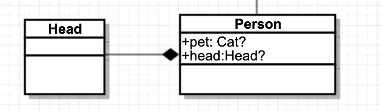

最后来看看这个例子中的整体关系：

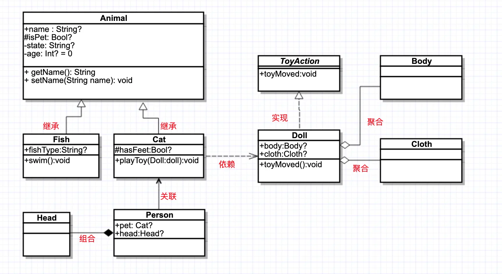

其实理解了之后我们发现还是很简单的，学会了之后就可以投入实践中了，举一个简单第三方库的类图例子，下图是Masonry的类图整理，可以看到项目结构很清晰的展示了出来。

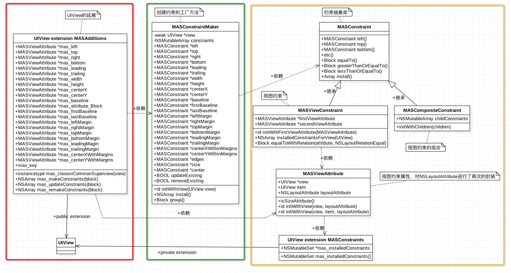

### 4. 类图的符号速查
- **矩形框**：类
- **实线**：关联
- **空心菱形+实线**：聚合
- **实心菱形+实线**：组合
- **空心三角+实线**：继承
- **空心三角+虚线**：实现
- **虚线箭头**：依赖

