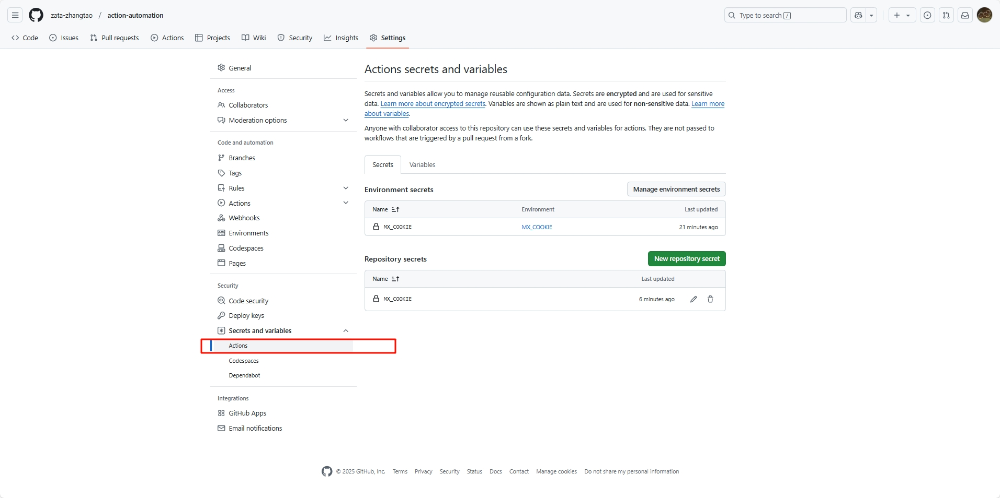
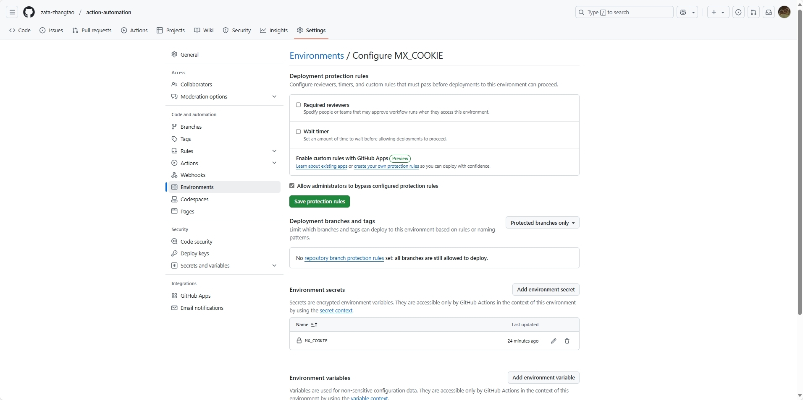
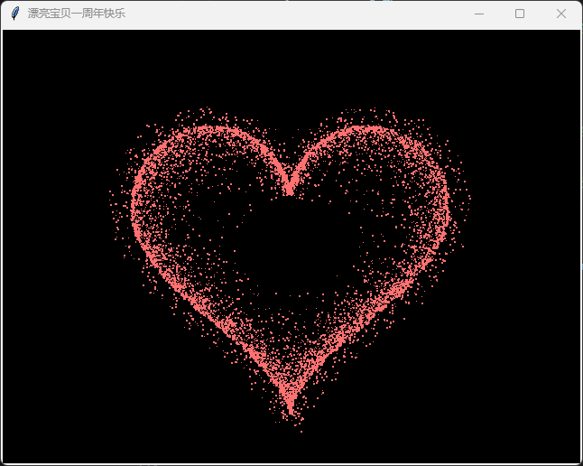

参考：
- https://github.com/tech-shrimp/GithubActionSample
- https://www.ruanyifeng.com/blog/2019/09/getting-started-with-github-actions.html [LXF,挺有用]


### 常用知识


### **基础概念**
1. **Workflow（工作流）**  
   工作流是一个自动化过程，定义在一或多个 YAML 文件中，存放在 `.github/workflows` 目录下。一个项目可以有多个工作流，他们顺序执行，你也可以在一个工作流里面引用执行另一个工作流
   
2. **Event（事件）**  
   触发工作流的事件，例如 `push`（推送代码）、`pull_request`（拉取请求）或定时触发。也可以手动执行，

3. **Job（任务）**  
   工作流中的一组步骤（Steps），运行在同一个虚拟机上。多个 Job 可以并行或按顺序执行。

4. **Step（步骤）**  
   Job 中的单个操作，例如运行命令或调用一个 Action。

5. **Action（动作）**  
   可重用的代码单元，通常由社区或官方提供，简化常见任务。

6. **Runner（运行器）**  
   执行工作流的服务器，GitHub 提供托管的 Runner，也支持自托管。

7. **共享的action**
    很多操作在不同项目里面是类似的，完全可以共享。GitHub 注意到了这一点，想出了一个很妙的点子，允许开发者把每个操作写成独立的脚本文件，存放到代码仓库，使得其他开发者可以引用。

    如果你需要某个 action，不必自己写复杂的脚本，直接引用他人写好的 action 即可，整个持续集成过程，就变成了一个 actions 的组合。这就是 GitHub Actions 最特别的地方。

    GitHub 做了一个官方市场 https://github.com/marketplace?type=actions ，可以搜索到他人提交的 actions。另外，还有一个 awesome actions 的仓库 https://github.com/sdras/awesome-actions ，也可以找到不少 action。

    
    每个 action 就是一个独立脚本，因此可以做成代码仓库，使用userName/repoName的语法引用 action。比如，actions/setup-node就表示github.com/actions/setup-node这个仓库，它代表一个 action，作用是安装 Node.js。事实上，GitHub 官方的 actions 都放在 github.com/actions 里面。
    既然 actions 是代码仓库，当然就有版本的概念，用户可以引用某个具体版本的 action。下面都是合法的 action 引用，用的就是 Git 的指针概念，详见官方文档。https://docs.github.com/en/actions/sharing-automations/creating-actions/about-custom-actions#versioning-your-action

    ```text
    actions/setup-node@74bc508 # 指向一个 commit
    actions/setup-node@v1.0    # 指向一个标签
    actions/setup-node@master  # 指向一个分支
    ```
8. 仓库密钥和环境密钥的区别，以及组织密钥

    参考：

    https://docs.github.com/en/actions/security-for-github-actions/security-guides/using-secrets-in-github-actions
    
    

    仓库密钥：（仓库下面的所有分支和标签可用）
    - 仓库密钥是在 GitHub 仓库级别设置的，用于保护仓库的访问权限和敏感信息。
    - 仓库密钥可以在仓库的“Settings” > “Secrets” > “Actions”中设置。
    - 仓库密钥只能在仓库内使用，不能跨仓库共享。


    环境密钥：（可设置哪些分支可用）
    - 环境密钥是在 GitHub 分支级别设置的，可以通过设置去设置哪些分支可用

    

    组织密钥：（可以设置哪些仓库可用）
    

---

### 构建画爱心为可执行程序
原始代码效果：



代码：

```python
# 版权https://github.com/royalneverwin/beating-heart

from tkinter import *  # 导入tkinter库，用于创建GUI界面
from math import sin, cos, pi, log  # 导入数学函数，用于心形计算
import random  # 导入随机数模块，用于生成随机点
import time  # 导入时间模块（当前代码未使用，但保留）

# 定义画布的宽度和高度
CANVAS_WIDTH = 640
CANVAS_HEIGHT = 480
# 计算画布中心坐标
CANVAS_CENTER_X = CANVAS_WIDTH / 2
CANVAS_CENTER_Y = CANVAS_HEIGHT / 2
# 心形放大倍数
IMAGE_ENLARGE = 11


def scatter_inside(x, y, beta=0.15):  # 在心形内部生成散点
    """使用对数分布在给定点附近生成内部散点"""
    ratiox = -beta * log(random.random())  # 对数分布计算x方向偏移量，可调整beta值改变分布
    ratioy = -beta * log(random.random())  # 对数分布计算y方向偏移量
    dx = ratiox * (x - CANVAS_CENTER_X)  # 计算x方向的实际偏移
    dy = ratioy * (y - CANVAS_CENTER_Y)  # 计算y方向的实际偏移
    return x - dx, y - dy  # 返回散点的新坐标


def heart_function(t, enlarge_ratio: float = IMAGE_ENLARGE):  # 定义心形曲线方程
    """根据参数t生成心形曲线的x,y坐标"""
    # 心形曲线参数方程
    x = 16 * (sin(t)**3)
    y = -(13 * cos(t) - 5 * cos(2*t) - 2 * cos(3*t) - cos(4*t))
    
    # 放大心形
    x *= enlarge_ratio
    y *= enlarge_ratio
    
    # 将心形移动到画布中心
    x += CANVAS_CENTER_X
    y += CANVAS_CENTER_Y
    
    return int(x), int(y)  # 返回整数坐标


def shrink(x, y, ratio):  # 向心形中心收缩点
    """根据距离中心点的平方反比计算收缩量"""
    sk_range = -1 / ((x - CANVAS_CENTER_X) ** 2 + (y - CANVAS_CENTER_Y) ** 2)  # 平方反比因子
    dx = ratio * sk_range * (x - CANVAS_CENTER_X)  # x方向收缩量
    dy = ratio * sk_range * (y - CANVAS_CENTER_Y)  # y方向收缩量
    return x - dx, y - dy  # 返回收缩后的坐标


class Heart:
    def __init__(self, frame):  # 初始化心形类
        self.points = set()  # 存储心形曲线上的点
        self.edge_points = set()  # 存储边缘散点
        self.inside_points = set()  # 存储内部散点
        self.all_points = {}  # 存储每一帧的所有点坐标
        self.build(2000)  # 构建初始点集，可调整点的数量
        self.frame = frame  # 动画的总帧数
        for f in range(frame):  # 预计算每一帧的点位置
            self.calc(f)
        self.random_halo = 1000  # 用于光晕效果的随机点数量（未直接使用）

    def build(self, number):  # 生成初始点集
        """在心形上生成随机点及其边缘和内部散点"""
        # 在心形曲线上随机生成number个点
        for _ in range(number):
            t = random.uniform(0, 2 * pi)  # 随机生成角度t
            x, y = heart_function(t)  # 计算心形上的点
            x, y = shrink(x, y, -1000)  # 向中心收缩点
            self.points.add((int(x), int(y)))  # 添加到点集

        # 生成边缘散点
        for px, py in self.points:
            for _ in range(3):  # 每个点生成3个边缘散点，可调整数量
                x, y = scatter_inside(px, py, 0.05)  # 在点附近生成散点，可调整beta值
                self.edge_points.add((x, y))  # 添加到边缘点集

        # 生成内部散点
        pt_ls = list(self.points)  # 将点集转为列表以便随机选择
        for _ in range(4000):  # 生成4000个内部散点，可调整数量
            x, y = random.choice(pt_ls)  # 随机选择一个基础点
            x, y = scatter_inside(x, y)  # 在其附近生成散点
            self.inside_points.add((x, y))  # 添加到内部点集

    def cal_position(self, x, y, ratio):  # 计算点在跳动时的位置
        """根据距离中心的平方反比计算跳动幅度"""
        bt_range = 1 / ((x - CANVAS_CENTER_X) ** 2 + (y - CANVAS_CENTER_Y) ** 2)  # 跳动因子
        dx = ratio * bt_range * (x - CANVAS_CENTER_X) + random.randint(-1, 1)  # x方向位移
        dy = ratio * bt_range * (y - CANVAS_CENTER_Y) + random.randint(-1, 1)  # y方向位移
        return x - dx, y - dy  # 返回跳动后的位置

    def calc(self, frame):  # 计算每一帧的点位置
        """预计算每帧中所有点的动态位置"""
        ratio = 800 * sin(frame / 10 * pi)  # 跳动幅度随正弦变化，30fps，可调整
        all_pts = []  # 存储当前帧所有点的列表

        # 生成光晕效果
        halo_radius = int(4 + 6 * (1 + sin(self.frame / 10 * pi)))  # 光晕半径随时间变化
        halo_number = int(3000 + 4000 * abs(sin(self.frame / 10 * pi) ** 2))  # 光晕点数量
        heart_halo_point = set()  # 存储光晕点
        for _ in range(halo_number):
            t = random.uniform(0, 2 * pi)  # 随机角度
            x, y = heart_function(t, enlarge_ratio=11.6)  # 生成光晕基础点
            x, y = shrink(x, y, halo_radius)  # 向中心收缩
            if (x, y) not in heart_halo_point:  # 避免重复
                heart_halo_point.add((x, y))
                x += random.randint(-14, 14)  # 添加随机偏移
                y += random.randint(-14, 14)
                size = random.choice((1, 2, 2))  # 随机选择点大小
                all_pts.append((x, y, size))  # 添加到点列表

        # 计算心形曲线上的点
        for x, y in self.points:
            x, y = self.cal_position(x, y, ratio)  # 计算跳动位置
            size = random.randint(1, 3)  # 随机点大小，可调整
            all_pts.append((x, y, size))

        # 计算边缘点
        for x, y in self.edge_points:
            x, y = self.cal_position(x, y, ratio)
            size = random.randint(1, 2)  # 随机点大小，可调整
            all_pts.append((x, y, size))

        # 计算内部点
        for x, y in self.inside_points:
            x, y = self.cal_position(x, y, ratio)
            size = random.randint(1, 2)  # 随机点大小，可调整
            all_pts.append((x, y, size))

        self.all_points[frame] = all_pts  # 保存当前帧的点数据

    def render(self, canvas, frame):  # 渲染点到画布上
        """在画布上绘制当前帧的所有点"""
        for x, y, size in self.all_points[frame % self.frame]:  # 循环取帧数据
            # 绘制矩形点，颜色为粉红色
            canvas.create_rectangle(x, y, x+size, y+size, width=0, fill='#ff7171')


def draw(root: Tk, canvas: Canvas, heart: Heart, frame=0):  # 动画绘制函数
    """递归调用实现心形跳动动画"""
    canvas.delete('all')  # 清空画布
    heart.render(canvas, frame)  # 绘制当前帧
    # 每30毫秒刷新一次，相当于约33fps
    root.after(30, draw, root, canvas, heart, frame+1)


if __name__ == '__main__':  # 主程序入口
    root = Tk()  # 创建主窗口
    root.title('漂亮宝贝一周年快乐')  # 设置窗口标题
    # 创建画布，背景黑色
    canvas = Canvas(root, bg='black', height=CANVAS_HEIGHT, width=CANVAS_WIDTH)
    canvas.pack()  # 将画布添加到窗口
    heart = Heart(20)  # 创建心形对象，帧数设为20
    draw(root, canvas, heart)  # 开始动画
    root.mainloop()  # 进入主循环，显示窗口

```

然后创建一个.github/workflows文件夹，并在其中创建一个love_heart.yml文件。文件内容如下填写,功能是创建一个windows的可执行程序
```yaml
# This workflow will install Python dependencies, run tests and lint with a single version of Python
# For more information see: https://docs.github.com/en/actions/automating-builds-and-tests/building-and-testing-python
# 这是一个 GitHub Actions 工作流，用于安装 Python 依赖、运行测试和代码检查，使用单一 Python 版本
# 更多信息请参考上述 GitHub 文档链接

name: 画爱心Windows版  # 工作流名称，显示在 GitHub Actions 界面上，表示这是一个在 Windows 上构建“画爱心”程序的工作流

on:  # 定义触发工作流的事件
  workflow_dispatch:  # 手动触发事件，允许用户通过 GitHub 界面手动运行此工作流

permissions:  # 设置工作流的权限
  contents: read  # 授予读取仓库内容的权限，确保工作流可以访问代码

jobs:  # 定义工作流中的任务
  pyinstaller-build:  # 任务名称，表示使用 PyInstaller 构建可执行文件
    runs-on: windows-latest  # 指定运行环境为最新的 Windows 系统
    steps:  # 定义任务的具体步骤
      - name: Create Executable  # 步骤名称，表示创建可执行文件
        uses: sayyid5416/pyinstaller@v1  # 使用社区提供的 PyInstaller Action，版本为 v1
        with:  # 配置 Action 的参数
          python_ver: '3.12'  # 指定使用的 Python 版本为 3.12
          spec: 'love_heart.py'  # 指定 PyInstaller 的构建配置文件或主 Python 文件为 love_heart.py
          upload_exe_with_name: 'love_heart'  # 指定上传的可执行文件名称为 love_heart
          options: --onefile, --name "love_heart", --windowed,  # PyInstaller 的构建选项
            # --onefile: 将所有内容打包为单个可执行文件（生成 .exe 文件）
            # --name "love_heart": 设置输出可执行文件的名称为 love_heart（最终为 love_heart.exe）
            # --windowed: 生成无控制台窗口的 GUI 应用程序，适合 Windows 上的图形界面程序
            # 注意：选项之间用逗号分隔，最后一个选项后不需要逗号，但此处保留原始格式
```


### **快速入门教程**
#### **目标**
创建一个简单的 GitHub Actions 工作流，在每次推送代码时运行一个脚本，输出 "Hello, GitHub Actions!"。

#### **步骤**
1. **创建仓库**  
   在 GitHub 上创建一个新仓库（或使用现有仓库）。

2. **添加工作流文件**  
   - 在仓库根目录下创建文件夹 `.github/workflows`。
   - 在该文件夹中创建一个文件，例如 `hello.yml`。

3. **编写工作流文件**  
   将以下内容写入 `hello.yml`：
   ```yaml
   name: Hello World Workflow

   # 触发条件：在推送代码到 main 分支时运行
   on:
     push:
       branches:
         - main

   # 定义任务
   jobs:
     say-hello:
       runs-on: ubuntu-latest # 使用 GitHub 提供的最新 Ubuntu 虚拟机
       steps:
         - name: Checkout code
           uses: actions/checkout@v3 # 检出代码到虚拟机

         - name: Say Hello
           run: echo "Hello, GitHub Actions!" # 运行简单的 shell 命令
   ```

4. **提交文件**  
   将 `hello.yml` 提交到仓库的 `main` 分支。

5. **查看运行结果**  
   - 转到仓库的 **Actions** 标签页。
   - 你会看到名为 "Hello World Workflow" 的工作流正在运行。
   - 点击工作流名称，查看日志，确认 "Hello, GitHub Actions!" 已输出。

---

### **进阶示例**
#### **运行测试并部署**
假设你有一个 Node.js 项目，想在推送代码时运行测试并部署到服务器。

1. **工作流文件示例**  
   创建 `.github/workflows/test-and-deploy.yml`：
   ```yaml
   name: Test and Deploy

   on:
     push:
       branches:
         - main

   jobs:
     test:
       runs-on: ubuntu-latest
       steps:
         - name: Checkout code
           uses: actions/checkout@v3

         - name: Setup Node.js
           uses: actions/setup-node@v3
           with:
             node-version: '16'

         - name: Install dependencies
           run: npm install

         - name: Run tests
           run: npm test

     deploy:
       needs: test # 在 test 任务成功后运行
       runs-on: ubuntu-latest
       steps:
         - name: Checkout code
           uses: actions/checkout@v3

         - name: Deploy to server
           run: |
             echo "Deploying to server..."
             # 这里可以添加实际部署命令，例如通过 SSH
   ```

2. **添加秘密（Secrets）**  
   如果部署需要敏感信息（如 SSH 密钥）：  
   - 转到仓库的 **Settings > Secrets and variables > Actions**。
   - 点击 **New repository secret**，添加密钥（如 `SSH_KEY`）。
   - 在工作流中通过 `secrets.SSH_KEY` 使用它。

---

### **常用配置**
1. **触发事件**  
   ```yaml
   on:
     push: # 推送时触发
       branches:
         - main
     pull_request: # 拉取请求时触发
       branches:
         - main
     schedule: # 定时触发（每天凌晨0点）
       - cron: '0 0 * * *'
   ```

2. **设置环境变量**  
   ```yaml
   env:
     MY_VAR: "Hello"
   jobs:
     example:
       runs-on: ubuntu-latest
       steps:
         - run: echo $MY_VAR # 输出 "Hello"
   ```

3. **使用社区 Action**  
   示例：使用 `actions/cache` 缓存依赖：
   ```yaml
   - name: Cache node modules
     uses: actions/cache@v3
     with:
       path: ~/.npm
       key: ${{ runner.os }}-node-${{ hashFiles('**/package-lock.json') }}
   ```

---

### **调试技巧**
- **查看日志**：在 Actions 标签页点击工作流，展开每个 Job 和 Step 查看详细输出。
- **添加调试步骤**：在步骤中运行 `ls -la`（Linux）或 `dir`（Windows）检查文件。
- **使用 GitHub 提供的测试工具**：在本地安装 `act`（需要 Docker）模拟运行工作流。

---

### **常见问题**
1. **工作流没触发？**  
   检查 `on` 配置是否匹配事件和分支。

2. **权限不足？**  
   在仓库设置中确认 Actions 已启用（Settings > Actions > General）。

3. **需要更多计算资源？**  
   考虑使用自托管 Runner。

---

### **扩展阅读**
- 官方文档：https://docs.github.com/en/actions
- 社区 Actions：https://github.com/marketplace?type=actions


### on字段

在 GitHub Actions 的 `on` 字段中，你可以定义触发工作流的事件。`workflow_dispatch` 是其中一种触发方式，表示手动触发。除了 `workflow_dispatch`，还有许多其他触发事件可以选择，具体取决于你的需求。以下是 `on` 可以填写的参数（触发事件类型），以及它们的用途和可能配置项：

---

### `on` 可填写的触发事件类型
#### 1. `workflow_dispatch`（手动触发）
- **作用**：允许用户通过 GitHub 界面手动触发工作流。
- **可选配置**：
  - `inputs`：定义手动触发时可以输入的参数。
- **示例**：
  ```yaml
  on:
    workflow_dispatch:
      inputs:
        name:
          description: '输入你的名字'
          required: true  # 是否必填
          default: 'Anonymous'  # 默认值
        version:
          description: '选择版本'
          type: choice  # 类型可以是 string, boolean, choice 等
          options:
            - 'v1'
            - 'v2'
          required: false
  ```
- **用途**：适合需要用户干预或自定义参数的场景，例如手动选择构建版本。

---

#### 2. `push`（推送事件）
- **作用**：当代码被推送到指定分支或路径时触发。
- **可选配置**：
  - `branches`：指定触发分支。
  - `branches-ignore`：忽略特定分支。
  - `paths`：指定触发文件路径。
  - `paths-ignore`：忽略特定文件路径。
  - `tags`：指定触发标签。
- **示例**：
  ```yaml
  on:
    push:
      branches:
        - main
        - 'feature/*'  # 支持通配符
      paths:
        - 'src/**'  # 只在 src 目录下文件变更时触发
      tags:
        - 'v*'
  ```
- **用途**：适合每次代码提交时自动构建或测试。

---

#### 3. `pull_request`（拉取请求事件）
- **作用**：当拉取请求（PR）被创建、更新或合并时触发。
- **可选配置**：
  - `branches`：目标分支。
  - `types`：触发的事件类型（如 `opened`, `synchronize`, `closed`）。
  - `paths`：触发文件路径。
- **示例**：
  ```yaml
  on:
    pull_request:
      branches:
        - main
      types:
        - opened  # PR 创建时触发
        - synchronize  # PR 更新时触发
      paths:
        - '*.py'  # 只在 Python 文件变更时触发
  ```
- **用途**：用于 PR 的自动化检查或构建。

---

#### 4. `schedule`（定时触发）
- **作用**：按计划时间触发，使用 cron 表达式。
- **可选配置**：
  - `cron`：定义运行时间（UTC）。
- **示例**：
  ```yaml
  on:
    schedule:
      - cron: '0 0 * * *'  # 每天 UTC 00:00 触发
      - cron: '*/15 * * * *'  # 每 15 分钟触发一次
  ```
- **用途**：适合定时任务，例如每天构建或检查。

---

#### 5. `release`（发布事件）
- **作用**：当 GitHub 发布（release）相关操作发生时触发。
- **可选配置**：
  - `types`：触发类型（如 `published`, `created`, `edited`）。
- **示例**：
  ```yaml
  on:
    release:
      types:
        - published  # 发布时触发
        - prereleased  # 预发布时触发
  ```
- **用途**：用于发布版本时的自动化构建或部署。

---

#### 6. `issues`（问题事件）
- **作用**：当 GitHub Issues 相关操作发生时触发。
- **可选配置**：
  - `types`：触发类型（如 `opened`, `closed`, `labeled`）。
- **示例**：
  ```yaml
  on:
    issues:
      types:
        - opened  # 新建 issue 时触发
        - labeled  # 添加标签时触发
  ```
- **用途**：适合与问题管理相关的自动化任务。

---

#### 7. `workflow_run`（工作流运行事件）
- **作用**：当另一个工作流完成时触发当前工作流。
- **可选配置**：
  - `workflows`：指定监听的工作流名称。
  - `types`：触发类型（如 `completed`）。
  - `branches`：触发分支。
- **示例**：
  ```yaml
  on:
    workflow_run:
      workflows: ['Build']  # 监听名为 Build 的工作流
      types:
        - completed  # Build 完成后触发
      branches:
        - main
  ```
- **用途**：用于工作流间的依赖关系，例如先构建再部署。

---

#### 8. 其他事件
- **`create`**：当创建分支或标签时触发。
  ```yaml
  on:
    create:
      branches:
        - 'feature/*'
  ```
- **`delete`**：当删除分支或标签时触发。
- **`fork`**：当仓库被 fork 时触发。
- **`watch`**：当用户点击“Star”时触发。
  ```yaml
  on:
    watch:
      types:
        - started  # 用户 star 仓库时触发
  ```

---

#### 组合使用
你可以组合多个事件类型。例如：
```yaml
on:
  push:
    branches:
      - main
  pull_request:
    branches:
      - main
  workflow_dispatch:
```
这样，工作流会在推送、拉取请求或手动触发时运行。

---

#### 参数总结表
| 触发事件           | 主要配置项                          | 示例用途                     |
|--------------------|-------------------------------------|------------------------------|
| `workflow_dispatch`| `inputs`                            | 手动构建，带自定义参数       |
| `push`             | `branches`, `paths`, `tags`         | 代码提交时构建             |
| `pull_request`     | `branches`, `types`, `paths`        | PR 检查                    |
| `schedule`         | `cron`                              | 定时任务                   |
| `release`          | `types`                             | 发布版本                   |
| `issues`           | `types`                             | Issue 管理                 |
| `workflow_run`     | `workflows`, `types`, `branches`    | 工作流依赖                 |
| `create`           | `branches`                          | 创建分支或标签             |

---

#### 针对你的需求
你的工作流目前使用 `workflow_dispatch`，适合手动触发构建“画爱心”程序。如果需要其他触发方式：
- **自动构建**：用 `push` 或 `pull_request`，在代码变更时触发。
- **定时构建**：用 `schedule`，每天生成新版本。
- **发布版本**：用 `release`，在发布时生成可执行文件。

如果你想具体调整（例如添加 `push` 或 `schedule`），可以告诉我，我帮你写出对应配置！