# hugo


## 常用命令

```bash
# start the hugo server
hugo server -D 

# build the hugo site
hugo -D
```


## hugo使用注意事项
1. `文件命名必须是index.xxxx.md`

md文件+图片的组合，文件夹的名称是随意命名的，但文件夹里md文件的命名，必须为index.md或index.zh-cn.md否则图片资源可能在打包上传时会消失。


2. `图片资源的放置位置有讲究`
看下面两张图，三张图片在md文件中本地查看都是可以的，但是在打包上传时，最后一个图片资源可能会消失。

`图片资源必须和.md文件在同一个文件夹下，否则图片资源可能在打包上传时会消失。`


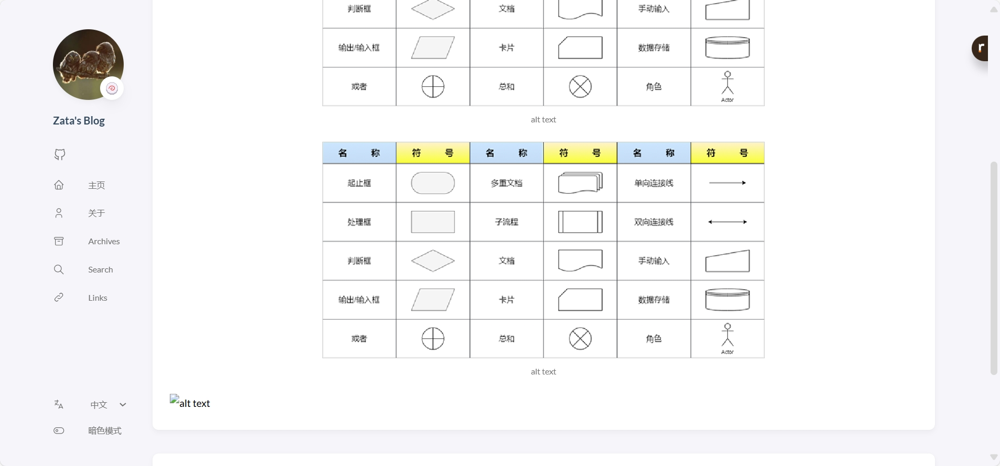


## hugo在ubuntu系统下安装使用


https://gohugo.io/getting-started/quick-start/

1. 安装hugo

```bash
sudo apt install hugo
```


2. 安装git


```bash
sudo apt install git-all
```


## hugo在windwos安装使用


- download 下载

https://github.com/gohugoio/hugo/releases

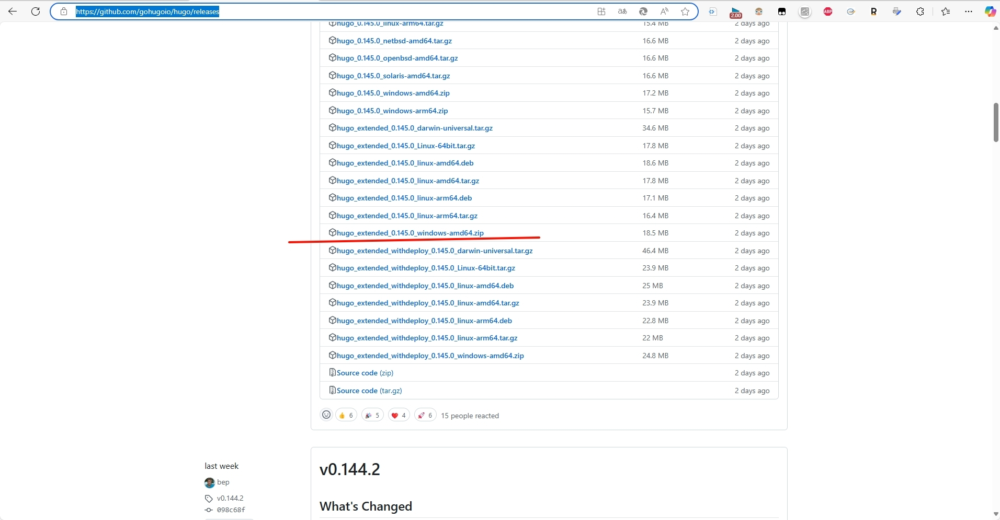


- unzip to local 解压到本地 , example : here I created a folder

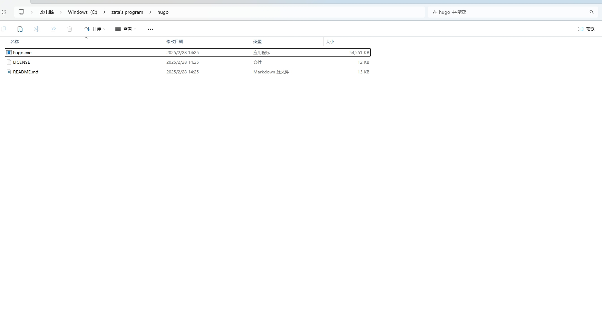


- run the cmd command under the directory 在目录下面运行cmd命令 ,example : here I created a folder named zata

```bash
hugo new site zata
```


- copy hugo.exe to zata folder 把hugo.exe复制到zata文件夹

- run the cmd command under the directory 在目录下面运行cmd命令,example : here I created a folder named zata


- then you can see the example site


- next step, you need to install the theme


- choose the theme you want to install , example : here I choose the theme named Stack


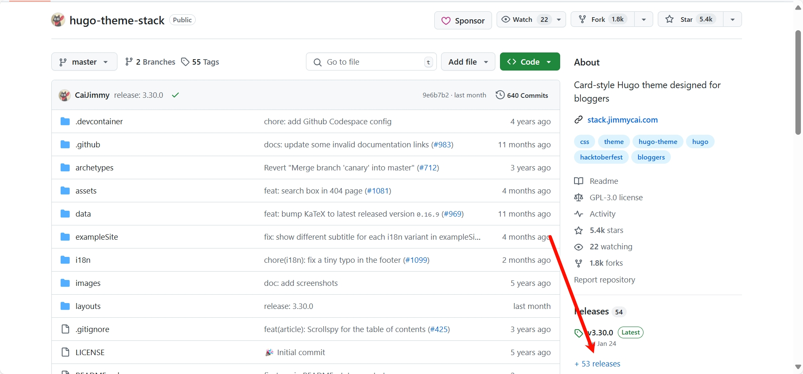
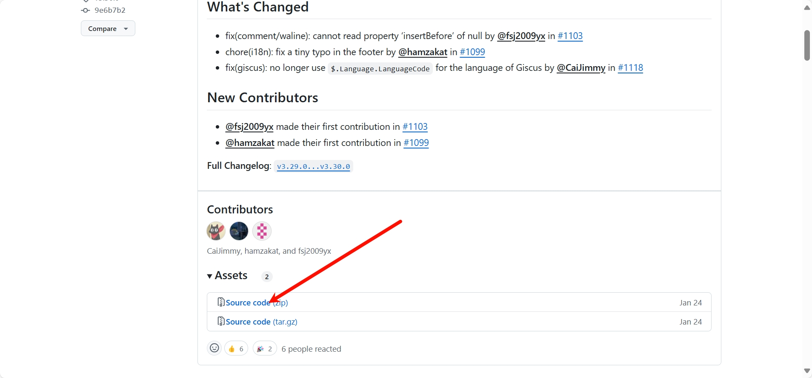


- unzip the theme to the zata/themes folder, and delete the version number
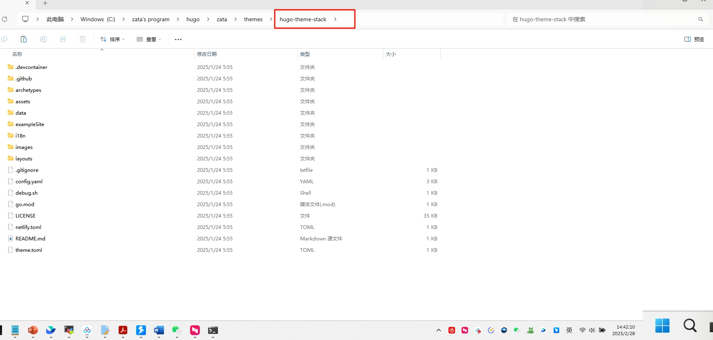


- copy [your-theme-name]/exampleSite/config.toml&content to zata/


- delete the toml file, because the toml file is not used, the yaml file is used

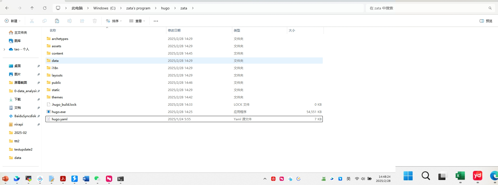

- delete rich-content folder,because the rich-content folder is cite some website, and the website is not used
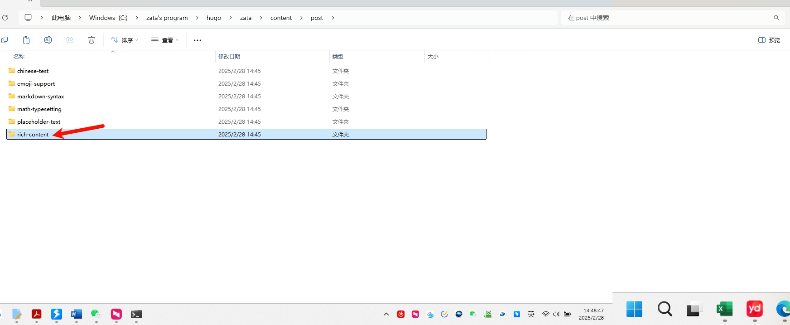

- run the cmd command under the directory in zata folder, then you can see:


- then you can create a new post
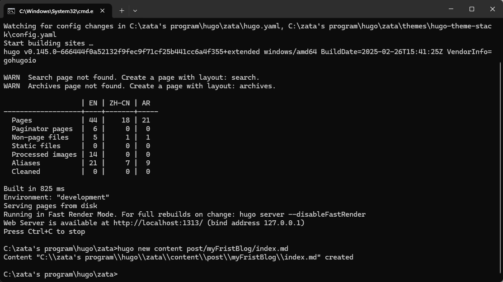
```bash
hugo new content post/myFristBlog/index.md
```
**myFtistBlog is the name of the page**
In hugo, a folder is a page, then the default language of index.md that you can modify in the hugo.yaml, the default language of index.zh-cn.md is Chinese, and the images used in md will be placed in this folder.


## 使用github部署hugo的静态页面常规方式（下面一节使用github action）


### 将hugo的编译成静态页面

1. 修改配置文件中的baseurl,具体如何修改可以看下一节 :[如何对应github静态页面的域名](#push-上一步生成的pulic文件夹到github)

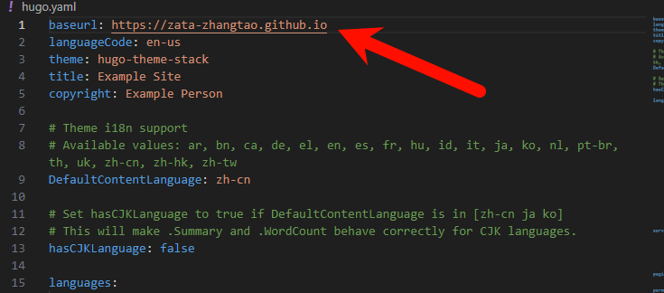


2. 在根目录下面使用hugo -D 命令生成静态页面
using "hugo -D" command to generate static pages in the root directory
    ```bash
    hugo -D
    ```
这将生成一个public文件夹
This will generate a public folder

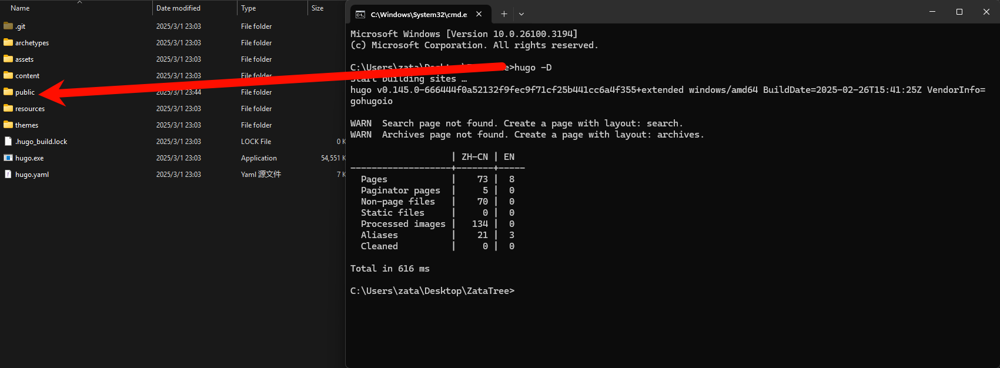

### push 上一步生成的pulic文件夹到github

1. 首先需要在github上创建一个仓库，这个仓库名如果是"[你的用户名].github.io" 那么后续生成的静态页面的地址就不会有后缀，不然就会有后缀，例如我的github名字是zata-zhangtao,我创建了一个仓库为zata-zhangtao.github.io，那么生成的静态页面的地址就是zata-zhangtao.github.io，而如果仓库名为zata-zhangtao, 那么生成的静态页面地址就会是zata-zhangtao.github.io/zata-zhangtao/

First, you need to create a repository on github, and if the repository name is "[your-username].github.io", then the static pages will not have a suffix, otherwise there will be a suffix, for example, my github username is zata-zhangtao, I created a repository named zata-zhangtao.github.io, then the static pages address will be zata-zhangtao.github.io, but if the repository name iszata-zhangtao, then the static pages address will be z


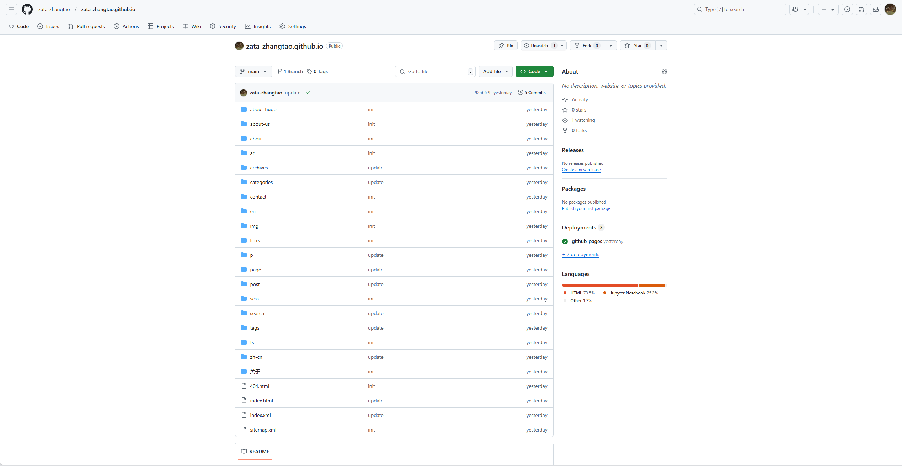


  


2. 把刚刚的public文件夹push到github上

push the public folder to github

具体的push命令和方式不在具体说明

the specific push command and way are not detailed


3. 设置github静态页面
setting up github pages 

进入仓库的设置页面，然后点击pages,然后再选你那个分支作为你的静态页面，选择完成之后，稍等几分钟，看到页面产生就可以使用了
into the repository settings page, click pages, then choose your branch as your static page, select complete, wait a few minutes, and see if the page is generated, and you can use it 

`如果你前面配置文件中的baseurl没有配置正确，可能会出现点击域名之后发现页面有问题，解决：`
重新修改baseurl，并重新编译和push，并且注意编译的时候有没有报错
if the baseurl in the hogo.yaml is not configured correctly, you will find that the page is not displayed correctly after clicking the domain, solve it by modifying the baseurl, recompiling and pushing, and pay attention to whether there are any errors when compiling 

   
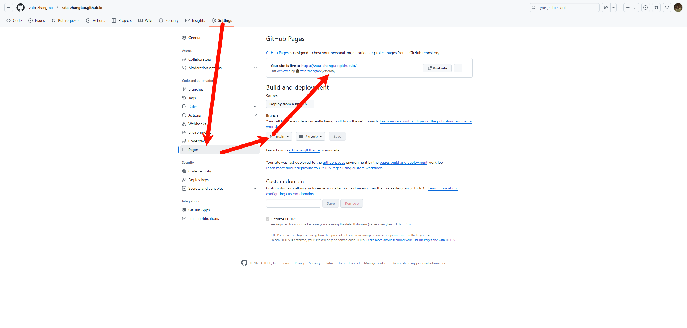


4. 然后你就可以看见你的静态页面了
then you can see your static page


## github 自动部署hugo的静态页面
automatically deploy hugo's static page by github action

参考网址：

    https://www.bilibili.com/video/BV1bovfeaEtQ?p=4


    https://gohugo.io/hosting-and-deployment/hosting-on-github/#build-hugo-with-github-action


“GitHub 自动部署 Hugo 的静态页面”是指利用 GitHub Actions（GitHub 提供的工作流自动化工具）来实现以下过程：当你推送 Hugo 项目代码到 GitHub 仓库时，自动完成 Hugo 静态网站的构建并将其部署到某个目标位置（通常是 GitHub Pages），无需手动操作。


1. 在自己的根路径下面创建一个.github/workflows/hugo.yaml文件,并将如下代码复制粘贴进去
`配置文件中有几点值得注意：`
- 需要修改你的分支名，我这里是hugo,需要改成你自己的分支名
- 注意一下版本的问题，这里我默认版本是0.141.0，


    ```yaml
    # Sample workflow for building and deploying a Hugo site to GitHub Pages
    name: Deploy Hugo site to Pages

    on:
      # Runs on pushes targeting the default branch
      push:
        branches:
          - hugo  # 注意要要修改你的分支名

      # Allows you to run this workflow manually from the Actions tab
      workflow_dispatch:

    # Sets permissions of the GITHUB_TOKEN to allow deployment to GitHub Pages
    permissions:
      contents: read
      pages: write
      id-token: write

    # Allow only one concurrent deployment, skipping runs queued between the run in-progress and latest queued.
    # However, do NOT cancel in-progress runs as we want to allow these production deployments to complete.
    concurrency:
      group: "pages"
      cancel-in-progress: false

    # Default to bash
    defaults:
      run:
        shell: bash

    jobs:
      # Build job
      build:
        runs-on: ubuntu-latest
        env:
          HUGO_VERSION: 0.141.0
        steps:
          - name: Install Hugo CLI
            run: |
              wget -O ${{ runner.temp }}/hugo.deb https://github.com/gohugoio/hugo/releases/download/v${HUGO_VERSION}/hugo_extended_${HUGO_VERSION}_linux-amd64.deb \
              && sudo dpkg -i ${{ runner.temp }}/hugo.deb
          - name: Install Dart Sass
            run: sudo snap install dart-sass
          - name: Checkout
            uses: actions/checkout@v4
            with:
              submodules: recursive
              fetch-depth: 0
          - name: Setup Pages
            id: pages
            uses: actions/configure-pages@v5
          - name: Install Node.js dependencies
            run: "[[ -f package-lock.json || -f npm-shrinkwrap.json ]] && npm ci || true"
          - name: Build with Hugo
            env:
              HUGO_CACHEDIR: ${{ runner.temp }}/hugo_cache
              HUGO_ENVIRONMENT: production
              TZ: America/Los_Angeles
            run: |
              hugo \
                --gc \
                --minify \
                --baseURL "${{ steps.pages.outputs.base_url }}/"
          - name: Upload artifact
            uses: actions/upload-pages-artifact@v3
            with:
              path: ./public

      # Deployment job
      deploy:
        environment:
          name: github-pages
          url: ${{ steps.deployment.outputs.page_url }}
        runs-on: ubuntu-latest
        needs: build
        steps:
          - name: Deploy to GitHub Pages
            id: deployment
            uses: actions/deploy-pages@v4
    ```


2. 创建一个github仓库，然后进入setting，将build and development 改成Github Action ，并且修改环境变量
ctreate a github repository, then enter setting, change build and development to Github Action, and modify the environment variable

    **修改Github Action**
    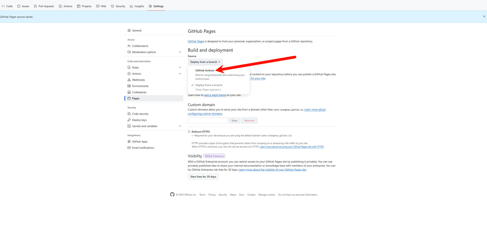

    **修改环境变量**
    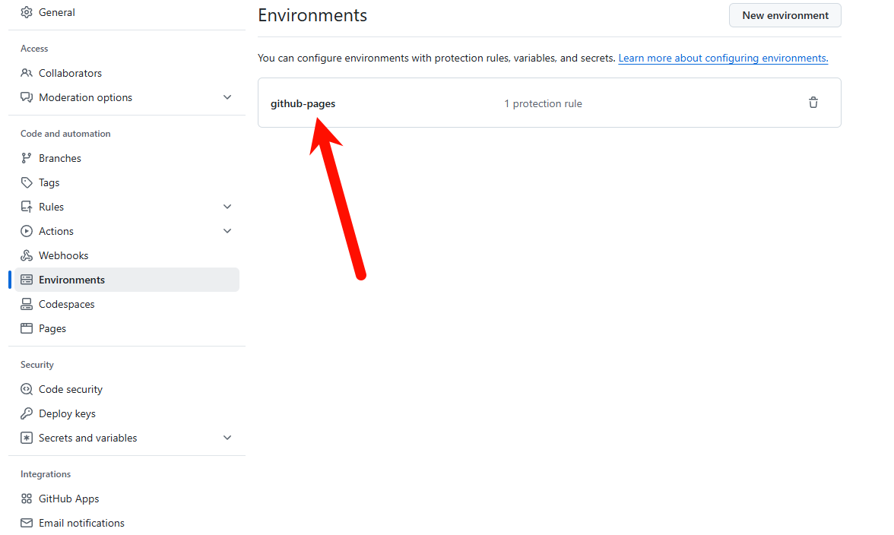
    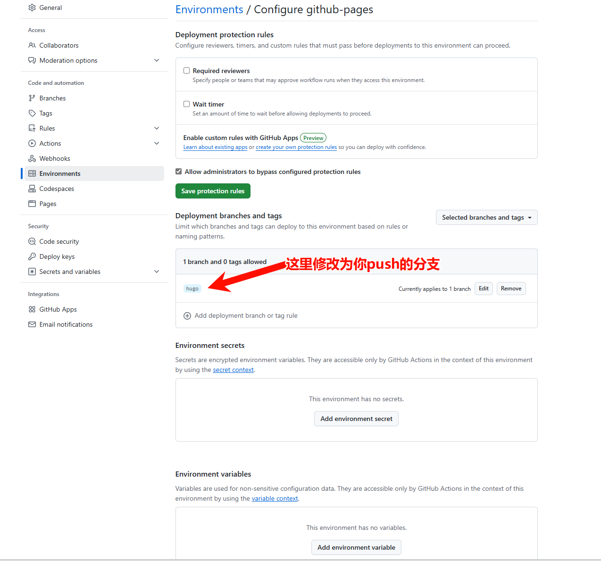


3. 需要将自己的根目录上传到github的一个仓库中，push之前可以把public文件夹和resources文件夹忽略掉,因为这两个文件夹是hugo编译生成的,自动部署可以自己生成，就不需要了。同时你许要修改根路径下面的yaml文件，主要是其中的baseurl，修改为`https://<username>.github.io/<repository>` 当然如果你的仓库名是`<username>.github.io`就可以修改为`https://<username>.github.io` 
you need to upload your root directory to a github repository, the repository name is not important, you can ignore the public folder and resources folder before pushing,because these two folders are generated by hugo, you don't need them. Also you need to modify the yaml file in the root directory, mainly the baseurl, modify it to `https://<username>.github.io/<repository>`, of course if your repository name is `<username>.github.io` you can modify it to `https://<username>.github.io`

    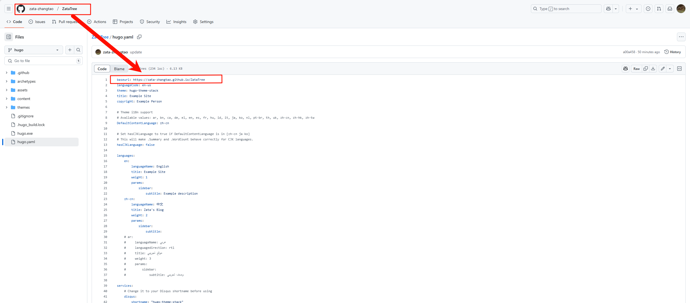
    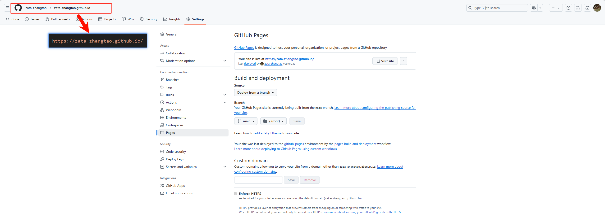

4. 准备好之后就可以push了，注意别push错了，必须要是之前配置环境变量和workflows里面的分支,push之后可以到action里面查看进度，稍后就可访问静态页面了
You are ready to push, don't push wrong, you must push to the branch you configured in the environment variable and workflows,push it, you can see the progress in the action, and you can access the static page later

    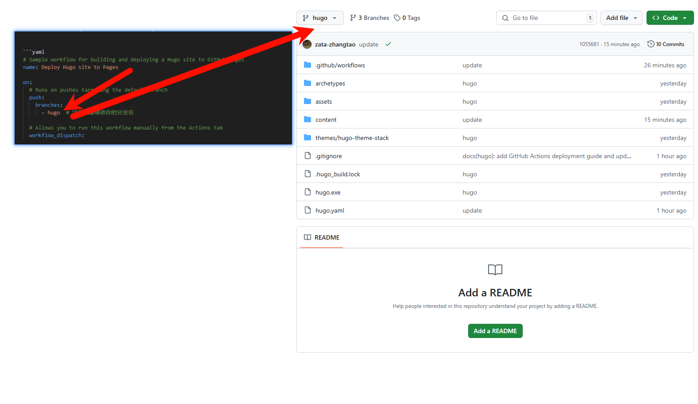
    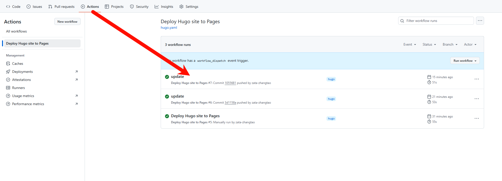


## 怎么使用自己的域名访问github pages


1. 配置DNS
    登录你自己的域名服务商,我的域名服务商是阿里云，这里配置两条记录,无论你原本是不是访问需要加分支名或者什么，解析地址都是`<username>.github.io` 
    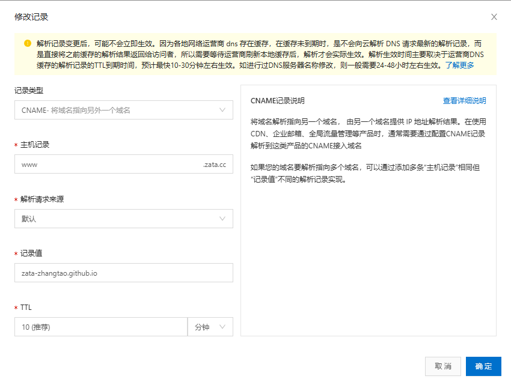
    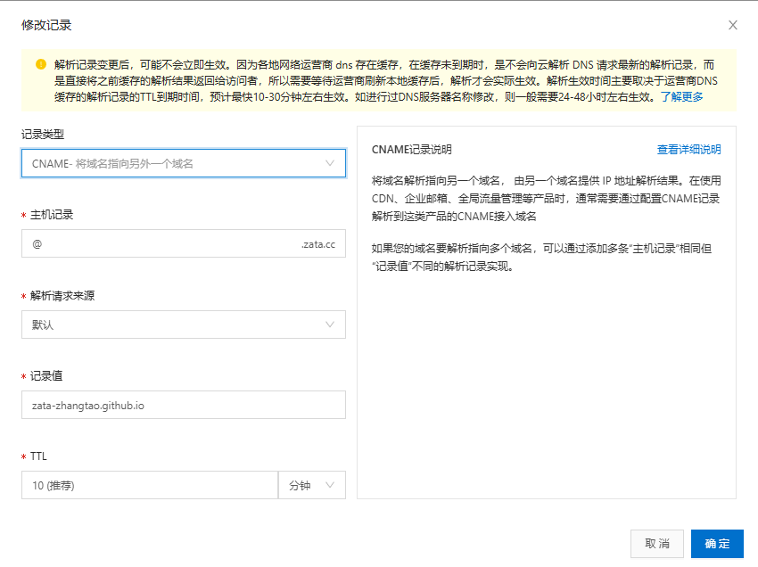
2. 到github仓库当中，修改如下配置：setting->Pages->Custom domain->输入你的域名->保存
    注意如果允许勾选enforce HTTPS，就一定勾选它，这会让你访问的时候浏览器显示安全
    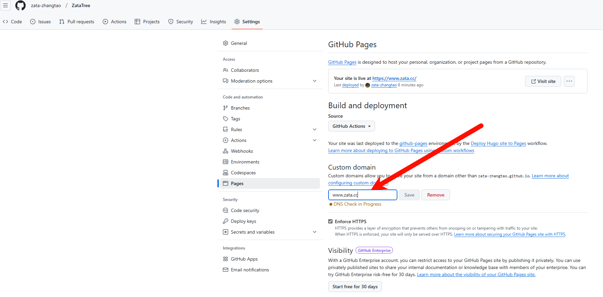


## 配置相关


1.  配置页面的样式
可以在项目的根目录下的config.yaml文件中进行配置。


2. 默认index.md文件头
```py
---
title: Chinese Test
description: 这是一个副标题
date: 2020-09-09
slug: test-chinese
image: helena-hertz-wWZzXlDpMog-unsplash.jpg
categories:
    - Test
    - 测试
---
```


3. 内容解释

在 Hugo（一个流行的静态网站生成器）中，**"slug"** 是一个用于控制页面 URL 的重要概念。它通常在文件的**前端事项（front matter）**中定义，用于自定义页面或文章的 URL 路径的最后一段。以下是关于 Hugo 中 "slug" 的详细解释：

1. **什么是 slug？**
- **定义**：Slug 是一个简洁、URL 友好的字符串，通常由小写字母、数字和连字符（`-`）组成，用于标识页面或内容的 URL。
- **作用**：它替代了默认的文件名或标题生成的 URL 片段，让 URL 更简洁、可读，并且对搜索引擎优化（SEO）更友好。
- **默认行为**：如果没有在前端事项中定义 slug，Hugo 会使用文件名（去掉扩展名）或标题（经过处理，如空格转为连字符）来生成 URL 的最后一段。

2. **在 Hugo 中使用 slug**
你可以在 Markdown 文件的**前端事项**中手动设置 slug。例如：

```yaml
---
title: "我的第一篇文章"
slug: "my-first-post"
---
```

- **效果**：假设文件位于 `content/posts/` 目录下，默认情况下，URL 可能是 `/posts/我的第一篇文章/`（或根据配置转为拼音/其他形式）。设置了 `slug: "my-first-post"` 后，URL 会变成 `/posts/my-first-post/`。
- **适用范围**：Slug 只影响 URL 的最后一段（文件名部分），不会改变目录结构（即 `posts` 部分仍由文件路径决定）。

3. **slug vs 文件名**
- 如果不设置 slug，Hugo 默认使用文件名。例如，文件名为 `my-first-post.md`，URL 会是 `/posts/my-first-post/`。
- 设置 slug 后，它会覆盖文件名。例如：
  - 文件名：`article-001.md`
  - 前端事项：`slug: "new-article"`
  - 结果 URL：`/posts/new-article/`

4. **slug 的规则和注意事项**
- **字符限制**：建议使用小写字母、数字和连字符，避免空格、特殊字符或大写字母，以符合 URL 标准。
- **与 url 的区别**：Hugo 中还有一个 `url` 前端事项选项，它可以完全覆盖整个路径（包括目录部分），而 slug 只修改最后一段。例如：
  ```yaml
  ---
  slug: "my-post"
  url: "/custom/path/to/my-post/"
  ---
  ```
  - `slug` 只影响 `/my-post` 部分。
  - `url` 会覆盖整个路径为 `/custom/path/to/my-post/`。
- **多语言支持**：在多语言网站中，可以为每种语言设置不同的 slug。例如：
  ```yaml
  # content/post/my-post.en.md
  ---
  slug: "my-post"
  ---
  # content/post/my-post.fr.md
  ---
  slug: "mon-article"
  ---
  ```

