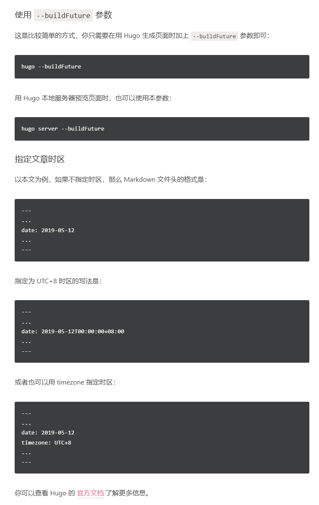
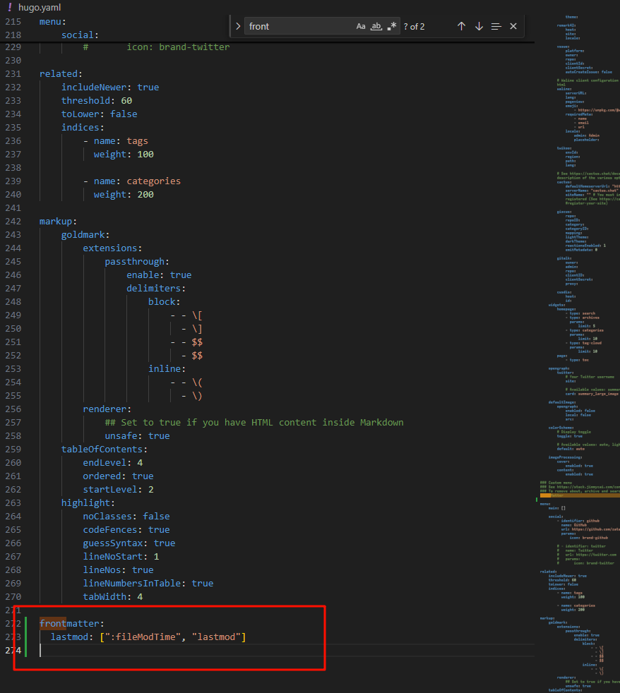
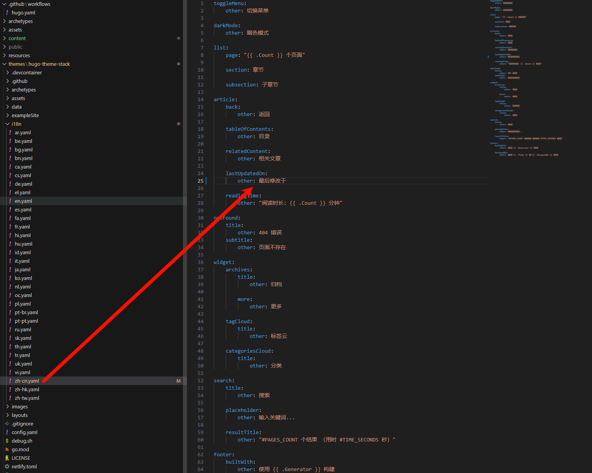

## 可能遇到的问题

### Hugo 文章日期设定上的小问题（时区问题）

参考： https://blog.hly0928.com/post/hugo-post-date-issue/


Hugo 在生成静态页面的时候，不会生成超过当前时间的文章；而 Hugo 默认采用的是 格林尼治平时 (GMT)，比北京时间 (UTC+8) 晚了 8 个小时。也就是说，当北京时间在 08:00 之前，而你又将文章发布日期设在当天时，Hugo 就默认不会生成这个页面。

解决方法： 
最后我选择文章头增加时区信息
```py
---
...
date: 2025-03-02T00:00:00+08:00
...
---
```





## Stack 主题

### Hugo Stack 主题添加[最后修改于]

参考：
- https://shitao5.org/posts/hugo-stack/


1. 配置[最后修改于]

      在主题的.yaml文件中添加
      
    ```py
    frontmatter:
    lastmod: [":fileModTime", "lastmod"]
    ```
    
    **这样会显示最后更新于**
    
    
    **如果要显示最后修改于**
    修改 themes/hugo-theme-stack/i18n 文件夹中的 zh-cn.yaml 文件
    