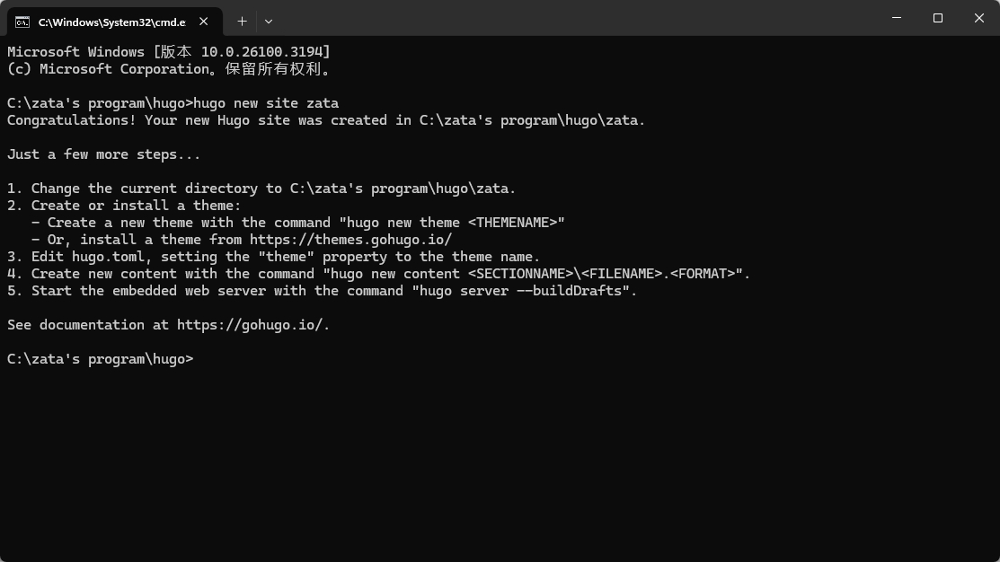
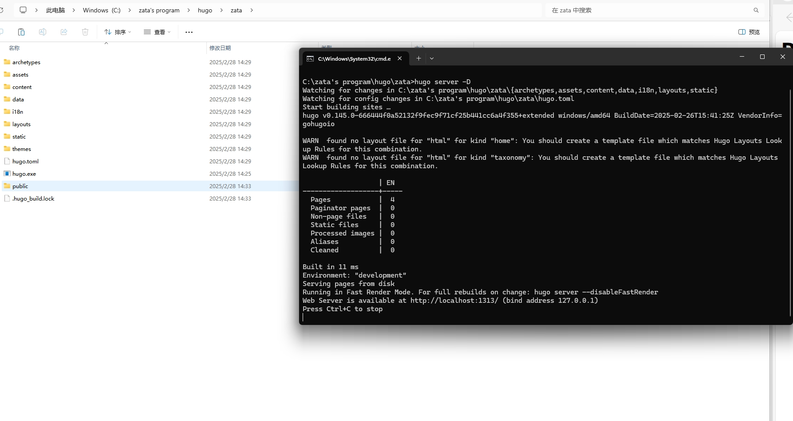
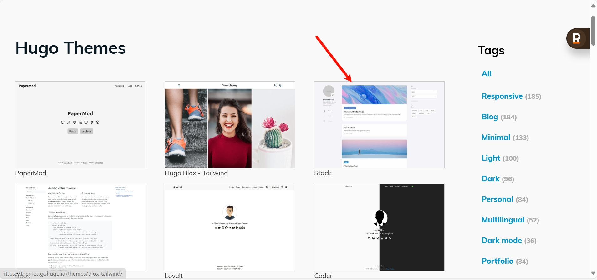
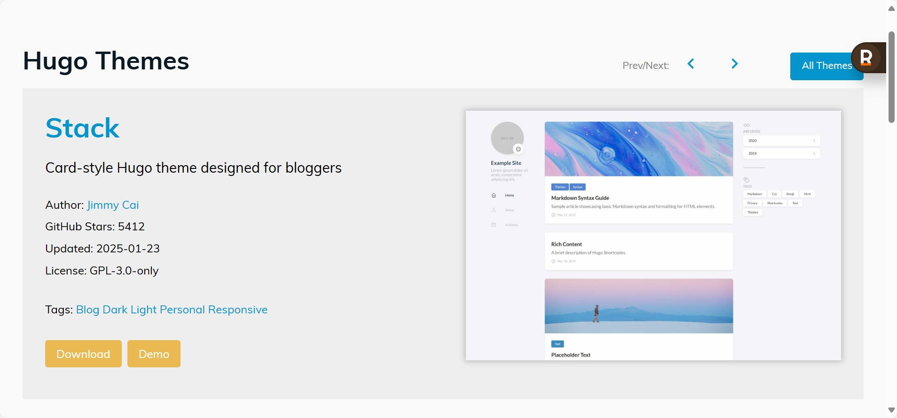
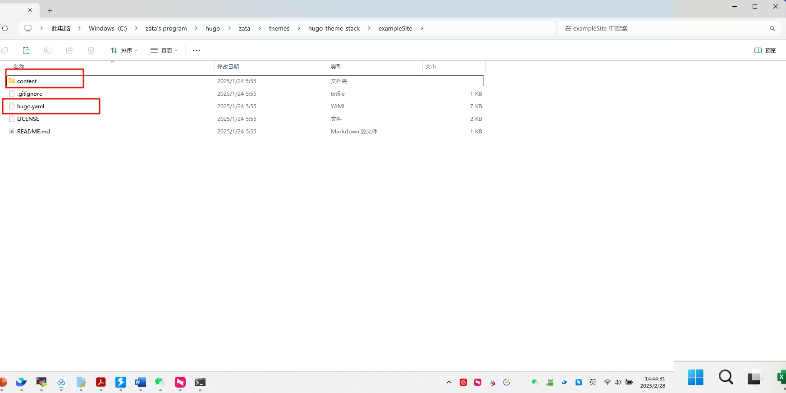
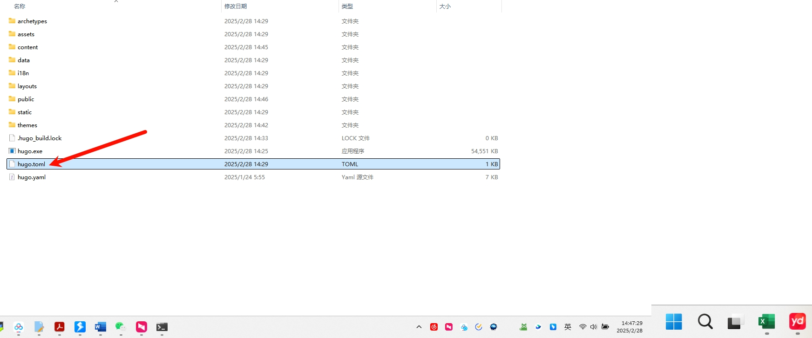
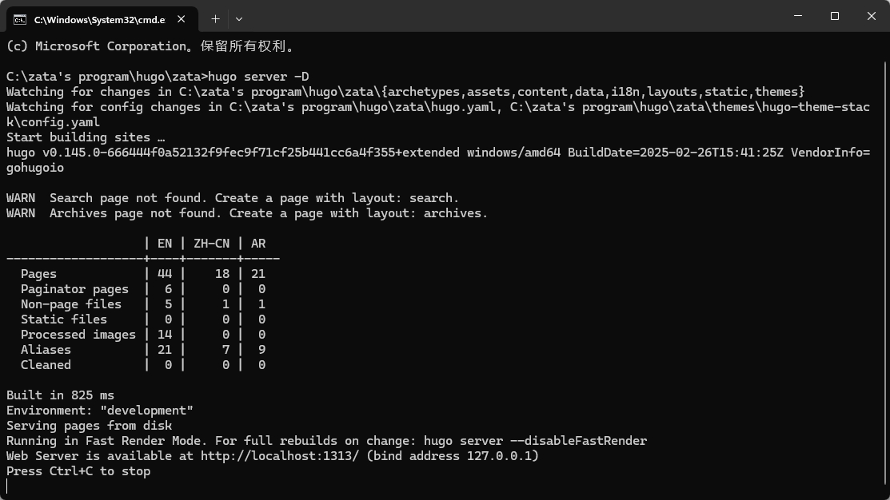
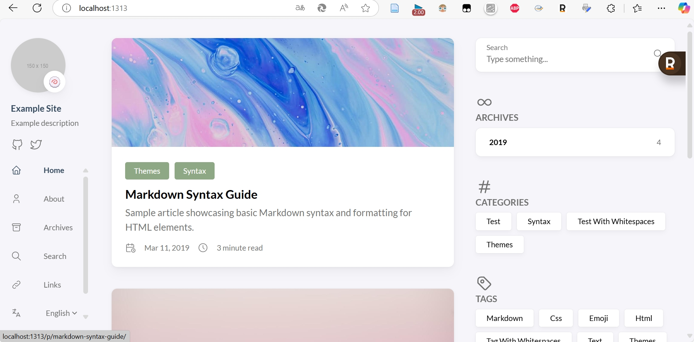
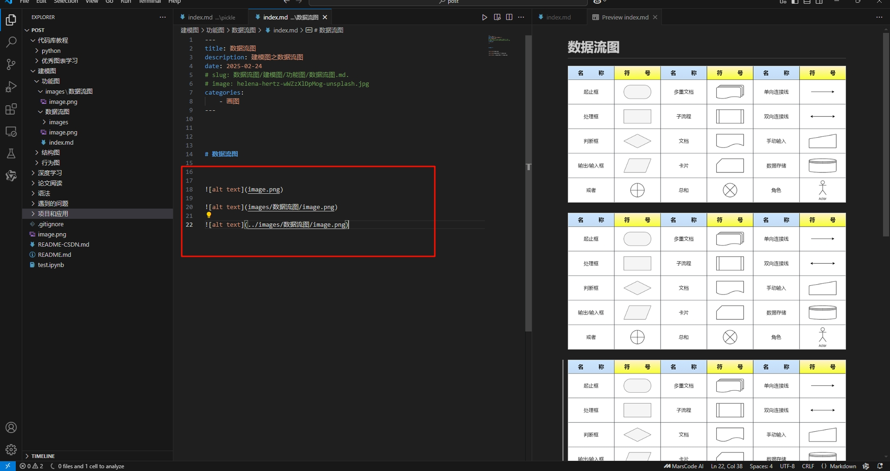

# hugo


## hugo安装使用


### 常用命令

```bash
# start the hugo server
hugo server -D 

# build the hugo site
hugo -D
```


### 安装 在ubuntu系统下

https://gohugo.io/getting-started/quick-start/

#### 安装hugo

```bash
sudo apt install hugo
```


#### 安装git


```bash
sudo apt install git-all
```


### windows版本 hugo安装

- download 下载

https://github.com/gohugoio/hugo/releases


- unzip to local 解压到本地 , example : here I created a folder


- run the cmd command under the directory 在目录下面运行cmd命令 ,example : here I created a folder named zata

```bash
hugo new site zata
```




- copy hugo.exe to zata folder 把hugo.exe复制到zata文件夹

- run the cmd command under the directory 在目录下面运行cmd命令,example : here I created a folder named zata



- then you can see the example site


- next step, you need to install the theme


- choose the theme you want to install , example : here I choose the theme named Stack




- unzip the theme to the zata/themes folder, and delete the version number


- copy [your-theme-name]/exampleSite/config.toml&content to zata/


- delete the toml file, because the toml file is not used, the yaml file is used



- delete rich-content folder,because the rich-content folder is cite some website, and the website is not used


- run the cmd command under the directory in zata folder, then you can see:




- then you can create a new post

```bash
hugo new content post/myFristBlog/index.md
```
**myFtistBlog is the name of the page**
In hugo, a folder is a page, then the default language of index.md that you can modify in the hugo.yaml, the default language of index.zh-cn.md is Chinese, and the images used in md will be placed in this folder.


## 注意事项
### `文件命名必须是index.xxxx.md`

md文件+图片的组合，文件夹的名称是随意命名的，但文件夹里md文件的命名，必须为index.md或index.zh-cn.md否则图片资源可能在打包上传时会消失。


### `图片资源的放置位置有讲究`
看下面两张图，三张图片在md文件中本地查看都是可以的，但是在打包上传时，最后一个图片资源可能会消失。

`图片资源必须和.md文件在同一个文件夹下，否则图片资源可能在打包上传时会消失。`




## 配置相关


### 配置页面的样式
可以在项目的根目录下的config.yaml文件中进行配置。


### 默认index.md文件头
---
title: Chinese Test
description: 这是一个副标题
date: 2020-09-09
slug: test-chinese
image: helena-hertz-wWZzXlDpMog-unsplash.jpg
categories:
    - Test
    - 测试
---


### 内容解释

在 Hugo（一个流行的静态网站生成器）中，**"slug"** 是一个用于控制页面 URL 的重要概念。它通常在文件的**前端事项（front matter）**中定义，用于自定义页面或文章的 URL 路径的最后一段。以下是关于 Hugo 中 "slug" 的详细解释：

1. **什么是 slug？**
- **定义**：Slug 是一个简洁、URL 友好的字符串，通常由小写字母、数字和连字符（`-`）组成，用于标识页面或内容的 URL。
- **作用**：它替代了默认的文件名或标题生成的 URL 片段，让 URL 更简洁、可读，并且对搜索引擎优化（SEO）更友好。
- **默认行为**：如果没有在前端事项中定义 slug，Hugo 会使用文件名（去掉扩展名）或标题（经过处理，如空格转为连字符）来生成 URL 的最后一段。

2. **在 Hugo 中使用 slug**
你可以在 Markdown 文件的**前端事项**中手动设置 slug。例如：

```yaml
---
title: "我的第一篇文章"
slug: "my-first-post"
---
```

- **效果**：假设文件位于 `content/posts/` 目录下，默认情况下，URL 可能是 `/posts/我的第一篇文章/`（或根据配置转为拼音/其他形式）。设置了 `slug: "my-first-post"` 后，URL 会变成 `/posts/my-first-post/`。
- **适用范围**：Slug 只影响 URL 的最后一段（文件名部分），不会改变目录结构（即 `posts` 部分仍由文件路径决定）。

3. **slug vs 文件名**
- 如果不设置 slug，Hugo 默认使用文件名。例如，文件名为 `my-first-post.md`，URL 会是 `/posts/my-first-post/`。
- 设置 slug 后，它会覆盖文件名。例如：
  - 文件名：`article-001.md`
  - 前端事项：`slug: "new-article"`
  - 结果 URL：`/posts/new-article/`

4. **slug 的规则和注意事项**
- **字符限制**：建议使用小写字母、数字和连字符，避免空格、特殊字符或大写字母，以符合 URL 标准。
- **与 url 的区别**：Hugo 中还有一个 `url` 前端事项选项，它可以完全覆盖整个路径（包括目录部分），而 slug 只修改最后一段。例如：
  ```yaml
  ---
  slug: "my-post"
  url: "/custom/path/to/my-post/"
  ---
  ```
  - `slug` 只影响 `/my-post` 部分。
  - `url` 会覆盖整个路径为 `/custom/path/to/my-post/`。
- **多语言支持**：在多语言网站中，可以为每种语言设置不同的 slug。例如：
  ```yaml
  # content/post/my-post.en.md
  ---
  slug: "my-post"
  ---
  # content/post/my-post.fr.md
  ---
  slug: "mon-article"
  ---
  ```

