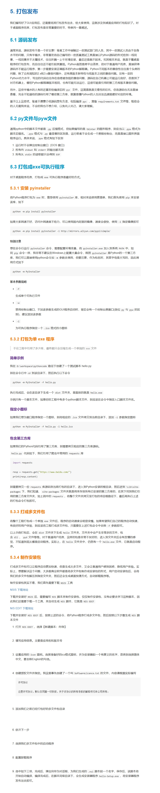

# Python程序打包exe




## 打包时需要特别注意的源码编写规范

除了基本的 Python 编码规范之外,在准备程序进行打包时,还需要特别注意以下几点:
### 1.1 依赖管理
- 确保 `requirements.txt` 文件中列出了程序所有的依赖库
- 检查依赖库的版本兼容性,避免打包后出现兼容性问题
- 尽可能使用 `pip freeze > requirements.txt` 自动生成依赖列表

### 1.2 动态导入处理
- 程序中如果使用了动态导入,需要确保 PyInstaller 能够正确识别并打包
- 可以使用 `PyInstaller --hiddenimport` 选项手动指定隐藏依赖

### 1.3 平台兼容性
- 如果程序需要跨平台运行,需要确保代码本身具有良好的跨平台兼容性
- 针对不同平台,可能需要使用条件编译或运行时检测来适配

### 1.4 文件路径处理
- 程序中涉及文件读写操作时,需要注意处理相对路径和绝对路径
- 打包后的程序文件结构可能与开发环境不同,需要适当调整路径

### 1.5 图形界面兼容性
- 如果程序有图形界面,需要确保界面组件在打包后能正常工作
- 可能需要额外打包一些 GUI 库的依赖项

### 1.6 第三方库限制
- 某些第三方库可能不支持 PyInstaller 打包,需要提前了解并做好替代方案
- 对于不支持的库,可以考虑使用纯 Python 实现或寻找替代方案

### 1.7 运行时环境
- 确保程序在打包后的运行环境下能正常工作,例如环境变量、系统依赖等


## 目录结构
典型的目录结构
project_name/
├── src/
│   ├── __init__.py
│   └── main.py
├── tests/
│   ├── __init__.py
│   └── test_main.py
├── resources/
│   ├── config.ini
│   └── images/
├── requirements.txt
├── setup.py
└── README.md
## 文件地址如何引用
如果项目中使用到了文件
### 相对导入
在同一个包内部,可以使用相对导入的方式引用其他模块。
pythonCopyfrom . import some_module
from .subpackage import another_module
### 绝对导入
跨包引用时,需要使用绝对导入的方式。
pythonCopyfrom project_name.modules import some_module
from project_name.subpackage import another_module
### 注意事项
避免循环导入问题,可以使用 __main__ 进行条件导入。
保持导入语句的位置在文件顶部。
优先使用绝对导入,相对导入仅在同一包内部使用。


## 打包成一个文件

```bash
pyinstaller  -F  main.py
```

## 打包成多个文件（软件启动速度会快点）
```bash
pyinstaller -D main.py
```
## 无控制台打包，多文件
```bash
pyinstaller -D -w main.py
```
## 其他参数
我来为您介绍 PyInstaller 的常用打包参数：

主要参数：

```
-F, --onefile       打包成一个独立的可执行文件
-D, --onedir        打包成一个文件夹(默认选项)
-w, --windowed      不显示命令行窗口(Windows系统)  
-c, --console       显示命令行窗口(默认,Windows系统)
-n NAME             指定生成的可执行文件名
--clean             在构建之前清理临时文件
```

常用可选参数：

```
--icon=<FILE.ico>   指定可执行文件的图标
--add-data         添加额外的数据文件 
--add-binary       添加额外的二进制文件
--paths            添加导入路径
--hidden-import    添加隐式导入的模块
--exclude-module   排除指定模块
```

高级参数：

```
--runtime-hook     指定运行时钩子脚本
--additional-hooks-dir  指定额外的钩子脚本目录  
--version-file     指定版本文件
--manifest         指定manifest文件(Windows)
--upx-dir          指定UPX压缩工具目录
--noupx            禁用UPX压缩
```

使用示例：

```bash
# 打包成单个可执行文件
pyinstaller -F main.py

# 打包成单个文件并指定图标
pyinstaller -F main.py --icon=app.ico

# 打包时添加数据文件
pyinstaller -F main.py --add-data "data:data"

# 打包成文件夹并不显示控制台
pyinstaller -D -w main.py
```


## 使用配置文件.spec打包

```bash
pyinstaller your_project.spec
```


# 打包好的exe 使用时传入参数

在开发桌面应用程序时,经常需要在打包为可执行文件(EXE)后,能够向它传递参数,以实现不同的功能。下面就讲解如何在将 Python 脚本打包为 EXE 文件后,仍然可以向其传递参数。


## 1. 准备工作

首先,我们需要有一个简单的 Python 脚本,用于演示如何传递参数。假设我们有一个名为 `main.py` 的文件,内容如下:

```python
import sys

if __name__ == '__main__':
    if len(sys.argv) > 1:
        arg1 = sys.argv[1]
        print(f"Argument passed: {arg1}")
    else:
        print("No arguments passed.")
```

这个脚本会检查命令行参数的数量,如果有参数传递,就会打印出第一个参数的值。

接下来,我们需要使用 PyInstaller 将这个 Python 脚本打包为可执行文件(EXE)。为此,我们创建一个名为 `ExePack.py` 的文件,内容如下:

```python
import PyInstaller.__main__
import shutil
import os

PyInstaller.__main__.run([
    'main.py',
    '--onefile',
    '--name=MyApp',
    '--distpath=dist',
    '--workpath=build',
    '--specpath=.',
    '--noconsole'
])

# 删除 build 文件夹
shutil.rmtree('build', ignore_errors=True)
# 删除 .spec 文件
os.remove('MyApp.spec')
```

这个脚本使用 PyInstaller 将 `main.py` 打包为一个名为 `MyApp.exe` 的可执行文件,并输出到 `dist` 文件夹。

## 2. 传递参数

现在,我们需要编写一个脚本,用于运行打包好的 EXE 文件并传递参数。创建一个名为 `args2exe.py` 的文件,内容如下:

```python
import subprocess
import os

def run_exe_with_args(exe_path, *args):
    """运行 exe 文件并传入参数"""
    if not os.path.exists(exe_path):
        print(f"文件不存在: {exe_path}")
        return

    command = [exe_path] + list(args)
    result = subprocess.run(command, capture_output=True, text=True)

    print("标准输出:", result.stdout)

if __name__ == '__main__':
    exe_path = os.path.join('dist', 'MyApp.exe')
    run_exe_with_args(exe_path, '参数1', '参数2')
```

这个脚本定义了一个 `run_exe_with_args` 函数,用于运行打包好的 EXE 文件并传递参数。在 `if __name__ == '__main__'` 部分,我们调用这个函数,传递 `'参数1'` 和 `'参数2'` 作为参数。

## 3. 运行

1. 首先,运行 `ExePack.py` 脚本,将 `main.py` 打包为 `MyApp.exe` 可执行文件。
2. 然后,运行 `args2exe.py` 脚本。这将启动 `MyApp.exe` 并传递参数 `'参数1'` 和 `'参数2'`。

在控制台上,你应该能看到以下输出:

```
Argument passed: 参数1
```

这就是在打包好的 EXE 文件中传递参数的方法。通过使用 `subprocess` 模块,我们可以运行 EXE 文件并向其传递参数,从而实现更灵活的应用程序功能。