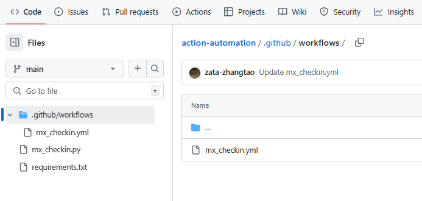
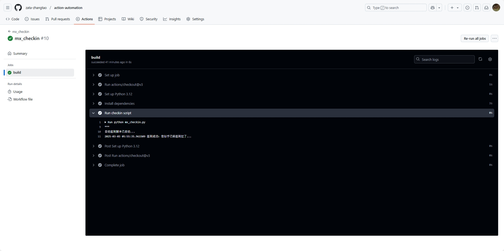
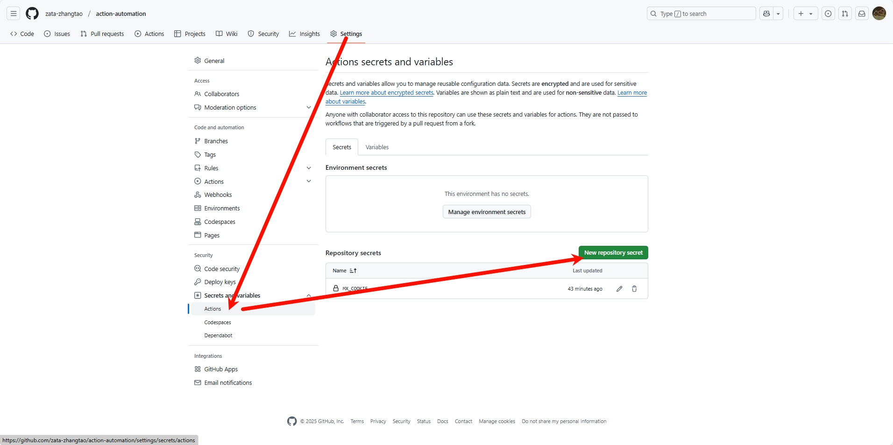

效果就是每天8点去自动签到



### Cookie的获取
参考：
https://www.diuber.com/cookie/


首先需要获取Cookie，这个Cookie是登录之后的Cookie，登录之后的Cookie是在浏览器的开发者工具中获取的，具体方法如下：
1. 打开浏览器，登录mx的账号
2. 打开浏览器的开发者工具，在Network中找到请求的接口，点击请求的接口，在Headers中找到Cookie，复制Cookie


### 签到的代码


```py
# mx_checkin.py
import requests
import schedule
import time
from datetime import datetime
Cookie = os.environ.get("MX_COOKIE")  # 把Cookie放置在action的环境变量中,例如这里是MX_COOKIE
# 签到函数
def checkin():
    # 替换为实际的签到接口 URL
    url = XXXXX

    # 准备请求头（可能需要 Cookie 或 Token 来验证身份）
    headers = {
        "User-Agent": "Mozilla/5.0 (Windows NT 10.0; Win64; x64) AppleWebKit/537.36 (KHTML, like Gecko) Chrome/91.0.4472.124 Safari/537.36",
        "Content-Type": "application/json",
        # 如果需要登录凭证，可以在这里添加 Cookie 或 Authorization
        "Cookie": Cookie,
        # "Authorization": "Bearer your_token_here"
    }

    # 准备请求数据（根据实际接口要求调整）
    data = {
        "userId": "your-user-id",  # 替换为你的用户 ID
        "timestamp": int(time.time())  # 可选：发送当前时间戳
    }

    try:
        # 发送签到请求
        response = requests.post(url, headers=headers)
        response_json = response.json()

        # 检查签到是否成功
        if response.status_code == 200 :
            print(f"{datetime.now()} 签到成功：{response_json.get('msg')}")
        else:
            print(f"{datetime.now()} 签到失败：{response_json.get('msg')}")
    except Exception as e:
        print(f"{datetime.now()} 签到请求失败：{str(e)}")


# 脚本主循环
if __name__ == "__main__":
    print("自动签到脚本已启动...")
    # 首次运行时立即签到（可选）
    checkin()
```

代码写好之后可以先在本地测试，保证测试ok


### github action的工作流配置

关于github action的内容，可以查看我的文章  [`github action使用`](../2-github-action-使用/)


```
# mx_checkin.yml
name: mx_checkin

on:
  schedule:
    # 此处是UTC时间，对应北京时间早八点
    - cron : '00 00 * * *'
  workflow_dispatch:

permissions:
  contents: read

jobs:
  build:

    runs-on: ubuntu-latest

    steps:
    - uses: actions/checkout@v3
    - name: Set up Python 3.12
      uses: actions/setup-python@v3
      with:
        python-version: "3.12"
    - name: Install dependencies
      run: |
        python -m pip install --upgrade pip
        if [ -f requirements.txt ]; then pip install -r requirements.txt; fi
    - name: Run checkin script
      run: |
        python mx_checkin.py
      env:
        MX_COOKIE: ${{ secrets.MX_COOKIE }}
```

### requirements.txt

把需要的库写在这个文件中
```text
requests
schedule
datetime
```
### 设置仓库密钥


把前面Cookie 填进去


